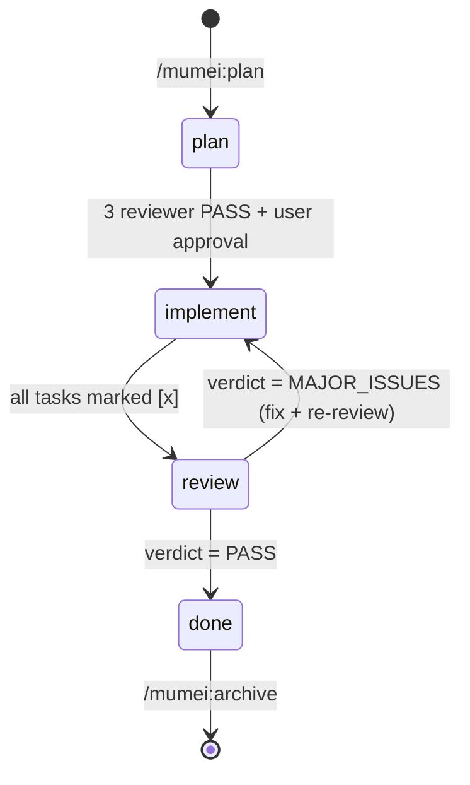
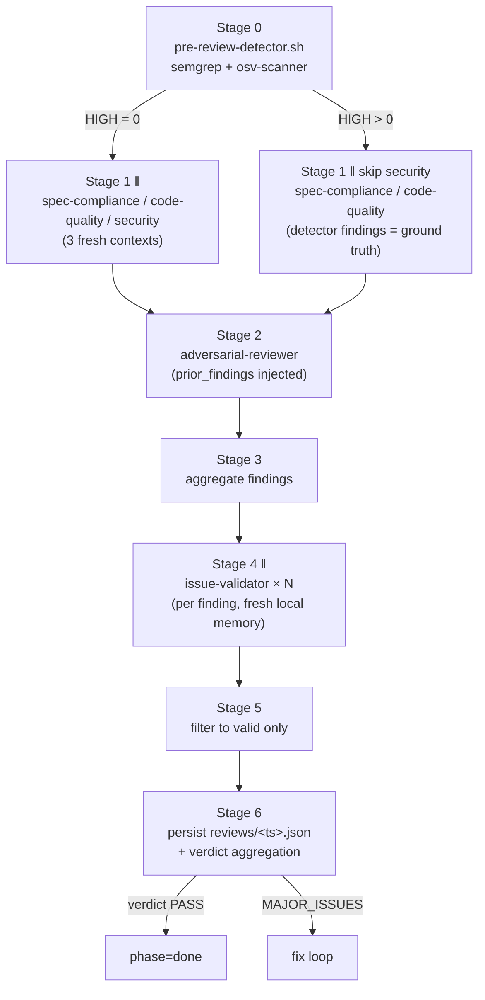

# mumei Architecture

This document maps mumei's runtime structure for developers who want to extend
or audit it. End-users do not need to read this — the [README](./README.md) is
sufficient for plugin install and daily workflow.

## Distribution layout

The repository ships only the directories below as the plugin payload. Other
top-level files (`CLAUDE.md`, `docs/`, `.claude/`) are gitignored development
artifacts and never reach the plugin user.

```text
mumei/
├── .claude-plugin/
│   ├── plugin.json         # plugin manifest (name / version / author / homepage)
│   └── marketplace.json    # self-hosted marketplace catalog
├── agents/                 # 8 reviewer / validator agents (Sonnet / Opus)
│   ├── requirements-reviewer.md
│   ├── design-reviewer.md
│   ├── tasks-reviewer.md
│   ├── spec-compliance-reviewer.md
│   ├── code-quality-reviewer.md
│   ├── security-reviewer.md
│   ├── adversarial-reviewer.md
│   └── issue-validator.md
├── skills/                 # user-invocable orchestration
│   ├── plan/               # /mumei:plan — the orchestrator
│   ├── brainstorm/         # /mumei:brainstorm — pre-spec Q&A
│   ├── init/               # /mumei:init — one-time per-project setup
│   └── archive/            # /mumei:archive — move done features to archive/
├── hooks/                  # Hook handlers + shared bash library
│   ├── hooks.json          # PreToolUse / PostToolUse / Stop registration
│   ├── _lib/               # shared bash modules
│   │   ├── state.sh        # .mumei/specs/<feat>/state.json read/write (atomic)
│   │   ├── tasks.sh        # tasks.md parser (BSD-awk compatible)
│   │   ├── safe-grep.sh    # null-safe grep + git check-ignore helper
│   │   ├── detectors.sh    # semgrep / osv-scanner runners + severity normalizer
│   │   └── log.sh          # mumei_log_info / warn / error / debug
│   ├── pre-edit-guard.sh   # P1 / P2 / P3 / I1 / I2 / W1
│   ├── pre-bash-guard.sh   # I3 / R2 / W2
│   ├── post-edit-guard.sh  # I4 (phantom completion)
│   ├── post-bash-guard.sh  # X1 (advisory: out-of-scope Bash writes)
│   ├── stop-guard.sh       # R1 / R3 + detector defense line
│   └── pre-review-detector.sh  # Stage 0 of /mumei:plan review pipeline
├── scripts/
│   └── lint-tasks.sh       # X2 (advisory: tasks.md format)
├── tests/                  # bats suite (175+ tests, CI on macOS + Ubuntu)
└── README.md / README.ja.md / LICENSE / SECURITY.md / CONTRIBUTING.md / CODE_OF_CONDUCT.md / PRIVACY.md
```

## Phase state machine

mumei tracks each feature through four phases. State is persisted in
`.mumei/specs/<feature>/state.json` (atomic write via `mktemp + jq empty + mv`).



Hooks gate every transition. The state machine is enforced at the OS boundary,
not by prompting.

## Hook rules — full enforcement table

The 14 rules below describe **what mumei refuses to do** when an invariant is
violated. Each rule is a single check in one of the handler scripts under
`hooks/`. Rules denoted _advisory_ surface findings via `additionalContext`
without blocking the tool call.

| ID  | Phase     | Hook event        | Trigger                                                         | Implementation             |
| --- | --------- | ----------------- | --------------------------------------------------------------- | -------------------------- |
| P1  | plan      | PreToolUse(Edit)  | Editing `src/` while spec incomplete                            | `hooks/pre-edit-guard.sh`  |
| P2  | plan      | PreToolUse(Write) | `design.md` while `requirements.md` has `[NEEDS CLARIFICATION]` | `hooks/pre-edit-guard.sh`  |
| P3  | plan      | PreToolUse(Write) | `tasks.md` without `design.md`                                  | `hooks/pre-edit-guard.sh`  |
| I1  | implement | PreToolUse(Edit)  | Owning task's `_Depends:_` not complete                         | `hooks/pre-edit-guard.sh`  |
| I2  | implement | PreToolUse(Edit)  | File outside any task's `_Files:_` (scope creep)                | `hooks/pre-edit-guard.sh`  |
| I3  | implement | PreToolUse(Bash)  | `git commit` with failing tests                                 | `hooks/pre-bash-guard.sh`  |
| I4  | implement | PostToolUse(Edit) | Marking `[x]` without an implementation diff                    | `hooks/post-edit-guard.sh` |
| W1  | implement | PreToolUse(Edit)  | Editing Wave N+1 file before Wave N committed                   | `hooks/pre-edit-guard.sh`  |
| W2  | implement | PreToolUse(Bash)  | `git commit` while current Wave has `[ ]` tasks                 | `hooks/pre-bash-guard.sh`  |
| R1  | review    | Stop              | Session ends with all tasks done but review skipped             | `hooks/stop-guard.sh`      |
| R2  | review    | PreToolUse(Bash)  | `git push` while latest review verdict is `MAJOR_ISSUES`        | `hooks/pre-bash-guard.sh`  |
| R3  | done      | Stop              | `phase=done` but feature still in `.mumei/current`              | `hooks/stop-guard.sh`      |
| X1  | any       | PostToolUse(Bash) | Bash modified files outside scope (advisory)                    | `hooks/post-bash-guard.sh` |
| X2  | any       | PostToolUse(Edit) | tasks.md format violation (advisory)                            | `scripts/lint-tasks.sh`    |

The single escape hatch is `MUMEI_BYPASS=1` (env var). It short-circuits every
hook on entry. There is no per-rule bypass; this is intentional (see
`docs/mumei-decisions.md` Escape hatch section).

## Reviewer pipeline (Phase 5)

When `/mumei:plan` enters phase=review, the orchestrator drives a 7-stage
pipeline. Stages 1, 4 are parallel; the rest are sequential.



Key constraints:

- **Detector findings are ground truth.** When `high_count > 0`, security-reviewer
  is skipped and the verdict pins to `MAJOR_ISSUES` regardless of LLM output.
- **Reviewers run on fresh contexts.** No reviewer sees its own prior runs;
  cross-context bleed is prevented structurally.
- **`issue-validator` memory is `local` (read-only).** Parallel writes would
  collide; the validator's role is filter-only.
- **`memory: project` reviewers persist learned patterns** under
  `.claude/agent-memory/<reviewer>/MEMORY.md` (gitignored, per-developer).

## File-based state model

mumei stores zero state outside the project tree. Everything lives under
`.mumei/`:

```text
.mumei/
├── current                       # active feature slug (1 line, gitignored)
├── specs/<feature>/
│   ├── requirements.md           # User Story + EARS ACs
│   ├── design.md                 # Architecture + Wave Plan
│   ├── tasks.md                  # Wave > Task hierarchy with _Files: _Depends: _Requirements:
│   ├── state.json                # phase / current_wave / created_at / updated_at (gitignored)
│   ├── spec-reviews/             # per-iteration JSON from spec-reviewers (created lazily by /mumei:plan; absent on fresh features)
│   └── reviews/                  # Phase 5 review results + detector reports
├── archive/<YYYY-MM>/<feature>/  # completed features moved here by /mumei:archive
└── scratch/<feature>.md          # /mumei:brainstorm output (tracked, team-shared)
```

The split `gitignored vs tracked` is precise:

- **Gitignored** (per-developer state): `.mumei/current`, `.mumei/specs/*/state.json`.
- **Tracked** (team-shared): everything else — `requirements.md`, `design.md`,
  `tasks.md`, `spec-reviews/`, `reviews/`, `scratch/`, `archive/`.

This division matters for review reproducibility: a fresh checkout has the
spec history but not the in-progress cursor.

## Distributable vs dev-only

The plugin payload is English; mumei's internal development uses Japanese in a
parallel set of dev-only files that are gitignored. Distinct boundaries:

| Directory / file                                                                                                                | Distributed?                                 | Language                                        |
| ------------------------------------------------------------------------------------------------------------------------------- | -------------------------------------------- | ----------------------------------------------- |
| `agents/`, `skills/`, `hooks/`, `scripts/`, `.claude-plugin/`                                                                   | Yes                                          | English                                         |
| `README.md`, `README.ja.md`, `LICENSE`, `SECURITY.md`, `CONTRIBUTING.md`, `CODE_OF_CONDUCT.md`, `PRIVACY.md`, `ARCHITECTURE.md` | Yes                                          | English (README.ja.md mirrors in Japanese)      |
| `CLAUDE.md`, `.claude/`, `docs/` (except `docs/document-corruption.md`)                                                         | No (gitignored)                              | Japanese                                        |
| `docs/document-corruption.md`                                                                                                   | Yes (single tracked exception under `docs/`) | English (linked from README Philosophy section) |
| `tests/`, `.github/`, `.editorconfig`, `.markdownlint-cli2.jsonc`, `_typos.toml`, `lychee.toml`, `.pre-commit-config.yaml`      | No (CI / dev tooling)                        | Mixed                                           |

Maintainers: do not add Japanese prose to distributable files; the
[CONTRIBUTING.md](./CONTRIBUTING.md) Conventions section explains how to use
HTML comments for Japanese intent notes inside English bodies.

## Bash conventions for hook authors

Hook handlers and `hooks/_lib/` modules follow a documented set of conventions
(see project-local `.claude/rules/bash-conventions.md` if you are the
maintainer). The five most load-bearing rules:

1. `set -u` always; `set -e` deliberately not used (handlers need fall-through
   on missing files).
2. Function prefix: `mumei_*` for public API, `_mumei_*` for internal helpers.
3. `${CLAUDE_PLUGIN_ROOT:-}` always with `:-` fallback.
4. **BSD awk compatible** (macOS default): no 3-argument `match($0, /.../, arr)`,
   no `gensub()`. Use `match()` + `RSTART`/`RLENGTH` + `substr()`.
5. JSON output via `jq -n --arg ... '{...}'`; never hand-construct JSON in shell.

The CI's `verify mumei_ prefix on bash functions` step enforces (2)
mechanically.

## Related documents

- [README.md](./README.md) — install + daily workflow
- [PRIVACY.md](./PRIVACY.md) — network egress + data storage policy
- [SECURITY.md](./SECURITY.md) — vulnerability reporting (private channel)
- [CONTRIBUTING.md](./CONTRIBUTING.md) — local dev setup + commit conventions
