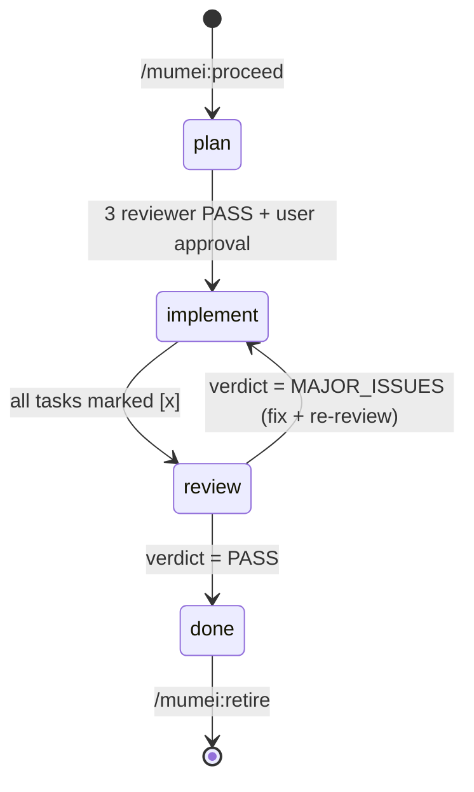
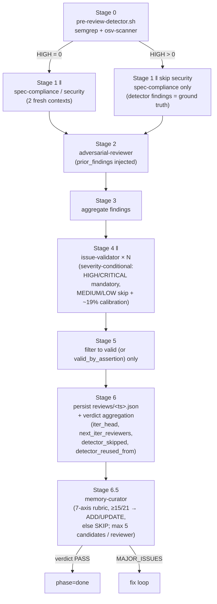

# mumei Architecture

This document maps mumei's runtime structure for developers who want to extend
or audit it. End-users do not need to read this — the [README](./README.md) is
sufficient for plugin install and daily workflow.

## Distribution layout

The repository ships only the directories below as the plugin payload. Other
top-level files (`CLAUDE.md`, `.claude/`, and most of `docs/`) are gitignored
development artifacts and never reach the plugin user. The single tracked
exception under `docs/` is `docs/document-corruption.md` (English, linked from
README's Philosophy section); see the table below for the full distribution
matrix.

```text
mumei/
├── .claude-plugin/
│   ├── plugin.json         # plugin manifest (name / version / author / homepage)
│   └── marketplace.json    # self-hosted marketplace catalog
├── agents/                 # 9 reviewer / validator / curator / author agents (Sonnet / Opus)
│   ├── requirements-reviewer.md
│   ├── design-reviewer.md
│   ├── tasks-reviewer.md
│   ├── spec-compliance-reviewer.md
│   ├── security-reviewer.md
│   ├── adversarial-reviewer.md
│   ├── issue-validator.md
│   ├── memory-curator.md
│   └── property-author.md
├── skills/                 # user-invocable orchestration
│   ├── proceed/            # /mumei:proceed — the orchestrator
│   ├── gather/             # /mumei:gather — pre-spec Q&A
│   ├── arrange/            # /mumei:arrange — one-time per-project setup
│   ├── examine/            # /mumei:examine — plan-vehicle review pipeline
│   ├── retire/             # /mumei:retire — move done features to archive/
│   └── reflect/            # /mumei:reflect — feature retrospective
├── hooks/                  # Hook handlers + shared bash library
│   ├── hooks.json          # event registration: PreToolUse / PostToolUse / Stop / TaskCreated / TaskCompleted / UserPromptSubmit + PreCompact / PostCompact / SessionStart / SessionEnd / FileChanged / CwdChanged / InstructionsLoaded / UserPromptExpansion / ConfigChange / PostToolUseFailure / SubagentStart / SubagentStop
│   ├── _lib/               # shared bash modules
│   │   ├── anchor.sh       # pre-flight bootstrap (cwd anchor + MUMEI_BYPASS + PLUGIN_ROOT export) sourced by every entrypoint
│   │   ├── state.sh        # .mumei/specs/<feat>/state.json read/write (atomic)
│   │   ├── tasks.sh        # tasks.md parser (BSD-awk compatible)
│   │   ├── safe-grep.sh    # null-safe grep + git check-ignore helper
│   │   ├── detectors.sh    # semgrep / osv-scanner runners + severity normalizer
│   │   ├── review.sh       # shared Phase 5 / /mumei:examine pipeline helpers
│   │   ├── ledger.sh       # cross-feature finding ledger (pillar C: move-resistant fingerprint + FP annotation, annotate-only)
│   │   ├── residual.sh     # residual exposition (pillar D: deterministic aggregation of advisory/unsure/needs_*/valid_by_assertion + always-on ai-blindspot-ceiling)
│   │   ├── memory.sh       # memory-curator atomic helpers (score → operation, validate, apply)
│   │   ├── cost-log.sh     # optional pre/post wrap helpers; SubagentStop hook is authoritative
│   │   ├── verify-log.sh   # test-run audit trail (commit-gate / worktree-clean / agent-run exit codes)
│   │   ├── worktree-verify.sh # clean-HEAD double-measurement (reward-hacking defense)
│   │   ├── config.sh       # .mumei/config.json: golden-path glob + golden append + tool_gates map (pillar B)
│   │   ├── gen-control.sh  # pillar E parsing: artifact path + Open Questions section
│   │   ├── property.sh     # pillar B: _Invariant: structure validation + opt-in AC enum
│   │   ├── reliability.sh  # append-only pass^k accumulator (→ reliability-log.jsonl) + window pass rate aggregator + shared pass-derivation (derive_pass) / dedup (has_row) helpers
│   │   ├── reviewer-prompt.sh # immutable prefix + variable suffix builder for cache-friendly prompts
│   │   ├── byte-exact.sh   # CRLF / tab advisory for byte-exact-prone file types
│   │   ├── hook-stats.sh   # hook decision recorder (.mumei/.hook-stats.jsonl)
│   │   ├── audit-log.sh    # append-only JSONL helper (.mumei/audit-log/*.jsonl)
│   │   ├── log-rotate.sh   # size-based truncate for append-only JSONL
│   │   ├── scratch-parser.sh # brainstorm scratch parser → vehicle recommend
│   │   ├── dependencies.sh # cross-feature `**Depends-Feature**:` queries (Phase D)
│   │   └── log.sh          # mumei_log_info / warn / error / debug
│   ├── pre-edit-guard.sh   # P1 / P2 / P3 / I1 / I2 / W1 / M1 / S1 / G1 / E1
│   ├── pre-bash-guard.sh   # I3 / I5 / R2 / W2 / G2 / G3
│   ├── post-edit-guard.sh  # I4 (phantom completion)
│   ├── post-bash-guard.sh  # X1 (advisory: out-of-scope Bash writes) + X3 (Wave auto-advance on git commit + spec-vehicle reliability append, internal) + X5 (agent-run verify-log)
│   ├── stop-guard.sh       # R1 / R3 + detector defense line
│   ├── pre-review-detector.sh  # Stage 0 of /mumei:proceed review pipeline
│   ├── userprompt-context-hint.sh  # UserPromptSubmit context hint
│   ├── post-task-event.sh  # TaskCreated / TaskCompleted handler (plan-vehicle counters + plan-vehicle reliability append on TaskCompleted via shared helper)
│   ├── pre-exitplan-guard.sh  # ExitPlanMode plan-vehicle init (L-P1)
│   ├── pre-compact-state-dump.sh  # PreCompact: inject .mumei/current state into additionalContext
│   ├── session-start-status.sh  # SessionStart: surface active feature status
│   ├── post-compact-validate.sh  # PostCompact: re-validate .mumei/current vs filesystem
│   ├── file-changed-validate.sh  # FileChanged: lint watched files on external edit
│   ├── cwd-changed-detect.sh  # CwdChanged: notify when entering mumei project
│   ├── instructions-loaded-audit.sh  # InstructionsLoaded: audit log of CLAUDE.md/rules loads
│   ├── userprompt-expansion-context.sh  # UserPromptExpansion: enrich /mumei:retire with feature summary
│   ├── config-change-audit.sh  # ConfigChange: audit + invalid JSON exit 2
│   ├── session-end-audit.sh  # SessionEnd: session metadata audit log
│   ├── post-tool-failure-audit.sh  # PostToolUseFailure: tool failure audit log
│   ├── subagent-cost-log-start.sh  # SubagentStart: pin active feature to .mumei/in-flight-agents/<agent_id>
│   ├── subagent-context-inject.sh  # SubagentStart (matcher *): framing prefix + active feature artifact (pillar E.3); property-author receives blind context only (pillar B)
│   ├── subagent-cost-log.sh  # SubagentStop: agent_id-based subagent jsonl usage extraction
│   └── stop-cost-backfill.sh  # Stop (async): safety-net cost-backfill for SubagentStop hooks that lost the jsonl-flush race
├── scripts/
│   ├── lint-tasks.sh       # X2 (advisory: tasks.md format)
│   └── cost-backfill.sh    # /mumei:reflect: rebuild cost-log.jsonl from session logs
├── tests/                  # bats suite (CI on macOS + Ubuntu)
├── schemas/                # shared JSON Schemas (state / review / cost-log + dashboard payloads: feature-summary / meta / trends / feature-detail / activity-event / sse-event) — NOT shipped in plugin tarball
├── dashboard/              # mumei-dashboard — Vite + React 19 + Tailwind v4 + shadcn/ui — NOT shipped in plugin tarball
└── README.md / README.ja.md / LICENSE / SECURITY.md / CONTRIBUTING.md / CODE_OF_CONDUCT.md / PRIVACY.md
```

## Phase state machine

mumei tracks each feature through four phases. State is persisted in
`.mumei/specs/<feature>/state.json` (atomic write via `mktemp + jq empty + mv`).



Hooks gate every transition. The state machine is enforced at the OS boundary,
not by prompting.

## Hook rules — full enforcement table

The rules below describe **what mumei refuses to do** when an invariant is
violated. Each rule is a single check in one of the handler scripts under
`hooks/`. Rules denoted _advisory_ surface findings via `additionalContext`
without blocking the tool call. The `L-*` rows at the bottom of the table
are plan-vehicle lifecycle hooks (state mutations plus the Stop and Bash
blocks) that fire only when the active feature's state lives under
`.mumei/plans/`; they are documented here for completeness alongside the
spec-vehicle rules.

| ID   | Phase        | Hook event               | Trigger                                                                                                                                                                                                                                                                                                                                                         | Implementation                |
| ---- | ------------ | ------------------------ | --------------------------------------------------------------------------------------------------------------------------------------------------------------------------------------------------------------------------------------------------------------------------------------------------------------------------------------------------------------- | ----------------------------- |
| P1   | plan         | PreToolUse(Edit)         | Editing `src/` while spec incomplete                                                                                                                                                                                                                                                                                                                            | `hooks/pre-edit-guard.sh`     |
| P2   | plan         | PreToolUse(Write)        | `design.md` while `requirements.md` has `[NEEDS CLARIFICATION]`                                                                                                                                                                                                                                                                                                 | `hooks/pre-edit-guard.sh`     |
| P3   | plan         | PreToolUse(Write)        | `tasks.md` without `design.md`                                                                                                                                                                                                                                                                                                                                  | `hooks/pre-edit-guard.sh`     |
| I1   | implement    | PreToolUse(Edit)         | Owning task's `_Depends:_` not complete                                                                                                                                                                                                                                                                                                                         | `hooks/pre-edit-guard.sh`     |
| I2   | implement    | PreToolUse(Edit)         | File outside any task's `_Files:_` (scope creep)                                                                                                                                                                                                                                                                                                                | `hooks/pre-edit-guard.sh`     |
| I3   | implement    | PreToolUse(Bash)         | `git commit` with failing tests, OR working-tree green but a clean-HEAD worktree fails (uncommitted-tampering divergence)                                                                                                                                                                                                                                       | `hooks/pre-bash-guard.sh`     |
| I4   | implement    | PostToolUse(Edit)        | Marking `[x]` without an implementation diff                                                                                                                                                                                                                                                                                                                    | `hooks/post-edit-guard.sh`    |
| I5   | implement    | PreToolUse(Bash)         | `git commit` with a declared `.mumei/config.json` `tool_gates` command failing (non-zero, or exit 127 = declared-but-absent) — typecheck / lint / semgrep / gitleaks; each run recorded to `verify-log.jsonl` (source=tool-gate)                                                                                                                                | `hooks/pre-bash-guard.sh`     |
| W1   | implement    | PreToolUse(Edit)         | Editing Wave N+1 file before Wave N committed                                                                                                                                                                                                                                                                                                                   | `hooks/pre-edit-guard.sh`     |
| W2   | implement    | PreToolUse(Bash)         | `git commit` while current Wave has `[ ]` tasks                                                                                                                                                                                                                                                                                                                 | `hooks/pre-bash-guard.sh`     |
| E1   | implement    | PreToolUse(Edit)         | Editing a production file (spec vehicle) while requirements.md is missing, OR its `## Open Questions` section is absent, has an unchecked `- [ ]`, or is non-`None` prose                                                                                                                                                                                       | `hooks/pre-edit-guard.sh`     |
| R1   | review       | Stop                     | Session ends with all tasks done but review skipped                                                                                                                                                                                                                                                                                                             | `hooks/stop-guard.sh`         |
| R2   | review       | PreToolUse(Bash)         | `git push` while latest review verdict is `MAJOR_ISSUES`                                                                                                                                                                                                                                                                                                        | `hooks/pre-bash-guard.sh`     |
| R3   | done         | Stop                     | `phase=done` but feature still in `.mumei/current`                                                                                                                                                                                                                                                                                                              | `hooks/stop-guard.sh`         |
| M1   | any          | PreToolUse(Edit)         | LLM-driven Edit/Write on `.claude/agent-memory/<reviewer>/MEMORY.md` (curator pipeline only)                                                                                                                                                                                                                                                                    | `hooks/pre-edit-guard.sh`     |
| S1   | any          | PreToolUse(Edit)         | LLM-driven Edit/Write on mumei harness state: `.mumei/current` / state.json / spec-reviews/_.json / reviews/_.json (orchestrator helpers only)                                                                                                                                                                                                                  | `hooks/pre-edit-guard.sh`     |
| G1   | any          | PreToolUse(Edit)         | Edit/Write on a golden path from `.mumei/config.json` `golden_paths` (project-wide, immutable spec/oracle files)                                                                                                                                                                                                                                                | `hooks/pre-edit-guard.sh`     |
| G2   | any          | PreToolUse(Bash)         | Bash-route mutation (`sed -i` / redirect / `tee` / `mv` / `rm` / `cp` / `truncate`) of a golden path — best-effort grep; clean-HEAD worktree restore is authoritative                                                                                                                                                                                           | `hooks/pre-bash-guard.sh`     |
| G3   | any          | PreToolUse(Bash)         | Test-tampering signature (`__eq__`→True / `sys.exit(0)` / `TestReport`) in a Bash command — advisory warn only, no deny                                                                                                                                                                                                                                         | `hooks/pre-bash-guard.sh`     |
| X1   | any          | PostToolUse(Bash)        | Bash modified files outside scope (advisory)                                                                                                                                                                                                                                                                                                                    | `hooks/post-bash-guard.sh`    |
| X2   | any          | PostToolUse(Edit)        | tasks.md format violation (advisory)                                                                                                                                                                                                                                                                                                                            | `scripts/lint-tasks.sh`       |
| X3   | implement    | PostToolUse(Bash)        | Wave auto-advance after a `git commit` that passes a triple gate (`tool_response.exit_code == 0` + HEAD moved + Conventional-Commits or `[wave-N]` subject); on the same gate, append spec-vehicle reliability-log rows for completed-but-unlogged tasks (pass from this commit's verify-log signal; skipped when none — REQ-26) — state mutation, not blocking | `hooks/post-bash-guard.sh`    |
| X4   | any          | PreToolUse(Bash)         | Record the I3 commit-gate test result (exit code) to `verify-log.jsonl` (internal, no deny); `MUMEI_TEST_CMD` overrides runner auto-detect                                                                                                                                                                                                                      | `hooks/pre-bash-guard.sh`     |
| X5   | any          | PostToolUse(Bash)        | Record an agent-run test exit code to `verify-log.jsonl` (both vehicles, internal, no block); detects `MUMEI_TEST_CMD` / `npm test` / `pytest` / `cargo test` / `go test` / `bats`                                                                                                                                                                              | `hooks/post-bash-guard.sh`    |
| L-P1 | plan-vehicle | PreToolUse(ExitPlanMode) | Opt-in gated on `.mumei/current` presence (Kuroko stance). When opted in, capture the plan markdown into `.mumei/plans/<slug>/plan.md` and initialize plan-vehicle `state.json` (state mutation, not blocking)                                                                                                                                                  | `hooks/pre-exitplan-guard.sh` |
| L-T1 | plan-vehicle | TaskCreated              | Increment `task_created_count` in plan-vehicle `state.json` (state mutation, not blocking)                                                                                                                                                                                                                                                                      | `hooks/post-task-event.sh`    |
| L-T2 | plan-vehicle | TaskCompleted            | Increment `task_completed_count`; when it reaches `task_created_count`, set `pending_review=true` (state mutation, not blocking)                                                                                                                                                                                                                                | `hooks/post-task-event.sh`    |
| L-R1 | plan-vehicle | Stop                     | `pending_review=true` with no PASS review JSON or no `detector_report` — block until `/mumei:examine` produces a PASS verdict                                                                                                                                                                                                                                   | `hooks/stop-guard.sh`         |
| L-R2 | plan-vehicle | PreToolUse(Bash)         | `git push` while latest plan-vehicle review verdict is `MAJOR_ISSUES` — deny                                                                                                                                                                                                                                                                                    | `hooks/pre-bash-guard.sh`     |

The single escape hatch is `MUMEI_BYPASS=1` (env var). It short-circuits every
hook on entry. There is no per-rule bypass; this is intentional (see
`docs/mumei-decisions.md` Escape hatch section).

## Reviewer pipeline (Phase 5)

When `/mumei:proceed` enters phase=review, the orchestrator drives a 7-stage
pipeline. Stages 1, 4 are parallel; the rest are sequential.



Key constraints:

- **Detector findings are ground truth.** When `high_count > 0`, security-reviewer
  is skipped and the verdict pins to `MAJOR_ISSUES` regardless of LLM output.
- **`spec-compliance-reviewer` accepts a `scope_source` parameter** that the
  orchestrator appends to the reviewer prompt as a literal `scope_source=<path>`
  suffix. The agent body branches on the file extension: `requirements.md`
  → spec-vehicle EARS comparison (full AC categories: ac_drift, missing_ac,
  scope_creep, over_engineering, silent_reinterpretation); `plan.md` →
  plan-vehicle natural-language plan comparison (scope_creep and
  silent_reinterpretation only — no formal ACs). One agent file serves both
  vehicles; the total deployed agent count remains at 8.
- **Reviewers run on fresh contexts.** No reviewer sees its own prior runs;
  cross-context bleed is prevented structurally.
- **`issue-validator` memory is `local` (read-only).** Parallel writes would
  collide; the validator's role is filter-only.
- **`memory: project` reviewers persist learned patterns** under
  `.claude/agent-memory/<reviewer>/MEMORY.md` (gitignored, per-developer).
- **Memory writes are gated by `memory-curator`.** Reviewers do not write
  directly. Each emits up to 5 `memory_candidates` per review; the
  orchestrator runs the curator (`tools: Read`, sonnet) per candidate, and
  only candidates scoring `≥ 15 / 21` on the 7-axis rubric are appended
  (ADD operation) or replace an existing entry verbatim (UPDATE operation)
  in MEMORY.md atomically (`hooks/_lib/memory.sh`). Direct LLM
  Edit/Write to `.claude/agent-memory/<r>/MEMORY.md` is denied by the M1
  hook rule (above). The plan-vehicle equivalent runs as **Step 8.5** in
  `/mumei:examine`.
- **Grounding (advisory downgrade).** Reviewers must attach a falsifiable
  `trace` (input → bad-output / source → sink) to every HIGH/CRITICAL
  finding. The `issue-validator` evaluates it on a 4th `REPRODUCIBLE` axis;
  an ungrounded HIGH/CRITICAL is stamped `severity_action: report_only` by
  `mumei_review_apply_advisory_downgrade` — surfaced as advisory, never
  dropped, and no longer pins the verdict. A HIGH/CRITICAL is never
  auto-suppressed on grounding grounds.
- **Input asymmetry.** The orchestrator injects full spec context
  (requirements.md + design.md, or plan.md) into `security-reviewer` while
  `adversarial-reviewer` sees the diff only (cold). This — not model
  rotation — is the diversity mechanism; all reviewers and the validator run
  on opus.
- **Framing neutralization.** Every diff-facing reviewer and the validator
  carries an immutable agent-body prefix instructing it to ignore
  "safe"/"reviewed"/"intentional" claims in the diff/PR/comments and
  re-derive from the code.
- **Cross-feature finding ledger.** `hooks/_lib/ledger.sh` records a
  move-resistant fingerprint (rule + enclosing symbol, line-independent)
  per validated finding to `.mumei/finding-ledger.jsonl`. When a fingerprint
  recurs that was previously a false positive, the orchestrator annotates the
  validator's context — annotation only, never auto-suppression. The
  orchestrator is the single writer (the validator stays read-only).
- **Ceiling disclaimer.** Every review JSON carries a `confidence_ceiling`
  one-liner (`mumei_review_ceiling_disclaimer`) naming the Claude-family
  blind spot and real-bug detection ceiling — AI review is an assist, not a
  replacement for human review.
- **Residual exposition.** `hooks/_lib/residual.sh` deterministically
  aggregates every signal objective verification cannot guarantee into a
  `residual` array on the review JSON: advisory (report_only) →
  `ungrounded-concern`, validator `unsure` → `insufficient-context`,
  validator `valid_by_assertion` → `unvalidated-assertion`, reviewer
  `filtered_out` `needs_dynamic_analysis` / `needs_architecture_review` →
  matching categories, plus an always-present `ai-blindspot-ceiling` item
  (every review, even a clean PASS). Aggregation is pure bash + jq — no AI
  drop gate — and conservatively over-includes; `invalid` findings are
  structurally excluded (never passed to the collector). Each item carries
  `{category, source, ref, note}` for human spot-check. No reduction-ratio
  or count KPI is emitted (Goodhart avoidance): the claim is "human review
  is reduced and concentrated onto the residual, not eliminated".

## File-based state model

mumei stores zero state outside the project tree. Everything lives under
`.mumei/`:

```text
.mumei/
├── current                       # active feature slug (1 line, gitignored)
├── config.json                   # project-wide config: golden_paths (tracked, hand-editable)
├── specs/<feature>/
│   ├── requirements.md           # User Story + EARS ACs (each with inline Examples block)
│   ├── design.md                 # Architecture + Wave Plan
│   ├── tasks.md                  # Wave > Task hierarchy with _Files: _Depends: _Requirements:
│   ├── state.json                # phase / current_wave / created_at / updated_at (gitignored)
│   ├── spec-reviews/             # per-iteration JSON from spec-reviewers (created lazily by /mumei:proceed; absent on fresh features)
│   └── reviews/                  # Phase 5 review results + detector reports
├── archive/<YYYY-MM>/<feature>/  # completed features moved here by /mumei:retire
└── scratch/<feature>.md          # /mumei:gather output (tracked, team-shared)
```

The split `gitignored vs tracked` is precise:

- **Gitignored** (per-developer state): `.mumei/current`, `.mumei/specs/*/state.json`.
- **Tracked** (team-shared): everything else — `requirements.md`, `design.md`,
  `tasks.md`, `spec-reviews/`, `reviews/`, `scratch/`, `archive/`.

This division matters for review reproducibility: a fresh checkout has the
spec history but not the in-progress cursor.

## Distributable vs dev-only

The plugin payload is English; mumei's internal development uses Japanese in a
parallel set of dev-only files that are gitignored. Distinct boundaries:

| Directory / file                                                                                                                               | Distributed?          | Language                                            |
| ---------------------------------------------------------------------------------------------------------------------------------------------- | --------------------- | --------------------------------------------------- |
| `agents/`, `skills/`, `hooks/`, `scripts/`, `.claude-plugin/`                                                                                  | Yes                   | English                                             |
| `README.md`, `README.ja.md`, `LICENSE`, `SECURITY.md`, `CONTRIBUTING.md`, `CODE_OF_CONDUCT.md`, `PRIVACY.md`, `ARCHITECTURE.md`                | Yes                   | English (README.ja.md mirrors in Japanese)          |
| `docs/document-corruption.md`, `docs/getting-started{,.ja}.md`, `docs/opus-4-7-playbook.md`, `docs/security-policy.md`, `docs/threat-model.md` | Yes                   | English (getting-started.ja.md mirrors in Japanese) |
| `CLAUDE.md`, `.claude/`, other `docs/` (`mumei-decisions.md`, `harness-engineering.md`, etc.)                                                  | No (gitignored)       | Japanese                                            |
| `tests/`, `.github/`, `.editorconfig`, `.markdownlint-cli2.jsonc`, `_typos.toml`, `lychee.toml`, `.pre-commit-config.yaml`                     | No (CI / dev tooling) | Mixed                                               |

Maintainers: do not add Japanese prose to distributable files; the
[CONTRIBUTING.md](./CONTRIBUTING.md) Conventions section explains how to use
HTML comments for Japanese intent notes inside English bodies.

## Bash conventions for hook authors

Hook handlers and `hooks/_lib/` modules follow a documented set of conventions
(see project-local `.claude/rules/bash-conventions.md` if you are the
maintainer). The five most load-bearing rules:

1. `set -u` always; `set -e` deliberately not used (handlers need fall-through
   on missing files).
2. Function prefix: `mumei_*` for public API, `_mumei_*` for internal helpers.
3. `${CLAUDE_PLUGIN_ROOT:-}` always with `:-` fallback.
4. **BSD awk compatible** (macOS default): no 3-argument `match($0, /.../, arr)`,
   no `gensub()`. Use `match()` + `RSTART`/`RLENGTH` + `substr()`.
5. JSON output via `jq -n --arg ... '{...}'`; never hand-construct JSON in shell.

The CI's `verify mumei_ prefix on bash functions` step enforces (2)
mechanically.

## Related documents

- [README.md](./README.md) — install + daily workflow
- [PRIVACY.md](./PRIVACY.md) — network egress + data storage policy
- [SECURITY.md](./SECURITY.md) — vulnerability reporting (private channel)
- [CONTRIBUTING.md](./CONTRIBUTING.md) — local dev setup + commit conventions
