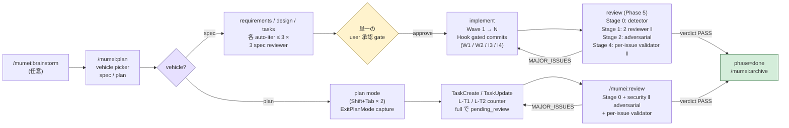

# mumei

[](./LICENSE)
[](https://github.com/hir4ta/mumei/actions/workflows/ci.yml)
[](https://github.com/hir4ta/mumei/actions/workflows/codeql.yml)
[](https://scorecard.dev/viewer/?uri=github.com/hir4ta/mumei)
[](https://slsa.dev/spec/v1.0/levels#build-l3)
[](https://www.sigstore.dev)
[](https://github.com/hir4ta/mumei/network/updates)

Claude Code 用の Quality Enforcement Layer。

spec の phase、Wave commit、review を Hook で物理的に強制します。「実行してください」と prompt するのではなく、エージェントが従えない OS の境界で tool 呼び出しを拒否します。

[English README](./README.md)



## 目次

- [Features](#features)
- [なぜ](#なぜ)
- [Commands](#commands)
- [二つの vehicle: `spec` と `plan`](#二つの-vehicle-spec-と-plan)
- [Security & supply chain](#security--supply-chain)
- [Philosophy: なぜ mumei (無名)](#philosophy-なぜ-mumei-無名)
- [Workflow](#workflow)
- [前提ツール](#前提ツール)
- [インストール](#インストール)
- [プロジェクト構成](#プロジェクト構成-mumeiinit-後)
- [Spec / tasks フォーマット](#spec--tasks-フォーマット)
- [Hook ルール](#hook-ルール)
- [Troubleshooting](#troubleshooting)
- [`mumei` がやらないこと](#mumei-がやらないこと)
- [Architecture](#architecture)
- [License](#license)

## Features

- **Hook で物理的に強制される phase** — spec が未完成のうちは `src/` を編集できず、Wave 内に `[ ]` の task が残っているうちは `git commit` できず、verdict が `MAJOR_ISSUES` のままだと `git push` できません。エージェントは prompt-level で回避できません。
- **決定論的な security ground-truth** — `semgrep` + `osv-scanner` を LLM reviewer の前に走らせ、HIGH の finding が出たら verdict を `MAJOR_ISSUES` に固定。LLM が本物の CVE を勝手に「軽い問題」と再判定することはできません。
- **3 つの spec reviewer** — `requirements` / `design` / `tasks` の reviewer が各々 fresh context で動き、draft → reviewer のループを最大 3 回まで自動で回します。コードを書く前に「会話の取りこぼし」と「会話に出てこなかった AC の混入」を catch します。
- **Wave 単位の commit** — 1 Wave = 1 commit。Hook が diff を各 task の `_Files:_` メタと突き合わせて、phantom completion (実装の diff が無いのに `[x]` を付ける) をブロックします。
- **3 reviewer + adversarial + validator pipeline** — `spec-compliance` / `security` (並列) と `adversarial` (sequential、prior_findings injection 付き) が走り、各 finding は severity 条件付き per-issue validator (fresh context、memory: local read-only) が再検証して偽陽性を取り除きます。
- **curator-gated な reviewer memory** — reviewer agent は `.claude/agent-memory/<r>/MEMORY.md` に直接書き込めません (M1 hook で deny)。代わりに review ごとに最大 5 件の候補を emit し、独立した `memory-curator` (sonnet、read-only) が 7 軸 rubric で score、`>= 15/21` の候補だけを atomic helper で永続化します。
- **署名 + provenance 付きリリース** — Sigstore keyless 署名、SLSA Level 3 provenance、CycloneDX SBOM、署名 commit + tag を全リリースに同梱。詳細は [Security & supply chain](#security--supply-chain)。
- **黒子 (kuroko) スタンス** — opt-in していないプロジェクトには副作用ゼロ。`.mumei/current` がなければ Hook はすべて no-op。テレメトリも、`.mumei/` の外への書き込みも、auto-commit も、auto-fix もしません。

## なぜ

AI コーディングエージェントはステップを飛ばしがちです。テストを書かないまま task を完了マークしたり、テストが通っていない状態で commit したり、ユーザーが頼んでいない要件を勝手に追加したり、レビューが終わる前に「機能は完成しました」と言ってしまったりします。

`mumei` はこういった挙動を tool 呼び出しの段階で止めます。「テストを必ず実行してください」と prompt で指示する方法だとエージェントは無視できますが、mumei は tool 呼び出し自体を OS の境界で拒否するため、構造的に回避できません。

## Commands

| コマンド                      | 説明                                                                                                                                                                                                                                                |
| ----------------------------- | --------------------------------------------------------------------------------------------------------------------------------------------------------------------------------------------------------------------------------------------------- |
| `/mumei:init`                 | プロジェクトごとの一回限りのセットアップ。`.mumei/` を作成し、`CLAUDE.md` への追加内容を diff preview 付きで提案します。                                                                                                                            |
| `/mumei:brainstorm <feature>` | spec を書き始める前の Q&A loop (最大 3 round × 5 質問)。出力は `.mumei/scratch/<feature>.md` に保存。                                                                                                                                               |
| `/mumei:plan [feature]`       | 新規 feature では vehicle picker (`spec` = フル SDD / `plan` = Claude plan-mode ラッパー)。既存 feature は自動 resume。spec vehicle: clarification → requirements → design → tasks (各々最大 3 回 auto-review) → 単一承認 → Wave by Wave → review。 |
| `/mumei:review`               | plan vehicle 専用の review pipeline。`pending_review=true` の状態で Stage 0 detector + security-reviewer + adversarial-reviewer + per-issue validator を現在の diff に対して回します。                                                              |
| `/mumei:archive <feature>`    | `done` になった feature を `.mumei/archive/<YYYY-MM>/<feature>/` に移動。vehicle (specs/ または plans/) を自動判定し、`scratch/<feature>.md` も `scratch.md` として一緒に持ち越します。                                                             |

## 二つの vehicle: `spec` と `plan`

mumei は **Quality Enforcement Layer** であり、本質は phase 遷移 / commit / push gate / review 完了の Hook 強制です。feature を gate に向けて駆動する手段が **vehicle** で、二種類あります。

- **`spec`** — フル SDD ワークフロー。`requirements.md` / `design.md` / `tasks.md` を draft し、3 つの spec reviewer を独立に走らせ、user の承認 gate を一度通したあと Wave by Wave に実装し、最後に 4-stage review。User Story / EARS AC / アーキ図が必要な大きめの feature 向け。
- **`plan`** — Claude Code の plan mode + `TaskCreate` の薄いラッパー。`/mumei:plan` で plan を選んだあと `Shift+Tab` × 2 で plan mode に入り、plan を承認すると Claude が task list を実行します。mumei は plan を `.mumei/plans/<slug>/plan.md` として捕捉し、`TaskCreated` / `TaskCompleted` で進捗を追い、全部完了 (`pending_review=true`) で session 終了と `git push` を gate します。

両 vehicle で review pipeline (Stage 0 detector + security + adversarial + per-issue validator + memory-curator)、`MUMEI_BYPASS=1` escape、`/mumei:archive` cleanup は共通。SDD ワークフローが過剰なら `plan`、要件とコードの明示的トレースが要るなら `spec` を選びます。

## Security & supply chain

mumei は ランタイムと配布物の両面で defense-in-depth を取ります。

**ランタイム (ローカル環境):**

| 項目             | 動作                                                                                                                             |
| ---------------- | -------------------------------------------------------------------------------------------------------------------------------- |
| **外部通信**     | mumei 自身は発生させません。`osv-scanner` (third-party detector) は CVE データのため `osv.dev` に問い合わせます (mumei 制御外)。 |
| **テレメトリ**   | なし。analytics、エラー報告、利用追跡は一切しません。                                                                            |
| **データ保管**   | すべてプロジェクトローカルの `.mumei/` 配下。`~/.claude/` などグローバル領域への書き込みは一切しません。                         |
| **使用ツール**   | `bash`、`jq`、`git` (必須)、review phase で `semgrep`、`osv-scanner` (必須)。すべてローカル実行可能。                            |
| **escape hatch** | `MUMEI_BYPASS=1` 環境変数。単一ルール、auditable。per-rule bypass や feature flag は無し。                                       |

**配布物 (インストールする artifact):**

- **Sigstore keyless 署名** — リリース tarball は OIDC で署名済、cosign で検証可能 (秘密鍵管理不要)。
- **SLSA Level 3 provenance** — `slsa-github-generator` reusable workflow で build provenance attestation を生成。
- **CycloneDX SBOM** — `mumei-sbom.cdx.json` を release asset として公開、Grype / Syft で取り込み可。
- **署名 commit + tag** — `main` は GPG/SSH 署名必須、release tag は annotated + signed。
- **strict cosign cert-identity** — verification は `release-reusable.yml@refs/tags/` のフルパスに pin、悪意ある sibling workflow が署名を偽造する経路を閉じています。

ダウンロードしたリリースの検証:

```bash
cosign verify-blob \
  --bundle "mumei-${TAG}.tar.gz.cosign.bundle" \
  --certificate-identity-regexp '^https://github.com/hir4ta/mumei/\.github/workflows/release-reusable\.yml@refs/tags/' \
  --certificate-oidc-issuer https://token.actions.githubusercontent.com \
  "mumei-${TAG}.tar.gz"
# 期待値: Verified OK
```

完全なセキュリティモデル: [SECURITY.md](./SECURITY.md) (脆弱性報告)、[docs/security-policy.md](./docs/security-policy.md) (tarball / SBOM / SLSA / signed tag の検証手順)、[docs/threat-model.md](./docs/threat-model.md) (脅威面と緩和策)、[PRIVACY.md](./PRIVACY.md)。

## Philosophy: なぜ mumei (無名)

`mumei` (無名、"no name") は[黒衣 (kuroko)](https://en.wikipedia.org/wiki/Kuroko) — 黒装束で「いないこと」になっている日本の舞台補助のことです。役者が気付かないうちに物理的に支える仕事をします。

`mumei` は Claude Code に対して同じ役を演じます。

- **ユーザーは Claude Code と対話する、mumei とは対話しない。** mumei は prompt にも会話にも顔を出しません。
- **OS の境界でしか動かない。** エージェントが phase をスキップする、壊れた Wave を commit する、`MAJOR_ISSUES` の verdict を push しようとする — その瞬間に Hook が静かに deny して、1 行の事実ベースの reason を返します。煽らず、バナーも出さず、意見も言いません。
- **opt-in していないプロジェクトには何もしない。** `.mumei/current` がなければ Hook はすべて no-op。
- **既存の gate は便利機能ではなく、構造的な対抗手段。** Microsoft Research の [DELEGATE-52](./docs/document-corruption.md) のような研究が示すように、フロンティア LLM は 20 回の delegate edit でドキュメント内容の 25% を破壊します。エージェント harness はこの劣化を救えません。mumei の「厳しいワークフロー」は役者が気付かない落下を支える kuroko の手のようなもの。

mumei は「何をしたか」ではなく「何を防いだか」で評価されます。

## Workflow

### 1. セットアップとブレスト (任意)

```text
/mumei:init                       # プロジェクトごと一回
/mumei:brainstorm user-auth       # spec 前の Q&A → .mumei/scratch/user-auth.md
```

`/mumei:init` は `.mumei/` を作成し `CLAUDE.md` への追加内容を diff preview 付きで提案します。`/mumei:brainstorm` は最大 3 round × 5 問、結果を次の step に渡します。

### 2. spec を生成する

```text
/mumei:plan user-auth
```

clarification → requirements → design → tasks を歩きます。各 draft は fresh context の reviewer (`requirements-reviewer` / `design-reviewer` / `tasks-reviewer`) が独立に audit、最大 3 回まで自動で iterate します。phase 遷移は hook gate: `requirements.md` に `[NEEDS CLARIFICATION]` が残っているうちは `design.md` を draft できません。3 reviewer 全 PASS の後、user が package 全体を 1 度だけ承認して phase が `implement` に進みます。

### 3. Wave ごとに実装する

Wave 1 の task を実装。`[x]` を付けます。Hook が verify: 実装ファイルが実際に変わっているか (phantom completion 防止)、`_Files:_` の scope を出ていないか、テストが通っているか、次の Wave に入る前に commit したか。

### 4. レビュー / 完了 / archive

すべての task が `[x]` になると review pipeline が起動:

```text
Stage 0:    pre-review-detector (semgrep + osv-scanner)            ← 決定論的 ground-truth
Stage 1 ‖:  spec-compliance + security (HIGH detector finding 時は skip)
Stage 2:    adversarial-reviewer (prior_findings injection)
Stage 3:    findings 集約
Stage 4 ‖:  per-issue validator × N (severity 条件付き)
Stage 5:    valid (or valid_by_assertion) のみ surface
Stage 6:    reviews/<ts>.json 永続化 + verdict 集計
Stage 6.5:  memory-curator が reviewer の memory_candidates を 7 軸 rubric で score (>=15/21 → ADD/UPDATE)
```

verdict `PASS` で `phase: done`。`/mumei:archive <feature>` で feature を `.mumei/archive/<YYYY-MM>/` に移動します。

## 前提ツール

mumei の review pipeline は 2 つの決定論的 detector を ground-truth として要求します。**hard prerequisite** で、片方でも欠けると review-phase Hook が fail-closed します。

| ツール                  | 用途                        | インストール                                                                                                   |
| ----------------------- | --------------------------- | -------------------------------------------------------------------------------------------------------------- |
| `semgrep` (≥ 1.50.0)    | SAST、OWASP Top 10 パターン | `brew install semgrep` (macOS)、`pip install semgrep` (Linux)                                                  |
| `osv-scanner` (≥ 1.7.0) | CVE / 依存脆弱性チェック    | `brew install osv-scanner` (macOS)、[release バイナリ](https://github.com/google/osv-scanner/releases) (Linux) |

`MUMEI_DETECTOR_TIMEOUT` (デフォルト `600` 秒) で per-detector の wall-clock timeout を調整できます。

## インストール

mumei は自前のマーケットプレイスを同梱しています。Claude Code 内で:

```text
/plugin marketplace add hir4ta/mumei
/plugin install mumei@mumei
/reload-plugins
```

インストール後、プロジェクトごとの一回限りのセットアップ:

```text
/mumei:init
```

アンインストール: `/plugin uninstall mumei@mumei` (プロジェクト内の `.mumei/` ディレクトリはそのまま残ります)。

## プロジェクト構成 (`/mumei:init` 後)

```text
your-project/
├── CLAUDE.md         # mumei 規約が追記されます (diff を承認した場合)
├── .gitignore        # `.claude/agent-memory-local/` が追加されます
└── .mumei/
    ├── .gitignore    # 開発者個別 state (`current`, `specs/*/state.json`) を ignore
    ├── current       # active feature slug (初回 /mumei:plan まで空)
    ├── specs/        # /mumei:plan が作成: requirements.md, design.md, tasks.md, state.json, spec-reviews/, reviews/
    ├── archive/      # /mumei:archive が移動: <YYYY-MM>/<feature>/
    └── scratch/      # /mumei:brainstorm の出力。チーム共有のため git 管理
```

## Spec / tasks フォーマット

**Spec (User Story + EARS + inline annotation):**

```markdown
# User Auth Requirements

## User Story

登録ユーザーとして、メールとパスワードでログインしたい。自分のデータにアクセスするため。

## Acceptance Criteria

- REQ-1.1 [CONFIRMED] WHEN 有効な認証情報を提出したら、システムは SHALL session cookie を発行する。
- REQ-1.2 [ASSUMPTION] WHILE ユーザーがログイン中、システムは SHALL 30 分ごとに session を refresh する。
- REQ-1.3 [NEEDS CLARIFICATION: どの IdP?] WHERE SSO が有効なとき、システムは SHALL 設定された IdP に委任する。
```

annotation: `[CONFIRMED]` (ユーザー発言で裏付け)、`[ASSUMPTION]` (合理的な推定)、`[NEEDS CLARIFICATION: ...]` (解決まで phase 遷移を block)。

**Tasks (Wave > Task、メタ必須):**

```markdown
## Wave 1: Setup

**Goal**: User model と DB schema を整える。
**Verify**: `npm run db:migrate` が成功する。

- [ ] 1.1 src/models/user.ts に User model を作成
  - _Files: src/models/user.ts_
  - _Depends: -_
  - _Requirements: REQ-1.1_
```

`_Files:_` / `_Depends:_` / `_Requirements:_` は **必須**。Hook gate がこれに依存します。

## Hook ルール

mumei は phase 遷移 / Wave 境界 / commit / push gate / reviewer memory write にわたって **15 個の hook ルール** を強制します。完全な enforcement table (rule ID、phase、hook event、トリガー、実装スクリプト) は [ARCHITECTURE.md → Hook rules](./ARCHITECTURE.md#hook-rules--full-enforcement-table) にあります。escape hatch は `MUMEI_BYPASS=1` 一つだけ。

## Troubleshooting

| 症状                                                                           | 解決                                                                                                                                             |
| ------------------------------------------------------------------------------ | ------------------------------------------------------------------------------------------------------------------------------------------------ |
| `Edit` が `"phase=plan"` 理由で deny (P1/P2/P3)                                | `/mumei:plan <feature>` を走らせ `[NEEDS CLARIFICATION]` を解決。3 spec reviewer 全 PASS + 承認で phase が advance。                             |
| `Edit` が `"out of scope"` / `"depends on task"` / `"uncommitted"` で deny     | `_Files:_` を調整 / 依存 task を完了 / 直前の Wave を先に commit (I1 / I2 / W1)。                                                                |
| `git commit` が `"Wave has incomplete tasks"` または `"Tests failing"` で deny | 残った `[ ]` を `[x]` に (実装 file が実際に変わっていることが条件)、もしくはテスト失敗を修正 (W2 / I3)。                                        |
| `[x]` が `"Phantom completion"` で blockされた (I4)                            | 対象 `_Files:_` を実際に編集してから `[x]`、または `[x]` を revert。                                                                             |
| `git push` が `"verdict: MAJOR_ISSUES"` で deny (R2)                           | `/mumei:plan` (plan vehicle なら `/mumei:review`) で findings を解消し、再 review。                                                              |
| Stop hook で session 終了が block (`R1` review 未実行 / `R3` archive 未実行)   | `/mumei:plan` で review を開始、verdict PASS 後に `/mumei:archive <feature>`。                                                                   |
| `Edit` が `.claude/agent-memory/<r>/MEMORY.md` で deny (M1)                    | reviewer memory は curator-gated。review JSON で候補を emit すれば orchestrator が curator スコア後に永続化します。                              |
| `pre-review-detector.sh` が exit 2 ("missing required detector binaries")      | `semgrep` + `osv-scanner` をインストール ([前提ツール](#前提ツール) 参照)。                                                                      |
| 単発で Hook を bypass したい                                                   | `MUMEI_BYPASS=1 <command>` をその shell 起動に限って付与。export はしない。詳細は [docs/document-corruption.md](./docs/document-corruption.md)。 |

## `mumei` がやらないこと

- CI/CD ツールではない。Hook は Claude Code 内でのみ動作。
- コードレビューサービスではない。reviewer はあなたの Claude Code 契約でローカル実行。
- SDD adapter ではない。mumei は独自の spec フォーマットを持ち、他 SDD ツールと統合しない (並列共存)。
- 多 tool 対応ではない。Cursor / Codex / Aider はサポート外。物理的強制レイヤーは Claude Code Hook 固有。
- ストレージシステムではない。state は plain file。DB なし、MCP server なし。

## Architecture

ランタイム構造の詳細 (配布物レイアウト、15 hook ルール、reviewer pipeline、phase state machine、ファイルベース state model) は [ARCHITECTURE.md](./ARCHITECTURE.md) を参照。

## License

MIT
