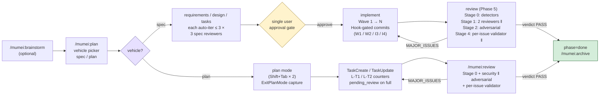

# mumei

[](./LICENSE)
[](https://github.com/hir4ta/mumei/actions/workflows/ci.yml)
[](https://github.com/hir4ta/mumei/actions/workflows/codeql.yml)
[](https://scorecard.dev/viewer/?uri=github.com/hir4ta/mumei)
[](https://slsa.dev/spec/v1.0/levels#build-l3)
[](https://www.sigstore.dev)
[](https://github.com/hir4ta/mumei/network/updates)

<div align="center">
  
</div>

Quality Enforcement Layer for Claude Code.

Hook-enforced spec phases, Wave commits, and reviews — at the OS boundary, not via prompt-level instructions the agent can ignore.

[日本語版 README](./README.ja.md)

## Installation

mumei ships its own self-hosted marketplace. Inside Claude Code, run:

```text
/plugin marketplace add hir4ta/mumei
/plugin install mumei@mumei
/reload-plugins
```

After install, run the one-time per-project setup:

```text
/mumei:init
```

Uninstall: `/plugin uninstall mumei@mumei` (the `.mumei/` directory in your project is left intact).

Prerequisites: `semgrep` + `osv-scanner` for the review-phase detectors. See [docs/getting-started.md → Prerequisites](./docs/getting-started.md#prerequisites) for install commands.

## 30-second tour



## Features

- **Hook-enforced phases** — phase / Wave / commit / push transitions are denied at the tool-call boundary; the agent cannot prompt its way around them.
- **Deterministic security ground-truth** — `semgrep` + `osv-scanner` run before LLM reviewers. HIGH findings pin the verdict to `MAJOR_ISSUES`.
- **3 spec reviewers + 4-stage review pipeline** — independent `requirements` / `design` / `tasks` reviewers on fresh contexts (auto-iter ≤ 3); `spec-compliance` + `security` parallel, then `adversarial`, then per-issue validator. `requirements-reviewer` audits AC `examples_coverage` (zero examples on high-risk AC, actor-trigger inconsistency) and `requirement_smell` (ambiguity / vagueness / incompleteness).
- **Wave-based commits** — 1 Wave = 1 commit. Hooks cross-check the diff against each task's `_Files:_` to block phantom completion.
- **Curator-gated reviewer memory** — independent `memory-curator` (sonnet, read-only) scores candidates on a 7-axis rubric; only `≥ 15/21` is persisted.
- **Signed, attestable releases** — Sigstore keyless signing, SLSA Level 3, CycloneDX SBOM, signed commits + tags. See [docs/getting-started.md → Security & supply chain](./docs/getting-started.md#security--supply-chain).
- **Kuroko (黒衣) stance** — zero side effects on projects that have not opted in. No `.mumei/current` = every Hook is a no-op. No telemetry.

## Commands

| Command                       | Description                                                                                                                                                                                                                                                             |
| ----------------------------- | ----------------------------------------------------------------------------------------------------------------------------------------------------------------------------------------------------------------------------------------------------------------------- |
| `/mumei:init`                 | One-time per-project setup. Creates `.mumei/`, proposes additions to `CLAUDE.md` with diff preview.                                                                                                                                                                     |
| `/mumei:brainstorm <feature>` | Optional pre-spec Q&A loop (max 3 rounds × 5 questions). Output saved to `.mumei/scratch/<feature>.md`.                                                                                                                                                                 |
| `/mumei:plan [feature]`       | Vehicle picker for new features (`spec` for full SDD or `plan` for Claude plan-mode wrapper); auto-resumes existing features. Spec vehicle: clarification → requirements → design → tasks (each auto-reviewed up to 3 times) → single approval → Wave-by-Wave → review. |
| `/mumei:review`               | Plan-vehicle review pipeline. Runs Stage 0 detector + security-reviewer + adversarial-reviewer + per-issue validator against the current diff once `pending_review=true` (set when the last `TaskCompleted` matches `task_created_count`).                              |
| `/mumei:archive <feature>`    | Moves a `done` feature to `.mumei/archive/<YYYY-MM>/<feature>/`. Auto-detects vehicle (specs/ or plans/) and carries `scratch/<feature>.md` along as `scratch.md`.                                                                                                      |

## What `mumei` is NOT

- Not a CI/CD tool. Hooks run inside Claude Code only.
- Not a code review service. Reviewers run locally via your Claude Code subscription.
- Not a SDD adapter. mumei has its own opinionated spec format.
- Not multi-tool. Cursor / Codex / Aider are not supported. The physical enforcement layer is Claude Code Hooks.
- Not a storage system. State is plain files. No DB, no MCP server.

## Documentation

- **[docs/getting-started.md](./docs/getting-started.md)** — long-form walkthrough: two vehicles, workflow, spec & tasks format, prerequisites, project layout, hook rules, troubleshooting.
- **[ARCHITECTURE.md](./ARCHITECTURE.md)** — runtime structure, distribution layout, full 16-rule enforcement table, reviewer pipeline, file-based state model.
- **[docs/opus-4-7-playbook.md](./docs/opus-4-7-playbook.md)** — practical guidance for running mumei on Claude Opus 4.7 (proactive `/compact`, subagent cost, prompt cache, byte-exact tools, `MUMEI_BYPASS=1` discipline).
- **[SECURITY.md](./SECURITY.md)** + **[docs/security-policy.md](./docs/security-policy.md)** + **[docs/threat-model.md](./docs/threat-model.md)** + **[PRIVACY.md](./PRIVACY.md)** — supply-chain verification, threat model, privacy.

## License

MIT
