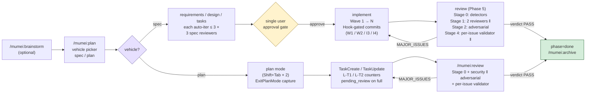

# mumei

[](./LICENSE)
[](https://github.com/hir4ta/mumei/actions/workflows/ci.yml)
[](https://github.com/hir4ta/mumei/actions/workflows/codeql.yml)
[](https://scorecard.dev/viewer/?uri=github.com/hir4ta/mumei)
[](https://slsa.dev/spec/v1.0/levels#build-l3)
[](https://www.sigstore.dev)
[](https://github.com/hir4ta/mumei/network/updates)

Quality Enforcement Layer for Claude Code.

Hook-enforced spec phases, Wave commits, and reviews — at the OS boundary, not via prompt-level instructions the agent can ignore.

[日本語版 README](./README.ja.md)



## Contents

- [Features](#features)
- [Why](#why)
- [Commands](#commands)
- [Two vehicles: `spec` and `plan`](#two-vehicles-spec-and-plan)
- [Security & supply chain](#security--supply-chain)
- [Philosophy: why "mumei" (無名)](#philosophy-why-mumei-無名)
- [Workflow](#workflow)
- [Prerequisites](#prerequisites)
- [Installation](#installation)
- [Project layout](#project-layout-after-mumeiinit)
- [Spec & tasks format](#spec--tasks-format)
- [Hook rules](#hook-rules)
- [Troubleshooting](#troubleshooting)
- [What `mumei` is NOT](#what-mumei-is-not)
- [Architecture](#architecture)
- [License](#license)

## Features

- **Hook-enforced phases** — Cannot edit `src/` while spec is incomplete, cannot `git commit` with `[ ]` tasks remaining, cannot `git push` while review verdict is `MAJOR_ISSUES`. Enforcement is at the tool-call boundary; the agent cannot prompt its way around it.
- **Deterministic security ground-truth** — `semgrep` + `osv-scanner` run before LLM reviewers. HIGH findings pin the verdict to `MAJOR_ISSUES` so the LLM cannot downgrade a real CVE.
- **3 spec reviewers** — Independent `requirements` / `design` / `tasks` reviewers on fresh contexts, auto-iterating draft → reviewer up to 3 times. Catches missing requirements and hallucinated acceptance criteria before code is written.
- **Wave-based commits** — 1 Wave = 1 commit. Hooks cross-check the diff against each task's `_Files:_` meta to block phantom completion (marking `[x]` without an actual implementation).
- **3-reviewer pipeline + adversarial + validator** — `spec-compliance` / `security` (parallel) plus `adversarial` (sequential, sees prior findings via injection), plus a severity-conditional per-issue validator on a fresh context that filters false positives before findings reach the user.
- **Curator-gated reviewer memory** — Reviewer agents do not write to their own memory; an independent `memory-curator` (sonnet, read-only) scores candidates on a 7-axis rubric and only `≥ 15/21` is persisted via atomic helpers. Direct LLM Edit/Write to reviewer memory is denied at the hook layer.
- **Signed, attestable releases** — Sigstore keyless signing, SLSA Level 3 provenance, CycloneDX SBOM, signed commits + tags. See [Security & supply chain](#security--supply-chain).
- **Kuroko (黒衣) stance** — Zero side effects on projects that have not opted in. No `.mumei/current` = every Hook is a no-op. No telemetry, no writes outside `.mumei/`, no auto-commit, no auto-fix.

## Why

AI coding agents skip steps. They mark tasks complete without writing tests. They commit with failing tests. They invent requirements that the user never asked for. They claim a feature is done before review runs.

`mumei` blocks those moves at the tool-call layer — not by prompting "you must run tests" (which the agent can ignore), but by denying the tool call at the OS boundary.

## Commands

| Command                       | Description                                                                                                                                                                                                                                                             |
| ----------------------------- | ----------------------------------------------------------------------------------------------------------------------------------------------------------------------------------------------------------------------------------------------------------------------- |
| `/mumei:init`                 | One-time per-project setup. Creates `.mumei/`, proposes additions to `CLAUDE.md` with diff preview.                                                                                                                                                                     |
| `/mumei:brainstorm <feature>` | Optional pre-spec Q&A loop (max 3 rounds × 5 questions). Output saved to `.mumei/scratch/<feature>.md`.                                                                                                                                                                 |
| `/mumei:plan [feature]`       | Vehicle picker for new features (`spec` for full SDD or `plan` for Claude plan-mode wrapper); auto-resumes existing features. Spec vehicle: clarification → requirements → design → tasks (each auto-reviewed up to 3 times) → single approval → Wave-by-Wave → review. |
| `/mumei:review`               | Plan-vehicle review pipeline. Runs Stage 0 detector + security-reviewer + adversarial-reviewer + per-issue validator against the current diff once `pending_review=true` (set when the last `TaskCompleted` matches `task_created_count`).                              |
| `/mumei:archive <feature>`    | Moves a `done` feature to `.mumei/archive/<YYYY-MM>/<feature>/`. Auto-detects vehicle (specs/ or plans/) and carries `scratch/<feature>.md` along as `scratch.md`.                                                                                                      |

## Two vehicles: `spec` and `plan`

mumei is a **Quality Enforcement Layer** — its primary job is the Hook-driven physical enforcement of phase transitions, commit / push gates, and review completion. The way you _drive_ a feature toward those gates is called a **vehicle**, and mumei ships two:

- **`spec`** — the full SDD workflow. Drafts `requirements.md` / `design.md` / `tasks.md`, runs three independent spec reviewers, opens a single user approval gate, then implements Wave by Wave with per-Wave commits and a final 4-stage review. Use when a feature is large enough to benefit from explicit user stories, EARS acceptance criteria, and an architecture diagram.
- **`plan`** — a thin wrapper around Claude Code's native plan mode + `TaskCreate`. After `/mumei:plan` selects this vehicle, you press `Shift+Tab` twice to enter plan mode, accept the plan, and let Claude execute the resulting task list. mumei captures the plan into `.mumei/plans/<slug>/plan.md`, tracks task completion via `TaskCreated` / `TaskCompleted` hooks, and once every task is complete (`pending_review=true`) gates session-end and `git push` until you run `/mumei:review`.

Both vehicles share the same review pipeline (Stage 0 detector + security + adversarial + per-issue validator + memory-curator), the same `MUMEI_BYPASS=1` escape hatch, and the same `/mumei:archive` cleanup. Pick `plan` when the SDD workflow feels heavier than the work itself; pick `spec` when explicit traceability between requirements and code is worth the friction.

## Security & supply chain

mumei takes a defense-in-depth posture for both runtime safety and the artifacts you install.

**Runtime (your local environment):**

| Aspect                     | Behaviour                                                                                                                         |
| -------------------------- | --------------------------------------------------------------------------------------------------------------------------------- |
| **External communication** | None initiated by mumei. `osv-scanner` (third-party detector) queries `osv.dev` for CVE data; mumei does not control its network. |
| **Telemetry**              | None. No analytics, no error reporting, no usage tracking.                                                                        |
| **Data storage**           | All state under project-local `.mumei/`. Nothing written to `~/.claude/` or any global location.                                  |
| **Tools used**             | `bash`, `jq`, `git` (required); `semgrep`, `osv-scanner` (required for review phase). All locally executable.                     |
| **Escape hatch**           | `MUMEI_BYPASS=1` env var, single rule, audited. No per-rule bypass, no feature flags.                                             |

**Distribution (the artifacts you install):**

- **Sigstore keyless signing** — every release tarball is signed via OIDC; cosign-verifiable, no private keys to manage.
- **SLSA Level 3 provenance** — build provenance attestation generated by the `slsa-github-generator` reusable workflow.
- **CycloneDX SBOM** — `mumei-sbom.cdx.json` published as a release asset, ingestable by Grype / Syft / etc.
- **Signed commits + tags** — `main` requires verified GPG/SSH signatures; release tags are annotated and signed.
- **Strict cosign cert-identity** — verification pins to the exact `release-reusable.yml@refs/tags/` path so a malicious sibling workflow cannot forge a signature.

Verify a downloaded release:

```bash
cosign verify-blob \
  --bundle "mumei-${TAG}.tar.gz.cosign.bundle" \
  --certificate-identity-regexp '^https://github.com/hir4ta/mumei/\.github/workflows/release-reusable\.yml@refs/tags/' \
  --certificate-oidc-issuer https://token.actions.githubusercontent.com \
  "mumei-${TAG}.tar.gz"
# Expect: Verified OK
```

Full security model: [SECURITY.md](./SECURITY.md) (vulnerability reporting), [docs/security-policy.md](./docs/security-policy.md) (verification recipes for tarball / SBOM / SLSA / signed tag), [docs/threat-model.md](./docs/threat-model.md) (threat surface and mitigations), [PRIVACY.md](./PRIVACY.md).

## Philosophy: why "mumei" (無名)

`mumei` (Japanese: 無名, "no name") is a [kuroko](https://en.wikipedia.org/wiki/Kuroko) — the Japanese stage assistant dressed in black, invisible by convention, whose job is to physically support the actor without being noticed.

`mumei` plays the same role for Claude Code:

- **The user works with Claude Code, not with mumei.** mumei stays out of the prompt, out of the conversation, out of the way.
- **It only acts at the OS boundary.** When the agent is about to skip a phase, commit a broken Wave, or push a `MAJOR_ISSUES` verdict, a Hook silently denies the action with a one-line factual reason. No nagging, no banners, no opinions.
- **It does nothing for projects that have not opted in.** Without `.mumei/current` set, every Hook is a no-op.
- **The existing gates are structural countermeasures, not convenience features.** They counter the degradation patterns documented in research like Microsoft Research's [DELEGATE-52](./docs/document-corruption.md) — frontier LLMs corrupt 25% of document content over 20 delegated edits, and agentic harnesses don't help. mumei's "strict workflow" is the kuroko's hand catching a fall the actor never sees.

mumei is judged by what it prevents, not by what it does.

## Workflow

### 1. Setup and (optionally) brainstorm

```text
/mumei:init                       # one-time per project
/mumei:brainstorm user-auth       # optional pre-spec Q&A → .mumei/scratch/user-auth.md
```

`/mumei:init` creates `.mumei/` and proposes additions to `CLAUDE.md` with a diff preview. `/mumei:brainstorm` runs up to 3 rounds × 5 questions, captured for the next step.

### 2. Generate the spec

```text
/mumei:plan user-auth
```

Walks through clarification → requirements → design → tasks. Each draft is independently audited by a fresh-context reviewer (`requirements-reviewer` / `design-reviewer` / `tasks-reviewer`), auto-iterating up to 3 times. Phase transitions are hook-gated: you cannot draft `design.md` while `requirements.md` has unresolved `[NEEDS CLARIFICATION]` markers, etc. After all three reviewers PASS, you approve the whole package once before phase advances to `implement`.

### 3. Implement Wave by Wave

Implement Wave 1's tasks. Mark `[x]` as you go. Hooks verify: implementation files actually changed (no phantom completion), no editing outside `_Files:_` scope, tests pass before commit, commit happens before starting the next Wave.

### 4. Review, done, archive

When all tasks are `[x]`, the review pipeline runs:

```text
Stage 0:    pre-review-detector (semgrep + osv-scanner)            ← deterministic ground-truth
Stage 1 ‖:  spec-compliance + security (skipped if HIGH detector findings)
Stage 2:    adversarial-reviewer (prior_findings injected)
Stage 3:    aggregate findings
Stage 4 ‖:  per-issue validator × N (severity-conditional)
Stage 5:    filter to valid (or valid_by_assertion) only
Stage 6:    persist reviews/<ts>.json + verdict aggregation
Stage 6.5:  memory-curator scores reviewer-emitted candidates (7-axis ≥15/21 → ADD/UPDATE)
```

Verdict `PASS` → `phase: done`. Run `/mumei:archive <feature>` to move the feature under `.mumei/archive/<YYYY-MM>/`.

## Prerequisites

mumei's review pipeline relies on two deterministic detectors as ground truth for security findings. These are **hard prerequisites** — the review-phase Hook fails closed when either is missing.

| Tool                    | Purpose                              | Install                                                                                                      |
| ----------------------- | ------------------------------------ | ------------------------------------------------------------------------------------------------------------ |
| `semgrep` (≥ 1.50.0)    | SAST, OWASP Top 10 patterns          | `brew install semgrep` (macOS), `pip install semgrep` (Linux)                                                |
| `osv-scanner` (≥ 1.7.0) | CVE / dependency vulnerability check | `brew install osv-scanner` (macOS), [release binary](https://github.com/google/osv-scanner/releases) (Linux) |

`MUMEI_DETECTOR_TIMEOUT` (default `600` seconds) tunes the per-detector wall-clock timeout; raise for very large repos.

## Installation

mumei ships its own self-hosted marketplace. Inside Claude Code, run:

```text
/plugin marketplace add hir4ta/mumei
/plugin install mumei@mumei
/reload-plugins
```

After install, run the one-time per-project setup:

```text
/mumei:init
```

Uninstall: `/plugin uninstall mumei@mumei` (the `.mumei/` directory in your project is left intact).

## Project layout (after `/mumei:init`)

```text
your-project/
├── CLAUDE.md         # mumei conventions appended (if you approved the diff)
├── .gitignore        # `.claude/agent-memory-local/` appended
└── .mumei/
    ├── .gitignore    # ignores per-developer state (`current`, `specs/*/state.json`)
    ├── current       # active feature slug (empty until first /mumei:plan)
    ├── specs/        # per /mumei:plan: requirements.md, design.md, tasks.md, state.json, spec-reviews/, reviews/
    ├── archive/      # per /mumei:archive: moved under <YYYY-MM>/<feature>/
    └── scratch/      # per /mumei:brainstorm; tracked intentionally so brainstorm history is shared
```

## Spec & tasks format

**Spec (User Story + EARS + inline annotations):**

```markdown
# User Auth Requirements

## User Story

As a registered user, I want to log in with email and password, so that I can access my data.

## Acceptance Criteria

- REQ-1.1 [CONFIRMED] WHEN the user submits valid credentials, the system SHALL issue a session cookie.
- REQ-1.2 [ASSUMPTION] WHILE the user is logged in, the system SHALL refresh the session every 30 minutes.
- REQ-1.3 [NEEDS CLARIFICATION: which IdP?] WHERE SSO is enabled, the system SHALL delegate to the configured IdP.
```

Annotations: `[CONFIRMED]` (backed by user statement), `[ASSUMPTION]` (reasonable inference), `[NEEDS CLARIFICATION: ...]` (blocks phase advance until resolved).

**Tasks (Wave > Task with mandatory meta):**

```markdown
## Wave 1: Setup

**Goal**: Establish the user model and DB schema.
**Verify**: `npm run db:migrate` succeeds.

- [ ] 1.1 Create User model in src/models/user.ts
  - _Files: src/models/user.ts_
  - _Depends: -_
  - _Requirements: REQ-1.1_
```

The `_Files:_` / `_Depends:_` / `_Requirements:_` lines are **mandatory**. They power the hook gates; without them mumei cannot enforce scope or order.

## Hook rules

mumei enforces **15 hook rules** across phase transitions, Wave boundaries, commit / push gates, and reviewer memory writes. The full enforcement table (rule ID, phase, hook event, trigger, implementation script) is in [ARCHITECTURE.md → Hook rules](./ARCHITECTURE.md#hook-rules--full-enforcement-table). The single escape hatch is `MUMEI_BYPASS=1`.

## Troubleshooting

| Symptom                                                                     | Resolution                                                                                                                                                 |
| --------------------------------------------------------------------------- | ---------------------------------------------------------------------------------------------------------------------------------------------------------- |
| `Edit` denied with `"phase=plan"` reason (P1/P2/P3)                         | run `/mumei:plan <feature>` and resolve any `[NEEDS CLARIFICATION]` markers; phase advances when all 3 spec reviewers PASS and you approve                 |
| `Edit` denied with `"out of scope"` / `"depends on task"` / `"uncommitted"` | adjust `_Files:_` / complete the dependency / commit the previous Wave first (I1 / I2 / W1)                                                                |
| `git commit` denied with `"Wave has incomplete tasks"` or `"Tests failing"` | mark remaining `[ ]` tasks `[x]` (only after their `_Files:_` actually changed), or fix the failing test runner output (W2 / I3)                           |
| `[x]` mark blocked with `"Phantom completion"` (I4)                         | implement the listed `_Files:_` first, or revert the `[x]`                                                                                                 |
| `git push` denied with `"verdict: MAJOR_ISSUES"` (R2)                       | re-run `/mumei:plan` (or `/mumei:review` for plan vehicle) to address findings, then re-review                                                             |
| Stop hook blocks session end (`R1` review pending / `R3` archive pending)   | run `/mumei:plan` to start review, or `/mumei:archive <feature>` once verdict is PASS                                                                      |
| `Edit` denied on `.claude/agent-memory/<r>/MEMORY.md` (M1)                  | reviewer memory is curator-gated — emit candidates via your review JSON instead; the orchestrator persists qualifying candidates atomically                |
| `pre-review-detector.sh` exits 2 with "missing required detector binaries"  | install `semgrep` + `osv-scanner` (see [Prerequisites](#prerequisites))                                                                                    |
| Need to bypass a Hook for a one-off                                         | `MUMEI_BYPASS=1 <command>` for that single shell invocation. Do not export persistently. See [docs/document-corruption.md](./docs/document-corruption.md). |

## What `mumei` is NOT

- Not a CI/CD tool. Hooks run inside Claude Code only.
- Not a code review service. Reviewers run locally via your Claude Code subscription.
- Not a SDD adapter. mumei has its own opinionated spec format. If you already use another SDD tool, mumei does not integrate with it — they live in parallel.
- Not multi-tool. Cursor / Codex / Aider are not supported. The physical enforcement layer is Claude Code Hooks.
- Not a storage system. State is plain files. No DB, no MCP server.

## Architecture

For a deeper look at the runtime structure (distribution layout, the 15 hook rules, the reviewer pipeline, the phase state machine, the file-based state model), see [ARCHITECTURE.md](./ARCHITECTURE.md).

## License

MIT
