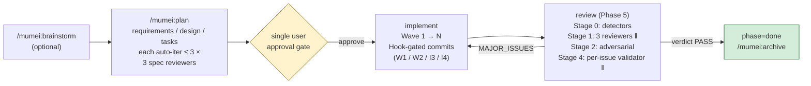

# mumei

[](https://github.com/hir4ta/mumei/releases)
[](./LICENSE)
[](https://github.com/hir4ta/mumei/actions/workflows/ci.yml)

Quality Enforcement Layer for Claude Code.

Hook-enforced spec phases, Wave commits, and reviews — at the OS boundary, not via prompt-level instructions the agent can ignore.

[日本語版 README](./README.ja.md)



## Contents

- [Features](#features)
- [Why](#why)
- [Commands](#commands)
- [Philosophy: why "mumei" (無名)](#philosophy-why-mumei-無名)
- [Workflow](#workflow)
- [Prerequisites](#prerequisites)
- [Installation](#installation)
- [Project layout](#project-layout-after-mumeiinit)
- [Spec document format](#spec-document-format)
- [Tasks document format](#tasks-document-format)
- [Hook rules](#hook-rules-full-list)
- [Security and Privacy](#security-and-privacy)
- [Troubleshooting](#troubleshooting)
- [What `mumei` is NOT](#what-mumei-is-not)
- [Architecture](#architecture)
- [License](#license)

## Features

- **Hook-enforced phases**: Cannot edit `src/` while spec is incomplete, cannot `git commit` with `[ ]` tasks remaining, cannot `git push` while review verdict is `MAJOR_ISSUES`.
- **3 spec reviewers**: Independent `requirements` / `design` / `tasks` reviewers on fresh contexts, auto-iterating draft → reviewer up to 3 times. Catches missing requirements and hallucinated acceptance criteria before code is written.
- **Wave-based commits**: 1 Wave = 1 commit. Hooks cross-check the diff against each task's `_Files:_` meta to block phantom completion (marking `[x]` without an actual implementation).
- **4-stage review pipeline**: `spec-compliance` / `code-quality` / `security` / `adversarial` reviewers, plus a per-issue validator on a fresh context (memory: local, read-only) that filters false positives before findings reach the user.
- **Deterministic security ground-truth**: `semgrep` + `osv-scanner` run before LLM reviewers. HIGH findings pin the verdict to `MAJOR_ISSUES` so the LLM cannot downgrade a real CVE.
- **Kuroko (黒衣) stance**: Zero side effects on projects that have not opted in. No `.mumei/current` = every Hook is a no-op. No telemetry, no writes outside `.mumei/`, no auto-commit, no auto-fix.

## Why

AI coding agents skip steps. They mark tasks complete without writing tests. They commit with failing tests. They invent requirements that the user never asked for. They claim a feature is done before review runs.

`mumei` blocks those moves at the tool-call layer — not by prompting "you must run tests" (which the agent can ignore), but by denying the tool call at the OS boundary.

## Commands

| Command                       | Description                                                                                                                                                                                                  |
| ----------------------------- | ------------------------------------------------------------------------------------------------------------------------------------------------------------------------------------------------------------ |
| `/mumei:init`                 | One-time per-project setup. Creates `.mumei/`, proposes additions to `CLAUDE.md` with diff preview.                                                                                                          |
| `/mumei:brainstorm <feature>` | Optional pre-spec Q&A loop (max 3 rounds × 5 questions). Output saved to `.mumei/scratch/<feature>.md`.                                                                                                      |
| `/mumei:plan <feature>`       | Drives the full lifecycle: clarification → requirements → design → tasks (each auto-reviewed up to 3 times) → single user approval → Wave-by-Wave implementation → 4-stage review with per-issue validation. |
| `/mumei:archive <feature>`    | Moves a `done` feature to `.mumei/archive/<YYYY-MM>/<feature>/`. Carries `scratch/<feature>.md` along as `scratch.md`.                                                                                       |

## Philosophy: why "mumei" (無名)

`mumei` (Japanese: 無名, "no name") is a [kuroko](https://en.wikipedia.org/wiki/Kuroko) — the Japanese stage assistant dressed in black, invisible by convention, whose job is to physically support the actor without being noticed.

`mumei` plays the same role for Claude Code:

- **The user works with Claude Code, not with mumei.** mumei stays out of the prompt, out of the conversation, out of the way.
- **It only acts at the OS boundary.** When the agent is about to skip a phase, commit a broken Wave, or push a `MAJOR_ISSUES` verdict, a Hook silently denies the action with a one-line factual reason. No nagging, no banners, no opinions.
- **It does nothing for projects that have not opted in.** Without `.mumei/current` set, every Hook is a no-op. mumei never interrupts work it was not invited to.
- **The existing gates (Wave commits, spec reviewers, fresh-context implementation reviewers, file-based state) are not just convenience features.** They are structural countermeasures against the degradation patterns documented in research like Microsoft Research's [DELEGATE-52](./docs/document-corruption.md) — frontier LLMs corrupt 25% of document content over 20 delegated edits, and agentic harnesses don't help. mumei's "strict workflow" is the kuroko's hand catching a fall the actor never sees.

mumei is judged by what it prevents, not by what it does.

## Workflow

### 1. One-time setup per project

```text
/mumei:init
```

Creates `.mumei/` directory structure, proposes additions to `CLAUDE.md` (with diff preview and explicit approval), and verifies the setup.

### 2. Brainstorm a feature (optional but recommended)

```text
/mumei:brainstorm user-auth
```

Up to 5 questions × 3 rounds. Output saved to `.mumei/scratch/user-auth.md`. Used as input for `/mumei:plan`.

### 3. Generate the spec

```text
/mumei:plan user-auth
```

Walks through:

- **Phase 1.1 — Clarification**: a brainstorm-style question loop (max 3 rounds × 5 questions). When `.mumei/scratch/<feature>.md` exists, only the residual gaps are queried.
- **Phase 1.2/1.3 — Requirements draft + reviewer**: User Story + EARS-format acceptance criteria + assumptions. The `requirements-reviewer` agent (fresh context) audits the draft against the conversation/scratch for coverage gaps, hallucinated ACs, and structural defects, and the orchestrator iterates `draft → reviewer` automatically up to 3 times.
- **Phase 2 — Design draft + reviewer**: architecture diagram, data model, components, trade-offs, Wave plan. `design-reviewer` audits requirements vs design coverage and structural quality. Same 3-iteration auto-loop.
- **Phase 3 — Tasks draft + reviewer**: Wave > Task hierarchy with `_Files:_`, `_Depends:_`, `_Requirements:_` meta. `tasks-reviewer` validates Wave Plan coverage, REQ-N.M traceability, and that every `_Files:_` path either exists or is gitignored.
- **Phase 3.5 — User approval gate**: a single approval gate (the only one). After the three spec reviewers all return PASS, the user reviews the whole package and approves once before phase advances to `implement`.

Phase entry is hook-gated. You cannot draft `design.md` while `requirements.md` has unresolved `[NEEDS CLARIFICATION]` markers, etc.

### 4. Implement Wave by Wave

Implement the tasks in Wave 1. Mark `[x]` as you go. Hooks verify:

- The implementation files actually changed (no phantom completion).
- You did not edit files outside the task's `_Files:_` scope.
- Tests pass before commit.
- Commit happens before starting the next Wave.

### 5. Review

When all tasks are `[x]`, `/mumei:plan` invokes the review pipeline:

```text
Stage 1 (parallel):
  ├─ spec-compliance-reviewer  (Sonnet, memory: project)
  ├─ code-quality-reviewer     (Sonnet, memory: project)
  └─ security-reviewer         (Opus,   memory: project)
Stage 2 (sequential):
  └─ adversarial-reviewer      (Opus,   memory: project, prior_findings)
Stage 3: aggregate findings
Stage 4 (parallel): per-issue-validator (Sonnet, memory: local, read-only) — one per finding
Stage 5: filter to valid only
Stage 6: write reviews/<timestamp>.json + update state
```

Each reviewer is independent (fresh context). No reviewer sees its own prior runs — only the project memory it has built up.

### 6. Done

When the review verdict is `PASS`, the feature transitions to `phase: done`.

```text
/mumei:archive user-auth
```

Moves the feature to `.mumei/archive/<YYYY-MM>/user-auth/`.

## Prerequisites

mumei's review pipeline relies on two deterministic detectors as ground
truth for security findings. These are **hard prerequisites** — the
review-phase Hook fails closed when either is missing (set
`MUMEI_BYPASS=1` to override, not recommended).

| Tool                    | Purpose                              | Install                                                                                                      |
| ----------------------- | ------------------------------------ | ------------------------------------------------------------------------------------------------------------ |
| `semgrep` (≥ 1.50.0)    | SAST, OWASP Top 10 patterns          | `brew install semgrep` (macOS), `pip install semgrep` (Linux)                                                |
| `osv-scanner` (≥ 1.7.0) | CVE / dependency vulnerability check | `brew install osv-scanner` (macOS), [release binary](https://github.com/google/osv-scanner/releases) (Linux) |

### Detector tunables

These are **not** escape hatches — the detectors still run. They tune
the detector behaviour for edge cases (slow scans, oversized
manifests). Defaults are appropriate for typical projects; override
only when needed.

| Variable                 | Default | Effect                                                                                                                                                            |
| ------------------------ | ------- | ----------------------------------------------------------------------------------------------------------------------------------------------------------------- |
| `MUMEI_DETECTOR_TIMEOUT` | `600`   | Per-detector wall-clock timeout in seconds (`semgrep` / `osv-scanner`). Raise for very large repos; lower in CI when a hung detector is worse than a missed scan. |

## Installation

mumei ships its own self-hosted marketplace. Inside Claude Code, run:

```text
/plugin marketplace add hir4ta/mumei
/plugin install mumei@mumei
```

That registers the marketplace catalog at `hir4ta/mumei` and installs the `mumei` plugin from it (user scope by default). Reload to activate:

```text
/reload-plugins
```

After install, run the one-time per-project setup:

```text
/mumei:init
```

- **Uninstall**: `/plugin uninstall mumei@mumei` (the `.mumei/` directory in your project is left intact).

## Project layout (after `/mumei:init`)

`/mumei:init` creates the directory skeleton only. Per-feature files appear later as you run `/mumei:brainstorm`, `/mumei:plan`, and `/mumei:archive`.

```text
your-project/
├── CLAUDE.md         # mumei conventions appended (if you approved the diff)
├── .gitignore        # `.claude/agent-memory-local/` appended (per-issue-validator memory)
└── .mumei/
    ├── .gitignore    # ignores per-developer state (`current`, `specs/*/state.json`)
    ├── current       # empty until the first /mumei:plan writes a feature slug
    ├── specs/        # populated by /mumei:plan <feature>: requirements.md, design.md, tasks.md, state.json, spec-reviews/, reviews/
    ├── archive/      # populated by /mumei:archive <feature>: moved under <YYYY-MM>/<feature>/
    └── scratch/      # populated by /mumei:brainstorm <feature>; tracked intentionally so brainstorm history is shared with the team
```

## Spec document format

`mumei` uses **User Story + EARS acceptance criteria + inline annotations**:

```markdown
# User Auth Requirements

## User Story

As a registered user, I want to log in with email and password, so that I can access my data.

## Acceptance Criteria

- REQ-1.1 [CONFIRMED] WHEN the user submits valid credentials, the system SHALL issue a session cookie.
- REQ-1.2 [CONFIRMED] IF 5 consecutive logins fail, then the system SHALL lock the account for 15 minutes.
- REQ-1.3 [ASSUMPTION] WHILE the user is logged in, the system SHALL refresh the session every 30 minutes.
- REQ-1.4 [NEEDS CLARIFICATION: which IdP?] WHERE SSO is enabled, the system SHALL delegate to the configured IdP.

## Out of Scope

- MFA (deferred to v2)

## Assumptions

- Bcrypt for password hashing (industry default)
```

Annotations:

- `[CONFIRMED]`: backed by user statement or existing artifact.
- `[ASSUMPTION]`: reasonable inference, not explicitly stated by the user.
- `[NEEDS CLARIFICATION: <question>]`: blocks `phase: design` until resolved.

## Tasks document format

```markdown
# User Auth Implementation Plan

## Wave 1: Setup

**Goal**: Establish the user model and DB schema.
**Verify**: `npm run db:migrate` succeeds.

- [ ] 1.1 Create User model in src/models/user.ts
  - _Files: src/models/user.ts_
  - _Depends: -_
  - _Requirements: REQ-1.1_
- [ ] 1.2 Add migration for users table
  - _Files: migrations/20260503_users.sql_
  - _Depends: 1.1_
  - _Requirements: REQ-1.1_

## Wave 2: Login flow

**Goal**: Email/password login + session cookie.
**Verify**: `npm test -- src/auth/login.test.ts` passes.

- [ ] 2.1 ...
```

The `_Files:_`, `_Depends:_`, `_Requirements:_` lines are **mandatory**. They power the hook gates. Without them, `mumei` cannot enforce scope or order.

## Hook rules (full list)

| ID  | Phase     | Hook                     | Trigger                                                                                                                                                                 |
| --- | --------- | ------------------------ | ----------------------------------------------------------------------------------------------------------------------------------------------------------------------- |
| P1  | plan      | PreToolUse(Edit\|Write)  | Editing `src/` while spec incomplete                                                                                                                                    |
| P2  | plan      | PreToolUse(Write)        | Creating `design.md` with `[NEEDS CLARIFICATION]` in `requirements.md`                                                                                                  |
| P3  | plan      | PreToolUse(Write)        | Creating `tasks.md` without `design.md`                                                                                                                                 |
| I1  | implement | PreToolUse(Edit\|Write)  | Editing a file owned by a task whose deps are not complete                                                                                                              |
| I2  | implement | PreToolUse(Edit\|Write)  | Editing a file not in any task's `_Files:_` (scope creep)                                                                                                               |
| I3  | implement | PreToolUse(Bash)         | `git commit` with failing tests                                                                                                                                         |
| I4  | implement | PostToolUse(Edit)        | Marking `[x]` without an implementation diff                                                                                                                            |
| W1  | implement | PreToolUse(Edit\|Write)  | Editing Wave N+1 file before Wave N is committed                                                                                                                        |
| W2  | implement | PreToolUse(Bash)         | `git commit` while current Wave has `[ ]` tasks                                                                                                                         |
| R1  | review    | Stop                     | Session ending with all tasks done but review skipped                                                                                                                   |
| R2  | review    | PreToolUse(Bash)         | `git push` while latest review verdict is `MAJOR_ISSUES`                                                                                                                |
| R3  | done      | Stop                     | `phase=done` reached but feature still listed in `.mumei/current` (archive pending)                                                                                     |
| X1  | any       | PostToolUse(Bash)        | Bash modified files outside scope (advisory only)                                                                                                                       |
| X2  | any       | PostToolUse(Edit\|Write) | `.mumei/specs/*/tasks.md` format violation: missing `_Files:_`/`_Depends:_`/`_Requirements:_` meta, bad REQ-N.M syntax, or non-existent `_Files:_` path (advisory only) |

## Security and Privacy

mumei operates **entirely locally**. mumei itself makes no outbound requests; the third-party `osv-scanner` it invokes does query `osv.dev` for CVE data on its own (see [PRIVACY.md](./PRIVACY.md)).

| Item                       | Description                                                                                                                       |
| -------------------------- | --------------------------------------------------------------------------------------------------------------------------------- |
| **External Communication** | None initiated by mumei. `osv-scanner` (third-party) queries `osv.dev` for CVE data; mumei does not control its network behavior. |
| **Telemetry**              | None. No analytics, no error reporting, no usage tracking.                                                                        |
| **Data Storage**           | All state under project-local `.mumei/`. Nothing written to `~/.claude/` or any global location.                                  |
| **Conversation History**   | Not stored by mumei. mumei is a quality-gate plugin, not a memory plugin.                                                         |
| **Tools Used**             | `bash`, `jq`, `git` (required); `semgrep`, `osv-scanner` (required for review phase). All locally executable.                     |
| **Code**                   | Open source — every hook and agent is auditable.                                                                                  |

Full policy: [PRIVACY.md](./PRIVACY.md)

## Troubleshooting

| Symptom                                                                                                | Cause                                                                                                         | Resolution                                                                                                                                                                                |
| ------------------------------------------------------------------------------------------------------ | ------------------------------------------------------------------------------------------------------------- | ----------------------------------------------------------------------------------------------------------------------------------------------------------------------------------------- |
| Hook denies `Edit` on `src/...` with `"phase=plan"` reason                                             | spec is incomplete (P1)                                                                                       | run `/mumei:plan <feature>` and walk through requirements / design / tasks until phase advances to `implement`                                                                            |
| Hook denies `Write` on `design.md` mentioning `[NEEDS CLARIFICATION]`                                  | unresolved markers in `requirements.md` (P2)                                                                  | resolve every `[NEEDS CLARIFICATION: ...]` marker (move to `## Open Questions` if deferring), then retry                                                                                  |
| Hook denies `Edit` on a file from Wave N+1                                                             | Wave N is uncommitted (W1)                                                                                    | finish + commit Wave N first (`git status` to see what's pending)                                                                                                                         |
| Hook denies `git commit` with `"Wave has incomplete tasks"`                                            | `[ ]` tasks remain in current Wave (W2)                                                                       | mark incomplete tasks `[x]` (only after their `_Files:_` actually changed), or revert the work-in-progress                                                                                |
| Hook denies `git commit` with `"Tests failing"`                                                        | the auto-detected test runner (`npm test` / `pytest` / `cargo test` / `go test ./...`) returned non-zero (I3) | fix the failing tests; `git commit` will retry until they pass                                                                                                                            |
| `[x]` mark blocked with `"Phantom completion"`                                                         | `_Files:_` paths for that task were not actually modified in this session (I4)                                | implement the listed files first, or revert the `[x]` mark                                                                                                                                |
| Hook denies `git push` with `"verdict: MAJOR_ISSUES"`                                                  | latest review record at `.mumei/specs/<feature>/reviews/<ts>.json` is `MAJOR_ISSUES` (R2)                     | re-run `/mumei:plan` to address findings, or re-review after fixing                                                                                                                       |
| Stop hook blocks session end with `"All tasks complete but review pending"`                            | review phase 5 was skipped (R1)                                                                               | run `/mumei:plan` — orchestrator detects `phase=review` and starts Stage 0                                                                                                                |
| Stop hook blocks session end with `"Feature reached phase=done but is still active in .mumei/current"` | archive not yet run (R3)                                                                                      | `/mumei:archive <feature>` (or clear `.mumei/current` to dismiss)                                                                                                                         |
| `pre-review-detector.sh` exits 2 with "missing required detector binaries"                             | `semgrep` or `osv-scanner` not on `PATH`                                                                      | macOS: `brew install semgrep osv-scanner`; Linux: see [semgrep docs](https://semgrep.dev/docs/getting-started) and [osv-scanner releases](https://github.com/google/osv-scanner/releases) |
| `bats` test fails on macOS but passes on Linux                                                         | BSD vs GNU `awk` / `sed` divergence                                                                           | most likely a `match($0, /.../, arr)` (3-arg) form, `gensub()`, or `sed -i` without an explicit `''` suffix — replace with the BSD-compatible form documented in `ARCHITECTURE.md`        |
| Need to bypass a Hook for a one-off                                                                    | escape hatch                                                                                                  | `MUMEI_BYPASS=1 <command>` for that single shell invocation. Do not export persistently. Documented in [docs/document-corruption.md](./docs/document-corruption.md)                       |

## What `mumei` is NOT

- Not a CI/CD tool. Hooks run inside Claude Code only.
- Not a code review service. Reviewers run locally via your Claude Code subscription.
- Not a SDD adapter. mumei has its own opinionated spec format. If you already use another SDD tool, mumei does not integrate with it — they live in parallel.
- Not multi-tool. Cursor / Codex / Aider are not supported. The physical enforcement layer is Claude Code Hooks.
- Not a storage system. State is plain files. No DB, no MCP server.

## Architecture

For a deeper look at the runtime structure (distribution layout, the 14 hook
rules, the reviewer pipeline, the phase state machine, and the file-based
state model), see [ARCHITECTURE.md](./ARCHITECTURE.md).

## License

MIT
