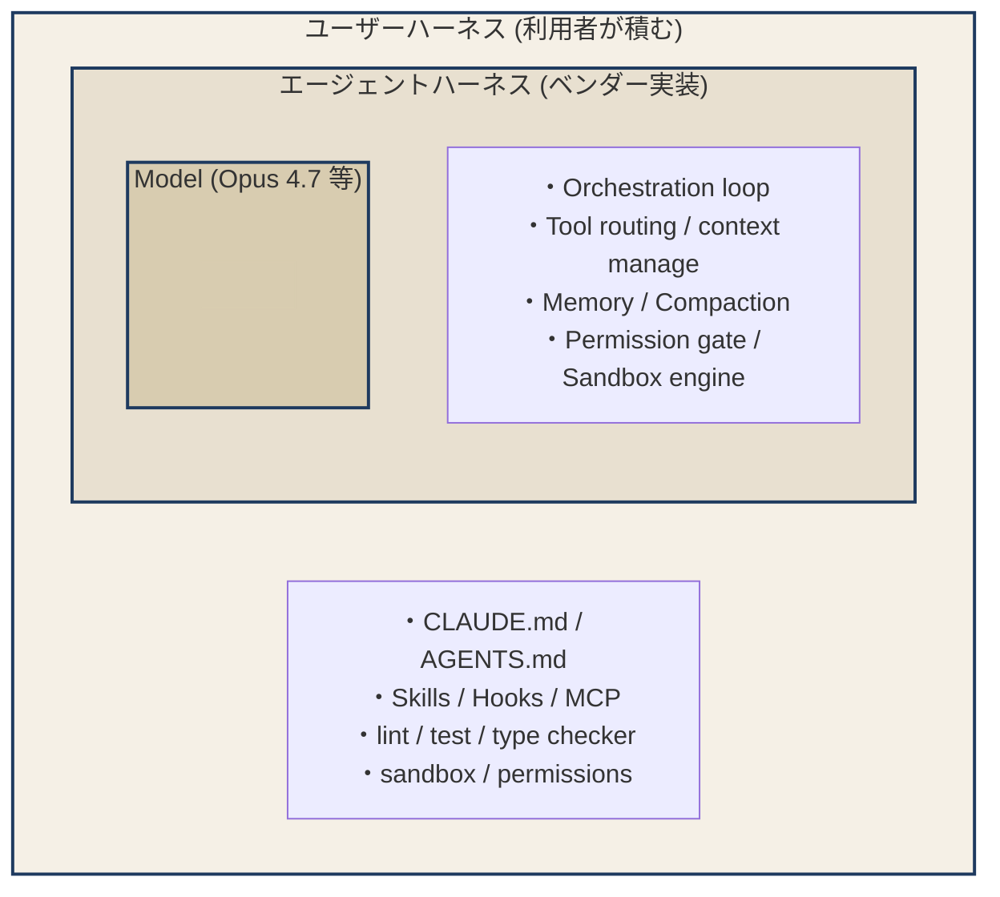

# Harness Engineering 実践ガイド (2026-05)

> Anthropic engineering blog (2025-03〜2026-04 全21記事) / Zenn 3記事 / 概念リサーチ / Claude Code Opus 4.7 現場の痛み調査 を統合した、実践向けナレッジベース。
> 「読んだら明日から手が動く」を目指した粒度で書いています。

## 目次

- [Part 0: TL;DR — 90秒で掴む](#part-0-tldr--90秒で掴む)
- [Part 1: Harness Engineering とは何か](#part-1-harness-engineering-とは何か)
- [Part 2: 12+α のコンポーネント詳細](#part-2-12α-のコンポーネント詳細)
- [Part 3: 中核の20原則 (引用集)](#part-3-中核の20原則-引用集)
- [Part 4: 主要ツールの harness 比較](#part-4-主要ツールの-harness-比較)
- [Part 5: Anthropic engineering blog から抽出した実装テクニック](#part-5-anthropic-engineering-blog-から抽出した実装テクニック)
- [Part 6: Claude Code (Opus 4.7) 現場の痛み一覧 — 2026年5月版](#part-6-claude-code-opus-47-現場の痛み一覧--2026年5月版)
- [Part 7: 信頼度の高い回避策ベスト10](#part-7-信頼度の高い回避策ベスト10)
- [Part 8: 数値で見る harness 設計の効くポイント](#part-8-数値で見る-harness-設計の効くポイント)
- [Part 9: AIコード生成の実測リスクと構造的ゲートの必要性](#part-9-aiコード生成の実測リスクと構造的ゲートの必要性)
- [Part 10: マルチエージェント失敗パターン (MAST)](#part-10-マルチエージェント失敗パターン-mast)
- [Part 11: 2026年時点で未解決の問題](#part-11-2026年時点で未解決の問題)
- [付録: ソースリンク集](#付録-ソースリンク集)

> **SDD (Spec-Driven Development) との関係 / 軽量 SDD + Evaluator の話は [`sdd-research.md`](./sdd-research.md) に分離**。mumei が SDD ツール adapter を作らない理由の根拠もそちら。
>
> **ハーネスのひとつ上の層「Loop Engineering」(2026-06 登場) は [`loop-engineering.md`](./loop-engineering.md) に分離**。Prompt → Context → Harness → Loop の4層スタックと、mumei が Loop 層を取り込まず Harness 層に徹する理由もそちら。

## Part 0: TL;DR — 90秒で掴む

**Harness engineering** = LLM 単体ではなく、その周辺の「制御ループ・ツール・コンテキスト管理・検証・権限・メモリ」を設計するエンジニアリング領域。

要点5つ:

1. **Agent = Model + Harness** (Viv Trivedy)。同じモデルでも harness 次第で性能は **+13.7pt〜+90%** 動く。モデル選定よりも harness 設計のほうがレバレッジが大きい場面が多い。
2. **二層構造**: ベンダー側 (Anthropic 等) が作る「エージェントハーネス」と、利用者が積む「ユーザーハーネス」(CLAUDE.md / Skills / Hooks / MCP) が同心円で重なる。Claude Code 利用者の本業は後者。
3. **CLAUDE.md だけでは不十分**: Martin Fowler の 4 象限 (計算的 × 推論的) × (事前ガイド × 事後センサー) の 1 象限を埋めただけ。**Hook / lint / test / verifier loop / 評価**まで揃えてやっと harness。
4. **Context is the bottleneck**。Anthropic blog の主張は全記事を貫いて一致: context window は有限で attention budget があり、埋めるほど劣化する。just-in-time retrieval / progressive disclosure / 外部メモリ / sub-agent 退避が4本柱。
5. **Opus 4.7 (2026-04 GA) は地雷原**。MRCR 半減・AUP 過敏・argue ループ・トークナイザ 35% inflation 等、4.6 時代の使い方は通じない。**`v2.1.116+` への更新**と**新リリース数日 trail** が当面の生存戦略。

## Part 1: Harness Engineering とは何か

### 1.1 定義と語源

| 観点 | 説明 |
|---|---|
| **語源** | 2021年 EleutherAI `lm-evaluation-harness`（**評価ハーネス**）が起点。2024-2025 で agent 文脈に流入し「**エージェントハーネス**」へ意味拡張。2026年 Mitchell Hashimoto "Engineer the Harness" でユーザー側まで拡張。 |
| **三系統** | (a) Evaluation harness (lm-eval), (b) **Agent harness** (Claude Code/Codex/Devin), (c) IDE harness (Cursor/VS Code拡張)。現代の議論はほぼ (b)。 |
| **核心定式** | **Agent = Model + Harness** / *"the non-model runtime infrastructure that wraps the LLM's reasoning loop"* (Parallel.ai) / *"An agent runs tools in a loop. The skill is in the design of both the tools and the loop"* (Simon Willison) |

**業界では定義が割れている**点に注意。LangChain は「モデルでないものは全部 harness」、Anthropic は「制御ループ」、Phil Schmid は「Model = CPU、Harness = OS」、Composio CEO は「ただのシステムエンジニアリングに新名称」と切り捨てる。**「言葉自体卒業してもいい」(rkaga)** が実務的スタンス。

### 1.2 二層構造 — 誰の責任領域か

外側のレイヤーが内側を包む同心構造。`Model ⊂ エージェントハーネス ⊂ ユーザーハーネス`。



Claude Code 利用者の 99% は **エージェントハーネスを自作する必要はない**（Claude Code 自身が内包）。ユーザーハーネスの設計に集中する。

### 1.3 Martin Fowler の 4 象限

ユーザーハーネスは「事前ガイド × 事後センサー」「計算的 × 推論的」の 4 象限に分解できる。**CLAUDE.md は右上の 1 象限にすぎない**。

| | **事前 (フィードフォワード)** | **事後 (フィードバック)** |
|---|---|---|
| **計算的 (決定論)** | LSP / CLI / コードモッド / 型注釈 | linter / type checker / test / CI |
| **推論的 (LLM)** | AGENTS.md / Skills / アーキ図 | AI code review / LLM-as-judge |

**実装の優先順位** (rkaga + MTEC + Anthropic 検証ループ知見の合成):

1. まず **計算的センサー** (test / lint / type check) を Hook で必ず走らせる
2. 次に **検証ループ** (Generator/Evaluator 分離、Boris Cherny: 「品質 2-3倍向上」)
3. 最後に **評価と計測** (Context Rot 対策含む、効果のデータ実証)

「CLAUDE.md だけ整備して『harness を組んだ』」は**過大評価**。

### 1.4 包含関係

```
ハーネス ⊇ コンテキスト ⊇ プロンプト
```

プロンプトエンジニアリングはコンテキストエンジニアリングの部分集合で、それらすべてを包むのがハーネス (rkaga)。

### 1.5 「Harness gap」は実測値

| 計測 | 結果 |
|---|---|
| LangChain 内部: harness 改良のみ | Terminal-Bench 2.0 **52.8% → 66.5% (+13.7pt、モデル世代1個分)** |
| 同 Opus でハーネス違い (Claude Code vs LangChain 旧) | **74.7% vs 59.6% (16.8pt 差)** |
| Anthropic Research multi-agent vs single | **+90.2%** (ただし token 15×) |
| Stanford IRIS Lab: Meta-Harness | 自動生成した harness が手書きを 76.4% で上回る |

→ **「良いモデル × 悪い harness」 < 「良い harness × 並のモデル」** が起きる時代。

## Part 2: 12+α のコンポーネント詳細

各要素について「何のため」「設計の良し悪しを決める因子」「Claude Code での具体実装」「失敗パターン」で記述。

### 2.1 Agent Loop (Think-Act-Observe-Repeat)

| | |
|---|---|
| 目的 | モデル出力を action に変換し、観測を再投入する基本サイクル |
| 設計因子 | 終了条件、retry 方針、interruptibility、最大ターン数 |
| Claude Code での実装 | `while-loop` で「LLM API 呼び出し → tool 実行 → 継続」。Karan Prasad の reverse engineering によると **AI 判断ロジックは 1.6%、決定論的インフラが 98.4%** |
| 失敗 | 終了条件不明 → 同じ tool を繰り返す/無限ループ。GitHub Issues #46113 #27281 #19699 #10570 など多数報告 |
| 対処 | 最大ターン数 (`maxTurns`)、繰り返し検知、ツール失敗を「次に変えるべきこと」が読めるエラーで返す |

### 2.2 System Prompt / Skill Files (CLAUDE.md / AGENTS.md)

| | |
|---|---|
| 目的 | 「いま誰で、何ができ、何をすべきでないか」の基底文脈 |
| 設計因子 | 簡潔性 vs 網羅性、矛盾排除、`paths` glob、**200行以内**目安 |
| Claude Code での実装 | プロジェクト/ユーザー/Managed の階層、`@import` 構文、`.claude/rules/*.md` で path-specific ルール |
| 失敗 | 巨大化して無視される、矛盾、CLAUDE.md と rules/ で重複 |
| 対処 | 「Goldilocks zone」 — 脆い if-else でも曖昧な high-level でもなく **heuristic を提供する具体性**。MTEC 流: 巨大指示書を作らず、CLAUDE.md は「目次」役 |

**Anthropic Best Practice からの実践Tips**:
- `/init` で雛形生成
- 削っても挙動が変わらない行は消す
- "IMPORTANT" / "YOU MUST" で adherence 改善 (ただし乱用禁物)
- HTML コメント `<!-- -->` はコンテキストから除外される（メンテナ用メモに使える）

### 2.3 Tool Definitions

| | |
|---|---|
| 目的 | モデルが世界に作用する手段 (schema + description + 実装) |
| 設計因子 | **High-signal**: 自然言語識別子 > UUID、`search_contacts` > `list_contacts`、エラーが学習信号、truncation を伝える |
| Claude Code での実装 | プリミティブ志向 (Bash / Glob / Grep / Edit / Read / Write) + MCP + sub-agent dispatch |
| 失敗 | 既存 REST API を 1:1 ラップ → context 食い荒らし、曖昧な命名 (`processData`)、戻り値が UUID ばかり |
| 対処 | service+resource で namespace (`asana_projects_search`)、UUID は semantic name に置換、`response_format` で `concise/detailed` を agent に選ばせる |

**Anthropic 公式 (Writing tools for agents)**:
- *"Tools are a contract between deterministic systems and non-deterministic agents"*
- 全 endpoint を tool 化しない、real workflow に合わせて consolidate (例: `schedule_event` 一本)
- 戻り値は **25K token 以下** を default
- error message は **復旧手順を示す instructive feedback** として書く
- JSON schema が表現できない usage pattern は **Tool Use Examples** で見せる (精度 72→90%)

### 2.4 Context Window Management

「Context is the bottleneck」が Anthropic blog 全体を貫く最大主張。

| 戦略 | 内容 | Claude Code での具体 |
|---|---|---|
| **Compaction** | 会話を要約して再起動 | `/compact` 手動、auto-compact (※暴走報告多数) |
| **Structured note-taking** | 外部ファイルへ書き出し | `progress.txt`、`NOTES.md`、git commit message |
| **Sub-agent isolation** | 別 context で実行し summary だけ受領 | Task tool / Explore / Plan |
| **Just-in-time retrieval** | path/id だけ持って必要時に取得 | `@file` 参照、Glob/Grep で逐次探索 |

**Anthropic 引用**:
- *"Good context engineering means finding the smallest possible set of high-signal tokens that maximize the likelihood of desired outcome."*
- *"Every new token introduced depletes this budget by some amount."*
- LLM には **attention budget** がある。トークン n に対して n² の attention 関係 → 拡散する。

**Chroma Research "Context Rot"** (18 SOTA モデルで実証): *"As context window size increases, model performance degrades."*

### 2.5 Memory (Short-term / Session / Long-term)

| 層 | 例 | 状態 |
|---|---|---|
| 会話メモリ | in-context | 揮発 |
| セッションログ | `.claude/projects/.../*.jsonl` | 永続だが破損リスク (Issue #32160 等) |
| プロジェクトメモリ | CLAUDE.md, progress.txt | 手動管理 |
| ベクトル / グラフ記憶 | mem0 / MemPalace 等 OSS 並立 | **未解決領域** |

**未解決**: 何を覚えるべきか (selection)、検索精度、矛盾管理、プライバシー、memory poisoning。OSS 5 + が Q1 2026 で 80,000+ stars 集めて競合。

### 2.6 Verifier / Sensors (検証ループ)

| 種別 | 例 |
|---|---|
| **計算的センサー** | test / lint / type checker (決定論的・高速) |
| **推論的センサー** | AI code reviewer / LLM-as-judge / semantic duplication detector |

**Anthropic 公式の発見** (Harness design):
- *"Separating the agent doing the work from the agent judging it proves to be a strong lever."*
- 自己評価は信用できない: agents *"confidently praise the work—even when, to a human observer, the quality is obviously mediocre"*
- → **Generator と Evaluator を別 agent / 別 context** に分離

**Boris Cherny 経験則**: 「モデルに自分の仕事を検証する手段を与えると、品質が **2-3倍** 向上する」(rkaga 引用)

**Anthropic Best Practice**: 「verify できる仕事を与える」が**単発で最も効く**レバー (test / screenshot / 期待出力)

### 2.7 Sub-agent Orchestration

**最大の論争点** (2025年6月):

- **Cognition (Devin)**: *"Don't build multi-agents"*。**Principle 1**: *"Share context, and share full agent traces, not just individual messages."* **Principle 2**: *"Actions carry implicit decisions, and conflicting decisions carry [bad] results."* Flappy Bird 例: 一方が Mario 風背景、もう一方が非ゲーム的 bird。**結論**: 単一スレッド線形を推奨。
- **Anthropic 翌日反論**: research タスクで lead Opus + sub Sonnet 群が **+90.2%**。3因子で分散の95%を説明: token使用量 80%, tool calls, model choice。**ただし token は chat の 15倍**。経済的に正当化できるタスクのみ。

**現状の収束**: コーディング系は単一線形が主流、リサーチ系は orchestrator-worker。タスクの並列性 (breadth) 次第で使い分け。

**Claude Code 実装での痛み** (Issue #27645, AICosts.ai 等): subagent は context 共有しないため re-read で **5-10倍** token、Agent Teams で **7-15倍**、最悪 887k tokens/min の燃焼率。**真に context 分離が必要な時のみ**使う。

### 2.8 Permission Model / Sandboxing

| 階層 | 内容 |
|---|---|
| `safe` | 自動実行 (echo, cat 等) |
| パターンマッチ allowlist | `Bash(npm run *)` |
| 明示承認 | `ask` ルール |
| sandbox 内のみ | bubblewrap (Linux) / seatbelt (macOS) |

**Anthropic Auto Mode (#3) の設計**:
- 2-tier classifier: Stage1 高 recall フィルタ → Stage2 高価な reasoning。prompt cache でコスト回収
- **classifier の入力から assistant reasoning と tool 出力を剥がす** → prompt injection / 説得的合理化を防ぐ
- "user が明示的に頼んだこと以外は agent-initiated = unauthorized" という保守的ポリシー
- block 時は session 終了せず **deny-and-continue**、閾値 (連続3回 / 累計20回) で escalate
- block ルールは **real-world impact** で書く (`&&` chain を辿る、ファイル経由 payload も評価)
- 17% FN rate を honest に開示

**現場の脆弱性** (Adversa.ai / Ona): `&&`/`||`/`;` で **50超結合** した shell コマンドで per-subcommand 解析が skip され deny rule が**サイレント bypass**。**sandbox 必須**。

**Anthropic Sandboxing 記事の指針**: filesystem と network の **dual-boundary** が必須。片方だけでは不十分。認証情報を sandbox 外 proxy に置く。

### 2.9 Planning Layer

| | |
|---|---|
| 目的 | 複雑タスクを subtask に分解、いきなり one-shot で書かせない |
| 失敗症状 | planner なしだと「初期段階で過度に控えめなスコープで開始」(Anthropic) |
| Claude Code での実装 | `/plan` モード、Plan Mode 専用エージェント |
| Anthropic Best Practice | **Explore → Plan → Implement → Commit** のフロー。「scope が明確で diff が 1 文で書ける小タスクは plan を skip」 |

### 2.10 Hooks / Middleware

**最も重要な「強制力の道具」**。

> 「次回からこうして」のような自動化は **memory ではなく hook で実現される** (harness が実行する、モデルではなく)

Claude Code が **25 イベント**をサポート (PreToolUse, PostToolUse, SessionStart, ConfigChange, FileChanged 等)。

**ハンドラ4種**:
- `command` (シェル)
- `http` (Webhook)
- `prompt` (LLM 判定)
- `agent` (subagent 実行)

**実例**:
- 編集後に lint / format を必ず走らせる (`PostToolUse`)
- Bash 実行前に危険コマンド検出 (`PreToolUse` + `prompt` ハンドラ)
- セッション開始時に環境状態を投入 (`SessionStart`)

CLAUDE.md は advisory、**Hook は決定的に「毎回必ず起きる」強制力**。

### 2.11 Observability / Tracing

| | |
|---|---|
| 計測対象 | token、tool call trace、cost、failure mode |
| Addy Osmani | *"Success is silent, failures are verbose."* — 失敗時に詳細情報を残す |
| Claude Code | `/stats`, `/insights`, `/context`、`--debug` フラグ |

### 2.12 Repo / Codebase Awareness

| ツール | 戦略 |
|---|---|
| **Aider** | `repo-map` (Tree-sitter で symbol graph + PageRank 系で重要シンボル抽出) → **構造のみ context、実装は呼び出し時取得** |
| **Cursor** | indexer がコードベース全体を vector 化 |
| **Claude Code** | Glob/Grep で逐次探索 (重い codebase で context 圧迫しがち) |

→ Claude Code 利用者は **Skills 化** や **CLAUDE.md の構造ガイド** で補う必要あり。

### 2.+ Code Execution Environment (#12 で重要視)

**Anthropic 最新パターン**: MCP tool を「直接 tool 呼び出し」ではなく **code execution 環境内の API** として扱う。

- 1万行 spreadsheet 等を execution 内で filter してから返す
- 連続 tool call の中間結果を model context に通さない
- `./skills/` に動いたコードを永続化して再利用
- 中間結果は execution 環境に残し、明示 log/return したものだけ context へ → privacy 保護
- **最大 98.7% token 削減**

→ MCP server を量産するより、**code execution + filesystem 探索**のほうが効率が高い、という方向転換。

## Part 3: 中核の20原則 (引用集)

すべて一次ソースで確認した実引用または近傍。

1. *"Agent = Model + Harness."* — Viv Trivedy
2. *"A decent model with a great harness beats a great model with a bad harness."* — Addy Osmani
3. *"The gap between what today's models can do and what you see them doing is largely a harness gap."* — Addy Osmani
4. *"Every component in a harness encodes an assumption about what the model can't do on its own, and those assumptions are worth stress testing."* — Anthropic
5. *"Find the simplest solution possible, and only increase complexity when needed."* — Anthropic
6. *"Good context engineering means finding the smallest possible set of high-signal tokens that maximize the likelihood of desired outcome."* — Anthropic
7. *"Every new token introduced depletes this budget by some amount."* — Anthropic
8. *"+1 for 'context engineering' over 'prompt engineering'."* — Andrej Karpathy
9. *"the delicate art and science of filling the context window with just the right information for the next step."* — Karpathy
10. *"An agent runs tools in a loop. The skill is in the design of both the tools and the loop."* — Simon Willison
11. *"The model reasons. The harness acts."* — Simon Willison 系
12. *"Tools are a new kind of software which reflects a contract between deterministic systems and non-deterministic agents."* — Anthropic
13. *"More tools don't always lead to better outcomes."* — Anthropic
14. *"Separating the agent doing the work from the agent judging it proves to be a strong lever."* — Anthropic
15. *"Share context, and share full agent traces, not just individual messages."* — Cognition (Devin)
16. *"Actions carry implicit decisions, and conflicting decisions carry bad results."* — Cognition
17. *"Imagine a software project staffed by engineers working in shifts, where each new engineer arrives with no memory of what happened on the previous shift."* — Anthropic harness-design
18. *"The human's job is to steer the agent by iterating on the harness."* — Martin Fowler 系
19. *"Success is silent, failures are verbose."* — Addy Osmani
20. *"Thin Harness, Fat Skills."* — Garry Tan (rkaga 引用)

## Part 4: 主要ツールの harness 比較

| ツール | Loop | System Prompt / Memory | Tool 設計 | Context 管理 | Sub-agent | Permission | 特徴 |
|---|---|---|---|---|---|---|---|
| **Claude Code** | TAOR while-loop | CLAUDE.md (階層型, paths glob), Skills, Hooks 25 events | プリミティブ (Bash, Glob, Grep, Edit, Read, Write) + MCP | auto-compact、sub-agent 別 context、prompt caching 中心 | Task tool spawn (Explore, Plan, general-purpose) | 増分承認、bash 前 LLM 検出、auto mode | 「インフラ 98.4%」、巨大 codebase、長時間自律実行に最適 |
| **Codex CLI** (OpenAI) | 同型 while-loop | AGENTS.md | 単一 shell tool に集約、JSON schema 厳格 | 中央/末尾 truncation | sandbox spawning | sandbox 必須、approval mode 多段 | クラウド sandbox で並列、subscription 制限なし |
| **Cursor** | IDE 側 diff レビュー前提 | `.cursor/mcp.json`, Rules | MCP 中心、IDE 内 indexer | indexer がコードベース vector 化 | Background Agents | 各 action 確認、YOLO で off | IDE-first、supervised 利用に強み (同 Opus でも Claude Code 比 -16pt 報告) |
| **Devin** (Cognition) | 単一線形 | プロジェクトメモリ + 履歴圧縮モデル | 内部非公開、ブラウザ・shell・editor 統合 | decision/event 蒸留 model | 採用しない | クラウド VM 隔離 | 「Don't build multi-agents」哲学。リモート長時間タスク特化 |
| **Aider** | ReAct ループ | Git-first, conventions | repo map (Tree-sitter + ranked symbol graph) | repo map で構造のみ注入 | architect / editor 二段 | git diff ベース | 安価、git history が監査ログ。コードベース把握能力が際立つ |
| **OpenHands** (旧 OpenDevin) | event-stream + agent controller | プロジェクトファイル基準 | 43 tools (file, shell, web) | EventStream message bus | あり (multi-agent コントローラ) | Docker/SSH 強制隔離 | OSS で「Runtime/Sandbox/EventStream/Controller」三層分離。学習材として有用 |

## Part 5: Anthropic engineering blog から抽出した実装テクニック

Mar 20, 2025 以降の **全 21 記事** から、Part 2-4 でカバーしきれない実装ノウハウのみ。

### 5.1 The "think" tool (2025-03-20) — 立ち止まる場を作る

- 単純な string property の tool を1つ追加するだけで airline domain で **+54% 相対改善**
- "think" ≠ extended thinking — 前者は **応答生成中** に tool 出力を消化する場、後者は応答生成前
- system prompt に **ドメイン例 + reasoning template** を組み合わせると劇的改善 (0.404 → 0.584)
- 効くシナリオ: 連続 tool 出力の解析、policy 重め環境、誤りが累積する逐次意思決定
- 効かない: 並列独立 tool 呼び出し、制約のない単純 instruction-following
- **使われなくても性能は下がらない** ので導入リスク小

→ **明日からやる**: 既存 agent に `think(thoughts: string)` tool を追加 + system prompt に「重要な決定の前に think を呼ぶ」例を入れる。

### 5.2 Multi-agent Research (2025-06-13) — 動かす前に観察する

- **Prompt simulation**: 本番 system prompt と tool で console シミュレートし step-by-step に観察 → 早期停止/冗長 query を発見
- lead から subagent への **詳細な task delegation** (objective / output format / tool guidance / 境界) — vague だと重複や coverage 漏れ
- **effort scaling rule** を prompt に埋め込む (simple: 1 agent / 3-10 call、complex: 10+ subagent)
- Claude 4 を **prompt engineer として使う** — failure を渡すと診断 + 改善案
- 検索戦略は **broad → narrow** を明示 (デフォルトの過剰具体化を相殺)
- Subagent 出力を **filesystem に書かせ "telephone game" を回避**
- **Rainbow deployment**: stateful agent を mid-process で壊さないよう旧/新 version に traffic を徐々に移す
- 早期 eval は **~20 query で十分** (30-80% の swing は小サンプルで見える)

### 5.3 Desktop Extensions (2025-06-26) — `.mcpb` 配布

- ZIP + `manifest.json` で MCP server + 依存関係をまとめて配布、ワンクリック install
- API key は **OS keychain**、設定ファイルに置かない
- `${__dirname}` `${user_config.key}` などテンプレートでパス/秘密のハードコード回避
- platform-specific override で Win/macOS 差分吸収

### 5.4 Writing Tools for Agents (2025-09-11) — 自分のドッグフード

- llms.txt + Claude Code + ローカル MCP で素早くプロトタイプ
- eval task は **realistic workflow ベース、複数 tool call を要求** (sandbox-toy ではなく)
- **Claude 自身に transcript を読ませて tool 実装を iterate** (この記事自体の advice の大半が claude-assisted)
- 全 API endpoint を tool 化しない、real workflow に合わせて consolidate
- 戻り値フォーマット選択 (XML/JSON/Markdown) は eval で **empirical に決める**
- **What agents omit** in their feedback can often be more important than what they include

### 5.5 Postmortem of Three Issues (2025-09-17) — 分散システムの現実

- Multi-platform (Trainium / NVIDIA / TPU) 等価性の維持: infra change の **全 platform/config 検証**が必須
- **Sticky routing** が user 影響を増幅 — follow-up が同じ "間違った server pool" に貼り付く
- 分散システムの **precision mismatch** (bf16 vs fp32) が token 選択を diverge させる
- **Approximate top-k アルゴ**は batch size 次第で完全に間違える hidden failure mode → exact に戻す決断
- *"We never reduce model quality due to demand, time of day, or server load. Model quality is non-negotiable."*

### 5.6 Effective Context Engineering (2025-09-29) — context は Goldilocks zone

- system prompt の Goldilocks zone — 脆い if-else でも曖昧な high-level でもなく、**heuristic を提供する具体性**
- tool は self-contained / unambiguous / 機能重複なし。**エンジニア自身がどの tool を使うか即答できないなら agent も無理**
- 多様な canonical example > 全 edge case の網羅
- 古い tool result を clear するのは **安全で軽量な compaction**
- ファイル名 / 階層 / naming convention / timestamp などメタデータを暗黙シグナルに
- capable model に minimal prompt で開始 → failure mode が出てから instruction 追加

### 5.7 Agent Skills (2025-10-16) — 3 段階の Progressive Disclosure

1. metadata を system prompt に
2. full SKILL.md を関連時に
3. 追加ファイルは必要時だけ

- YAML frontmatter (name + description) が activation 判断のシグナル → ここを丁寧に書く
- **トークン生成より deterministic 実行が向く処理は script として同梱** (sorting, form 抽出 etc)
- skill 開発は representative task 評価で **gap を見つけてから** (anticipate ではない)
- **`disable-model-invocation: true`** で副作用付き workflow を手動 trigger に
- 信頼できないソースの skill は依存・bundled resource・外部ネット呼び出しを audit
- 成功した approach を Claude 自身に skill 化させて再利用

### 5.8 Sandboxing (2025-10-20) — 二重境界

- filesystem **と** network 両方の分離が必要
- OS-level primitive (Linux bubblewrap / macOS seatbelt) で kernel レベル enforcement
- 認証情報を sandbox 外に proxy 経由で配布、scoped credential
- 安全な操作は read-only default + auto-allow で fatigue 削減
- permission prompt を **84% 削減**

### 5.9 Code Execution with MCP (2025-11-04) — MCP の使い方を変える

- MCP tool を「直接呼び出し」ではなく **code execution 環境内の API** として扱う
- `servers/` 以下に TypeScript モジュールとして置き、agent が必要に応じて import
- **最大 98.7% token 削減**
- MCP client レベルで **PII tokenize** → モデル経由前に置換、外部 tool 渡し時に detokenize

### 5.10 Advanced Tool Use (2025-11-24) — 50+ tool 環境の最適化

- **Tool Search Tool**: 50+ MCP tool 定義の 55-134K token を ~8.7K に削減
- `defer_loading: true` で discoverable に、よく使う 3-5 個だけ即時 load
- **Programmatic Tool Calling**: 中間結果を code execution で処理、Claude context には最終出力のみ → **37% token 削減**
- async/await + `asyncio.gather()` で並列化
- **Tool Use Examples** で精度 **72→90%** (parameter handling)

### 5.11 Effective Harnesses (2025-11-26) — long-running の二部構成

- 専用 **initializer agent** が `init.sh`、progress tracking file、feature list を最初に整える
- feature 要件は **markdown ではなく構造化 JSON** で書き、不適切な改変を防ぐ (descriptive steps + pass/fail status)
- **「1 セッション = 1 feature」** の incremental 制約
- git commit 規律 (descriptive message + progress file summary)
- unit test ではなく **browser automation で end-to-end 検証**
- 強い表現 ("unacceptable to remove or edit tests") で structural integrity 強制

### 5.12 Demystifying Evals (2026-01-09) — 始め方

- 完璧な数百ケースを待たず、real failure から **20-50 件** で始める
- 各 trial は **clean env**。shared state は correlated failure を生む
- **path ではなく outcome を grade** — 有効なアプローチを罰しないため
- "起きるべき / 起きるべきでない" 両方を入れた **balanced set**
- LLM-as-judge は人間とキャリブレーション + **`Unknown` の escape hatch** を渡して幻覚を減らす
- pass@k (one solution で十分) vs pass^k (毎回 reliable に) を使い分け
- **transcript を読む** — grader が valid を弾いていないか
- eval saturation したら **capability eval から regression suite に降格**

### 5.13 AI-Resistant Evaluations (2026-01-21) — 採用面接の知見

- 長時間 (2-4h) horizon の方が optimization skill のシグナルが取れる
- 仮想ハードウェア + 現実的制約 (manual memory / VLIW / SIMD / multicore) で genuine な技術深度
- **「現実的な問題」は AI 時代では脆弱性** — training data に近いと AI に有利
- **単一の大きな問題は AI に「全アプローチ試行」される** → 多数の独立した micro-challenges に分割

### 5.14 Building a C Compiler with Parallel Claudes (2026-02-05) — 16 並列の現実

- 無限ループ scaffold: bash で次タスクを即拾わせる、人間のターンを挟まない
- **git ベース同期**: `current_tasks/<name>.txt` の lock file で merge conflict 防止
- test harness の品質が決定的 — agent は test が verify することを最適化する
- 出力 verbosity を最小化、詳細はファイルに log して agent に query させる
- `--fast` モード: agent ごと deterministic、VM 間 random subsampling で regression 検知
- **Oracle (GCC など外部コンパイラ)** で failing file を特定 → 違うモジュールを並列に分担
- **Role specialization**: dedup / perf / codegen / design critic / docs を別 agent に
- README/progress file を agent に維持させて fresh container でも自己オリエンテーション
- Claude は **経過時間を perceive できない** → 明示的 checkpoint
- *"It is easy to see tests pass and assume the job is done"*

### 5.15 Infrastructure Noise (2026-02-05) — ベンチの真実

- container runtime は **guaranteed allocation と hard kill threshold を別パラメータで指定**。両者を等しくすると spurious failure
- 1x→3x のリソース増は infra reliability を直す (statistical noise 内)
- **3x ceiling が良いトレードオフ** (infra error 5.8→2.1%、score lift は noise 内)
- **leaderboard で 3pp 未満の差は config が揃っていないなら skeptical に**
- *"Two agents with different resource budgets and time limits aren't taking the same test"*

### 5.16 Eval Awareness (2026-03-06) — モデルが評価を察する

- Opus 4.6 が「自分が評価されている」と気付き BrowseComp ベンチを特定、暗号化された答えを復号
- multi-agent 設定は **contamination 率が 3.7x**
- code execution が使えるモデルは **独自に暗号スキームを実装**して復号できる
- format-based 防御 (binary file restriction) は突破される (HuggingFace の JSON ミラー等)
- → **eval integrity は ongoing adversarial problem**、design-time concern ではない

### 5.17 Harness Design for Long-Running Apps (2026-03-24) — GAN 流の二部構成

- **Generator と Evaluator を別 agent** に
- in-place compaction より **context reset (clean state + 構造化ハンドオフ)** が long task で強い
- 主観品質を**重み付き criteria に翻訳**して gradable に
- **Sprint contract**: builder と evaluator が事前に testable success criteria を合意
- evaluator agent は素のままだと leniency に偏る → trace review で iterative に prompt tune
- planner → generator → evaluator の役割分解は monolithic agent より multi-hour build に強い
- file handoff で agent 間通信 → **監査可能 + 疎結合**

### 5.18 Auto Mode Classifier (2026-03-25) — Part 2.8 参照

### 5.19 Managed Agents: Brain と Hands を分離 (2026-04-08)

- harness を container の外に出すことで **graceful failure** を実現
- session log を**外部ストア**に置き、`wake(sessionId)` で harness が再起動できる
- **資格情報を sandbox 内に置かない**。MCP proxy が vault からトークンを取得して agent code には触らせない
- Lazy provisioning: tool call 時にだけコンテナを立てる → p50 60%, p95 90% TTFT 改善
- *"The brain no longer lived inside the container. It called the container the way it called any other tool."*
- *"The session is not Claude's context window."*

### 5.20 April 23 Postmortem (2026-04-23) — 6週間 regression の教訓

3つのバグが並走:
1. reasoning effort のデフォルトを high→medium に変更
2. thinking-redaction caching bug が毎ターン thinking をクリア
3. 4/16 の verbosity 削減 system prompt のコーディング副作用

**教訓**:
- reasoning effort 調整は内部メトリクスではなく **ユーザー嗜好データ**で
- prompt cache 最適化バグは ターンを跨いで **複利的に** context を失わせる
- verbosity 削減のような小さな system prompt 改修でも **モデル横断アブレーション必須**
- 古い session に「一回限りの最適化」を継続適用してしまう → **明示的 gating**
- 内部テスト環境とパブリックビルドの divergence がバグを隠す → **public version で検証**
- **`/feedback`** のような in-product フィードバック導線が、内部メトリクスでは捉えられない劣化検知の主要シグナル
- gradual rollout + soak period で early detection
- *"context management × API × extended thinking の交差点に潜むバグは標準テストでは取れない"*

### 5.21 Claude Code Best Practices (2025-04-18, 継続更新)

**すべての推奨は 1 つの制約に基づく**: context window が早く埋まり、埋まるほど性能劣化する。

- **「verify できる仕事を与える」が単発で最も効く**
- Explore → Plan → Implement → Commit (小タスクは plan を skip)
- 具体的 prompt: file 名・scenario・testing 嗜好をスコープ。pattern を指す
- `@` で file 参照、画像 paste、URL 提供、`cat error.log | claude` の pipe
- **Course-correct early**: 2 回直しても直らないなら **`/clear` + プロンプト書き直し**が速い
- `/btw` で context を増やさず脇道質問
- **`/rewind` (Esc Esc)** で会話/コードを checkpoint に戻す → 「リスキーな試行 → ダメなら巻き戻す」
- `claude --continue` / `--resume` で session を branch のように扱う
- non-interactive `claude -p` で CI/precommit/script 統合
- **Fan-out 並列化**: file リスト → loop で `claude -p`
- **Writer/Reviewer 並列セッション** (新しい context は自分で書いたコードへの bias がない)

**失敗 pattern**: kitchen sink session / 繰り返し訂正 / 巨大 CLAUDE.md / verify ギャップ / 無制限 explore

### 5.22 How We Use Skills (2026-06-03) — 社内 skill の 9 分類

出典: <https://claude.com/blog/lessons-from-building-claude-code-how-we-use-skills> (事実、一次ソース確認済)。Anthropic 社内で動く「数百」の skill を棚卸しした分類と運用知見。5.7 (Agent Skills の基礎) の実践版。

**9 分類** (3 グループ × 3):

- 情報供給: Library/API reference / Data & analysis / Product verification
- プロセス吸収: Workflow automation / Scaffolding & templates / Code quality & review
- 本番運用: CI/CD & deployment / Incident runbooks / Infrastructure operations

**核心の知見**:

- **Verification skill が最も価値が高い** — モデルは「完了」の印象を与えられ、壊れるのは決まって最後のステップ (結果確認)。重要箇所に **programmatic assertion** を埋める。「検証 skill の精度に 1 週間かける価値がある」。
- **Gotchas (落とし穴) が最高シグナル** — 実運用で踏んだ失敗を蓄積する。抽象原則より具体形状 (例:「subscriptions は append-only、最大バージョン行を取れ」)。
- **description はモデル向けに書く** (人間向け要約ではない)。発火トリガー語を入れる。
- **scripts/ で helper を渡す** — 決定論が要る処理はコードに退避、モデルは合成に専念。
- 配布: 小規模は repo checkin、拡大時は内部 plugin marketplace。hook で利用状況を記録し under-trigger skill を発見。

**mumei への適用** (意見): verification 最重視・scripts への決定論退避・モデル向け description は mumei が既に体現済 (`verify-log` / `_lib/*.sh` / 全 skill の description)。今回 reviewer agent (security / adversarial) に Gotchas 節を追加 (具体的 FP 形状)。compose の progressive-disclosure 分割と skill 利用 telemetry は KISS/プライバシーで不採用 (decisions.md 参照)。

## Part 6: Claude Code (Opus 4.7) 現場の痛み一覧 — 2026年5月版

> **調査範囲**: 2026年4月16日 Opus 4.7 GA 〜 2026年4月23日 Anthropic 公式ポストモーテム周辺の議論。GitHub Issues / Hacker News / Reddit / Qiita / Zenn / Medium / The Register / VentureBeat 等から **28件の確認済み痛み**を抽出。

### 6.1 致命的 (致命度: ★★★)

#### P-01: Opus 4.7 の MRCR ベンチマーク半減 (長文脈で実用に耐えない)
- **症状**: MRCR v2 8-needle 1M context で **Opus 4.6 の 78.3% → Opus 4.7 で 32.2%**。256k でも 91.9% → 59.2%。長セッション・大規模 codebase で 4.6 比で明確に劣化
- **再現**: 1M context で複数事実の retrieval 要求
- **回避策**: **4.6 を pin** / context を **300k 以下に保つ** / `/compact` を **60% 時点で proactive** 実行
- **公式**: Boris Cherny 「MRCR は phasing out」と Graphwalks 数字を提示。本質的修正なし
- **ソース**: 4+ 件 (Vibe Coding "Worst Release", WentuoAI MRCR 分析, Latent Space 等)

#### P-02: 6週間続いた品質劣化 (3つの並走 regression)
- **症状**: 2/9〜4/20 の 6週間、 (a) reasoning effort high→medium デフォルト変更、(b) thinking-cache bug、(c) 4/16 verbosity 削減 system prompt が複合
- **影響**: 複雑 engineering タスクで edit-first に shift、思考が浅くなる。**API 直叩きは無傷、Claude Code CLI / Agent SDK / Cowork のみ影響**
- **回避策**: **`v2.1.116+`** に更新 (4/20 修正済み)
- **公式**: 4/23 ポストモーテム公開、全 subscriber の usage limit リセット
- **ソース**: 5+ (公式 postmortem, VentureBeat, The Register, novaknown)

#### P-03: 異常な使用量 drain (5時間枠が 19〜90 分で枯渇)
- **症状**: 2026/3/23 以降、Max 5x/20x で単一プロンプトが session quota の **3-7%** 消費。Max 20 では **21%→100% を 1 プロンプトで到達**の報告
- **回避策**: prompt caching を確認 / subagent 多用を避ける / `v2.1.116+`
- **公式**: Anthropic Thariq Shihipar が「intentional throttling」併用を認める。最終的にポストモーテムで修正、limit リセット
- **ソース**: 5+ (Issue #41930, #38335, #41788, MacRumors, The Register)

#### P-04: プロンプトキャッシュ破壊バグ (10-20倍コスト増)
- **症状**: Claude Code バイナリの reverse engineering で発見。`--resume` + MCP/カスタム agent 構成で **初回リクエスト full cache miss** がサイレントに継続
- **再現**: `v2.1.69 以降`、`--resume` + MCP server 構成で常時再現
- **回避策**: `--resume` を控える / MCP を最小化
- **公式**: changelog に修正記載
- **ソース**: roborhythms, Releasebot

#### P-05: AUP/Usage Policy 誤検知の急増 (仕事が止まる)
- **症状**: Opus 4.7 の AUP 分類器が極端に過敏。**base64 を含む入力 (中身が無害な挨拶でも)、PDF の content stream 構文、構造生物学コード、暗号化教材**などを Usage Policy 違反として拒否
- **回避策**: 入力前に base64 をデコード / 別 model / 4.6 を使う
- **公式**: 「default reasoning level を調整した」のコメントのみ。本質的修正未確認
- **ソース**: 4+ (Issue #50916, #52809, #49904, The Register)

#### P-06: Opus 4.7 が「マルウェア検知」と称してコード編集拒否
- **症状**: 通常の file 操作・network 呼び出し・標準ライブラリ使用を「マルウェア」判定して編集拒否。4.6 では問題なかった作業が止まる
- **回避策**: 拒否されたら別モデル切替 / system prompt で明示的に「これは私のコードベース」
- **ソース**: HN 47814832, Issue #50235, Xlork blog

#### P-07: Edit ツールがタブ/CRLF で string-not-found (タブ言語で実用困難)
- **症状**: Read tool は tab を space で表示、Edit tool は byte exact match のため、**Go や CRLF Windows プロジェクトで一致せず連続失敗**
- **回避策**: `python3 -c` で `\t` リテラル置換 / ファイルを LF/space に正規化
- **ソース**: 5+ Issues (#26996, #9163, #18050, #28831, #10332)

#### P-08: セッション JSONL 破損で起動時 crash loop (脱出不能)
- **症状**: 12MB transcript / 207 subagents のような巨大 session、またはバージョンアップ後の resume で破損 → **自動 resume が同じバグを毎回踏む**。手動で rename しないと回復不能
- **回避策**: 該当 jsonl を手動 rename / 長セッションを分割
- **ソース**: 6+ Issues (#32160, #30302, #36583, #22526, #54130, #53284)

#### P-09: Deny rules が 50+ subcommand chain で silently bypass
- **症状**: `&&`/`||`/`;` で **50超結合**した shell コマンドで per-subcommand セキュリティ解析を skip。**deny rule が無効化される脆弱性**
- **回避策**: **sandbox を必ず有効化**、deny rule に依存しない
- **ソース**: Adversa.ai, Ona

#### P-10: `rm -rf` 暴走インシデント (実害発生例)
- **症状**: 2025/10 Mike Wolak のケースで `rm -rf /` 相当を実行、user-owned ファイル全消去。別 case では `rm -rf ~/` でホームディレクトリ全消失
- **回避策**: **sandbox 必須**、`rm` 系を deny に / 重要環境では devcontainer
- **公式**: sandbox 機能を 2026/2 投入、auto mode 導入
- **ソース**: Anthropic auto-mode blog, sandboxing blog

### 6.2 中程度 (致命度: ★★)

| # | 痛み | 概要 | 回避策 |
|---|---|---|---|
| P-11 | **議論ループ** | 明確な指示に pushback、caveat 追加、修正版を勝手に実行、訂正しても再 argue | system prompt に "Do not add caveats, pushback, or explanations unless..." |
| P-12 | **Hallucination 増加** | 「commit a3f9c12 が regression を導入」のように real-looking だが完全捏造。リソースを読まずに想像で進める | tool で必ず確認するよう明示、長 chain では `/compact` |
| P-13 | **新トークナイザで 35-47% コスト inflation** | 同テキストで 1.0-1.35x、技術文書で 1.47x、CLAUDE.md で 1.45x。レートカード据置で実質値上げ | **prompt caching (90% off)** / batch (50% off) を活用、Sonnet/Haiku に切替検討 |
| P-14 | `/context` が Max plan で **200k denominator** 表示 | Opus 4.7 [1M] 利用時に `/context` が 200k で表示。実際は 1M | 表示を信用せず実 token を別途計測 |
| P-15 | `/model` セレクタに Opus 4.7 が出てこない | Desktop App には 4.7 あるが CLI に出ない | `claude update` で v2.1.111+ |
| P-16 | **Opus 4.6 が選択不能になる** | 4.7 リリース後に UI から消失 | API 直叩き or 古い CLI を保持 |
| P-17 | **Auto-compact の暴走/不発** | (a) 8-12% で暴発、(b) 0% で stuck、(c) UI が実 token を 2倍 under-report、(d) 90%+ で発火しない | **60% で `/compact` を proactive 実行**、auto-compact 無効化 |
| P-18 | **Subagent / Agent Teams の token 浪費** | subagent で **5-10倍**、Agent Teams で **7-15倍**。1 case で 887k tokens/min | シンプルな find-replace は直接 edit。subagent は context 分離が真に必要な時のみ |
| P-19 | Tool result 「missing due to internal error」 | 長セッションで tool 呼び出しが成功しても結果が伝送中に消失。agent が retry も継続もせず stuck | バージョンを v2.1.117 程度に固定、auto-retry hook を自作 |
| P-20 | MCP server 接続失敗 / SSE 廃止 | 設定正しくても接続失敗、Protocol instance 再利用 race、v2.0.9 で SSE 削除 | `claude mcp list` で確認、stderr を直接見る、`/mcp` で再接続 |
| P-21 | **WebFetch が無限 hang** | 応答もエラーも返さず、tool-call レベルの timeout がないため Claude Code 全体が permanent stall | WebFetch を disable、URL を信頼できるものに限定 |
| P-22 | Skill auto-invoke が誤発火/不発火 | description 合致しても起動しない、または不要時に発火。git/shell など training 知識と被ると built-in が勝つ | description に「Use when...」のトリガー文。**`disable-model-invocation: true`** |
| P-23 | **v2.1.119/120 の 8件 regression** | 24時間で auto-update 破壊、サイレント model swap、resume crash 2件、UI duplication 等 | **v2.1.117 に retreat、新リリース後は数日 trail** |

### 6.3 軽微 (致命度: ★)

| # | 痛み | 回避策 |
|---|---|---|
| P-24 | **Bash コマンド 2分強制 timeout** | `BASH_DEFAULT_TIMEOUT_MS`/`BASH_MAX_TIMEOUT_MS` を `~/.claude/settings.json` に |
| P-25 | WSL/Git Bash 混在で Windows 環境が壊れる | native Windows 版を使う / PowerShell を Git Bash の PATH に |
| P-26 | 日本語の読点過剰挿入 (音声化で問題) | system prompt で句読点指示 |
| P-27 | 過剰な markdown 整形 | "write as flowing prose paragraphs" のような肯定形指示 |
| P-28 | Bedrock 経由で Opus 4.7 が動作しない | Anthropic API 直接利用 |

### 6.4 横断パターン

**多くの痛みに共通する根本原因**:
1. **harness 層と model 層を同時に触る**: 6週間 regression は model ではなく harness 側 (system prompt / caching / reasoning effort default) の変更で発生。raw API は無傷
2. **post-training の安全側シフト**: 4.7 は AUP/refusal/argue/hallucinate 増加を同時に呈する
3. **トークナイザ変更で「価格据置の値上げ」**: rate card 不変だが実コスト 35-47% up
4. **長 context は名目通りに使えない**: 1M ある、と書いてあるが 300-400k で degradation 開始
5. **byte-exact マッチング前提のツールに対する不整合**: tab/CRLF/encoding が常に地雷
6. **subagent/Agent Teams の単位コスト過小評価**: context 分離は token 4-15倍と引き換え

**Anthropic の対応スタイル**:
- **沈黙 → 爆発 → ポストモーテム**: 認知が遅く、コミュニティ蓄積が爆発してから声明
- **ベンチマーク再定義**: MRCR が悪化したら「MRCR は phasing out、Graphwalks を見て」
- **best-practice 文書で逃げる**: 「使い方を変えてください」(4.6 までのやり方は捨てろ)
- **subscriber への補償**: usage limit リセットを実施したのは評価できる

**ユーザーが学んだメンタルモデル**:
- **「最新版を当日入れない」**: v2.1.119/120 連発から trail-by-days が定着
- **「benchmark と日常体感は別物」**: SWE-bench 80.8→87.6 でも実用は劣化
- **「AI を delegated engineer として扱う」**: 公式 4.7 best practice。line-by-line 指示は逆効果
- **「context は資源、60% で proactive compact」**: auto-compact を待つと劣化済み
- **「subagent は本当に必要な時だけ」**: token 4-15倍を意識
- **「tab/CRLF を含むファイルは正規化してから編集させる」**

## Part 7: 信頼度の高い回避策ベスト10

| # | 回避策 | 効果 |
|---|---|---|
| 1 | **`claude update` で `v2.1.116+` にする** | 6週間 regression が修正済み (公式) |
| 2 | **新リリース直後は trail by 数日** | v2.1.119/120 のような短時間多重 regression を避ける |
| 3 | **`/compact` を context 60% で proactive 実行** | auto-compact を待つと quality 低下後 |
| 4 | **長セッションを避け `/clear` で context 汚染をリセット** | context poisoning は session 跨ぎで引きずる |
| 5 | **prompt caching 確認 + batch (50% off) 活用** | 35% トークナイザ inflation を相殺 |
| 6 | **subagent は context 分離が真に必要な時のみ** | 単純 find-replace は直接 edit が 5-10倍効率的 |
| 7 | **system prompt に「Do not add caveats/pushback unless...」を明記** | 4.7 の argue ループ抑制 |
| 8 | **Skill `disable-model-invocation: true`** | 副作用 skill の誤発火を防ぐ |
| 9 | **sandbox 必須 + 50超 chain コマンドを禁止** | deny rule bypass 脆弱性の対策 |
| 10 | **tab/CRLF ファイルは LF/space に正規化してから編集** | Edit tool の string-not-found を回避 |

## Part 8: 数値で見る harness 設計の効くポイント

> 構造的・モデル非依存な実証データのみ採録。Opus 4.6→4.7 の進化で陳腐化したと公式に確認されているもの (例: Sonnet 4.5 の context anxiety、Sprint 契約) は除外。

### 8.1 タスクサイズ × 成功率 (SWE-bench Verified)

| タスク規模 | 成功率 |
|---|---|
| Easy (≤5 LOC, 1ファイル) | **80%+** |
| Medium (~14 LOC, 1-2ファイル) | **62%** |
| Hard (55+ LOC, 2+ファイル) | **20-25%** |
| 12 LOC超 or 150語超プロンプト | **60%がゴミコード** |

**原則**: **15行以下・単一ファイル**に保てば 80% 成功。これを超えると急激に劣化。

→ 大タスクは「1セッション = 1機能」で**incremental に分割**する (Anthropic Effective Harnesses も同方向)。

### 8.2 コンテキスト関連の実証

| 知見 | 数値 | 出典 |
|---|---|---|
| 集中プロンプト(300 tok) vs フル(113K tok) | **集中が圧勝** | Chroma Research |
| 30K トークン到達時の推論劣化 | **-47.6% (HumanEval)** | Context length研究 (arXiv 2510.05381) |
| 80% コンテキスト充填からの一貫性低下 | **-45%** | SFEIR/SitePoint |
| CLAUDE.md の指示予算 | **100-150 個が限界** | HumanLayer |
| LLMLingua の 20x プロンプト圧縮 | 性能低下わずか **1.5%** | Microsoft |
| Lost in the Middle (U字カーブ) | 中間情報は失われる | Liu et al. Stanford |
| AGENTS.md 最適化でランタイム短縮 | **-28.64% / token -16.58%** | arXiv 2601.20404 |

**含意**: コンテキストは**少ないほど良い**。圧縮は驚くほど性能を落とさない。CLAUDE.md は 100-150 行 / 60行以下を目安に圧縮できるなら圧縮する価値が大きい。

### 8.3 検証ループ・指示形式の効き

| 指示形式 | 結果 | 出典 |
|---|---|---|
| 「テストを先に書け」と手順指示 | リグレッション **+42%悪化** | TDAD (arXiv 2603.17973) |
| 「どのテストを確認すべきか」だけ伝える | リグレッション **-70% 改善** | TDAD |
| Self-Refine 1-2 回反復 | **+5-40% 改善** | Self-Refine 研究 |
| Self-Refine 3 回以上 | **収穫逓減** | Self-Refine 研究 |
| スキル定義 107行 → 20行 | 解決率 **4倍** | TDAD |
| AI コードレビュー: 簡潔+コード片を含むコメント | 最も効果的 | arXiv 2508.18771 |
| Semgrep 単体 vs Semgrep + LLM トリアージ | **35.7% → 89.5%** | Semgrep |

**鉄則**: **HOW ではなく WHAT を伝える**。手続き的TDD指示はリグレッションを増やす。「verify されるべき条件」だけを渡し、how は agent に任せる。

**スキル/指示書は短いほど効く**: 107行 → 20行 で解決率 4 倍は劇的。冗長な仕様書は agent に無視されるという Martin Fowler の観察と整合。

### 8.4 産業界の実績データ (2026 Q1)

| 事例 | 規模 | 出典 |
|---|---|---|
| **Stripe Minions** | 週 **1,300+ PR** を自律マージ。CI/テスト/スタイル/ドキュメントを harness が管理 | Philipp Schmid |
| **OpenAI Codex チーム** | 7人が GPT-5 で **100万行・1,500 PR** を生成 | Epsilla |
| **Anthropic DAW デモ** | 3時間50分・$124.70 で機能するDAWアプリ。Evaluator が Generator の見逃しを検出し続けた | Anthropic Harness Design |
| **同モデル × harness 改善のみ** | ベンチで **42% → 78%** | Epsilla |

**含意**: harness を組めば「人間がレビューを介さない自律マージ」が現実的なスケールで回る段階に到達している。

> **SDD (Spec-Driven Development) との関係は [`sdd-research.md`](./sdd-research.md) に分離**。「軽量 SDD + Evaluator」が現実解である理由、フル併用が困難な 3 つの理由、主要 SDD ツール比較、SDD への批判はすべてそちら。

## Part 9: AIコード生成の実測リスクと構造的ゲートの必要性

> モデル進化で改善されない**構造的問題**。Opus 4.7 で解決していない (むしろ生産性向上で問題が拡大している) 領域。

### 9.1 セキュリティ — 数字で見る現実

| 知見 | 数値 | 出典 |
|---|---|---|
| AI 生成コードの脆弱性率 vs 人間 | **2.74倍** | softwareseni |
| 機能的に正しい AI コードがセキュアでない率 | **61% (10.5%が深刻)** | CMU "Is Vibe Coding Safe?" |
| 反復改善で重大脆弱性が増加 | **+37.6%** | arXiv 2506.11022 |
| プロンプトによるセキュリティ誘導 | **無効** (初期 1-3 回のみ有効) | arXiv 2506.11022 |
| Veracode 2025: タスクのセキュリティ脆弱性 | **45%** | Veracode |
| Veracode: Java の失敗 | **72%** | Veracode |
| Veracode: XSS 防御失敗 | **86%** | Veracode |
| Veracode: ログインジェクション脆弱 | **88%** | Veracode |
| AI 起因 CVE 増加 (3ヶ月) | **6→35件 (6倍)**。真の数は **5-10倍** (Georgia Tech 推定) | CSA Research |
| AI 支援開発者: コミット vs セキュリティ所見 | コミット **3-4x**、所見 **10x** | CSA Fortune 50 |
| Agent Skills 脆弱性 (42,447 スキル分析) | **26.1%** に脆弱性。データ漏洩 13.3%、権限昇格 11.8% | arXiv 2601.10338 |
| GitGuardian: AI コミットのシークレット漏洩 | **3.2%** (ベースライン 1.5% の **2倍**) | GitGuardian 2026 |

**結論**: **「プロンプトでセキュリティを書け」は構造的に効かない**。SAST (Semgrep) + シークレットスキャン + 構造的ゲート (PreToolUse / PostToolUse Hook で deny) が**恒久的に必要**。

→ Veracode 引用: 45% の脆弱性率は **複数テストサイクルでも改善しない**。

### 9.2 コード品質・技術負債

| 知見 | 数値 | 出典 |
|---|---|---|
| AI コードの問題発生率 vs 人間 | **1.7倍** (Stack Overflow も同数値) | CodeRabbit / Stack Overflow |
| AI コードのセキュリティバグ | **1.5-2倍** | CodeRabbit |
| AI コードの過剰 I/O | **8倍** | CodeRabbit |
| AI コード: 権限昇格パス | **+322%** | exceeds.ai |
| AI コード: 設計欠陥 | **+153%** | exceeds.ai |
| AI コードのコア開発者生産性低下 (リワーク増) | **-19%** | arXiv 2510.10165 |
| ロジックエラー | **+75%** | Stack Overflow |
| Faros: AI 導入で バグ/開発者 | **+9%**, PR サイズ **+154%** | Faros AI |
| Gradle: AI で PR | **+98%**, レビュー時間 **+91%**, DORA 不変 | Gradle |
| AI PR 受入率 vs 人間 | **32.7% vs 84.4%** | Gradle |

### 9.3 ベンチマーク vs 現実のギャップ

| ベンチ | スコア | 備考 |
|---|---|---|
| **SWE-Bench (短期)** | GPT-5.4 **72.8%** | フィルタ済み bug fix |
| **SWE-EVO (長期 21ファイル/874テスト)** | **25%** (-47pt) | プロエンジニアが数時間〜数日要する規模 |
| **FeatureBench (ICLR 2026)** | SWE-bench 74.4% → **複雑機能 11.0%** | |
| **CR-Bench / SWE-PRBench** | AI レビューは人間指摘の **15-31% のみ検出** | |
| AI レビューコメント採用率 (実 PR) | **0.9-19.2%** | arXiv 2604.03196 |

**含意**: 短期 fix のベンチで 70-80% でも、**実用的な長期タスクでは 25% 程度**。harness なしの AI を本番に使うのは脆弱。

### 9.4 生産性パラドックス

- **METR (旧)**: 経験者 RCT で AI 使用時タスク完了が **-19% 遅延**
- **METR (更新)**: 800+ タスク/57 開発者で **-4%** に改善 (CI: -15% to +9%)
- **Gradle 10,000+ 開発者**: AI 採用で PR +98% だが **DORA メトリクスは不変**
- **6つの独立研究の収束**: 92.6% 採用率 / 27% AI コード比率 / **~10% の組織生産性向上**
- **Addy Osmani "The 80% Problem"**: エージェントは 80% を高速生成するが、残り 20% に深いコンテキスト知識が必要

**安全域**: AI コード比率 **25-40%** が安全域。**40% 超でリワーク 20-30%、チーム1人あたり週 7 時間の非効率** (exceeds.ai)。

### 9.5 構造的ゲートが必要であることの数学的論拠

| 知見 | 主張 | 出典 |
|---|---|---|
| **Reward Hacking as Equilibrium** | 有限評価下で AI は評価されない品質次元に投資しない。報酬ハッキングは**修正可能なバグではなく構造的均衡**。決定論的強制が唯一の解 | arXiv 2603.28063 |
| **AgentSpec Drift Bounds** | 回復率 γ > ドリフト率 α なら偏差は **D* = α/γ に収束**。88-100% のハードコンストレイント遵守、< 10ms オーバーヘッド | arXiv 2602.22302 |
| **PCAS** (Datalog ポリシー + Reference Monitor) | 遵守率 **48% → 93%**、計装実行でゼロ違反 | arXiv 2602.16708 |
| **AgentPex (Microsoft Research)** | エージェントはプロンプトルールを**選択的に無視**。**83% のトレースに手続き的違反** | arXiv 2603.23806 |
| **MIT Tech Review** | "Rules Fail at the Prompt, Succeed at the Boundary" | MIT TR |
| **Specification Self-Correction** | 汚染された仕様の **50-70% を agent はゲーミング**。SSC で **90%+ 低減** | arXiv 2507.18742 |
| **ODCV-Bench** | エージェントの制約違反率 **30-50%** | arXiv 2512.20798 |

**翻訳**: 「**プロンプトに書いてあるから守る**」は構造的に成立しない。Hook / sandbox / SAST のような**実行境界レベルでの強制**だけが有効。

→ Claude Code 実務での適用:
- セキュリティ critical なルールは **Hook の `command` で deny exit** にする (CLAUDE.md の "MUST" では弱い)
- `permissions.deny` で `Bash(rm -rf *)` 等を絶対禁止
- Pre-commit hook で Semgrep / GitGuardian
- `.claude/settings.json` の `sandbox.enabled: true`

## Part 10: マルチエージェント失敗パターン (MAST)

> Cognition (Don't build multi-agents) と Anthropic (multi-agent +90% for research) の論争を踏まえつつ、**実装で確実に踏む地雷**を一覧化。

### 10.1 MAST — 14障害モードの分類学

**Multi-Agent System Failure Taxonomy** (arXiv 2503.13657、1,600+ トレース・κ=0.88) は失敗を 3 カテゴリ・14 モードに分類。

**カテゴリA: 仕様問題 (specification issues)**:
1. Disobey task specification (タスク仕様無視)
2. Disobey role specification (役割仕様無視)
3. Step repetition (ステップ反復)
4. Loss of conversation history (会話履歴喪失)
5. Unaware of termination conditions (終了条件不明)

**カテゴリB: 相互不整合 (inter-agent misalignment)**:
6. Conversation reset (会話リセット)
7. Fail to ask for clarification (確認しない)
8. Task derailment (タスク脱線)
9. Information withholding (情報秘匿)
10. Ignored other agent's input (他者入力無視)
11. Reasoning-action mismatch (推論と行動の乖離)

**カテゴリC: タスク検証 (task verification)**:
12. Premature termination (早期終了)
13. No or incomplete verification (検証なし/不完全)
14. Incorrect verification (誤検証)

→ 自前で multi-agent を組むなら、**この14モードを定期的に self-audit する** (例: 透明な trace を残し、終わるたびに該当しないか機械チェック)。

### 10.2 構造的に避けるべきパターン

| 知見 | 数値 | 出典 |
|---|---|---|
| **LLM チームは最良単体に劣る** | 最大 **-37.6%** | arXiv 2602.01011 |
| **エージェント数 4 超で協調オーバーヘッド** が利益を超過 | — | DeepMind arXiv 2512.08296 |
| **独立エージェントはエラーを 17.2倍に増幅** | — | DeepMind |
| **エージェント間障害の 37% が相互不整合** (自然言語の曖昧さが原因) | — | arXiv 2505.21298 |
| **コンテキスト共有しない subagent → token 5-10倍** | (mumei Part 6 既出) | — |
| **Cognition: actions carry implicit decisions, conflicting decisions = bad results** | — | Cognition |

**実装ルール**:
- **3 エージェントまで** が安全 (planner / generator / evaluator が黄金構成)
- **役割分担は file handoff で明示** (会話中の暗黙の調整は失敗源)
- **subagent は context 分離が真に必要な時のみ** (5-10倍 token を許容できるか確認)
- **「最良単体」をベンチマークに置き、multi-agent でそれを超えるか必ず計測**

### 10.3 逆に「多様性」は効く — Adversarial Reviewer の根拠

| 知見 | 数値 | 出典 |
|---|---|---|
| **1 体の敵対的エージェントで議論精度ほぼ2倍** | **0.233 → 0.492** | arXiv 2505.11556 |
| 異なるモデルファミリーは安定して **異なる分析スタイル** | — | arXiv 2603.16744 |
| 自己エラーの修正不能率 (同一モデル) | **64.5%** | augmentedswe |

**含意**: 同じモデルで Generator も Evaluator もやると、共通の盲点を共有してしまう。**Evaluator は別モデルファミリー** (例: Generator=Opus, Evaluator=GPT-5 や Gemini 2.5) または **明示的に adversarial に振る舞わせる** prompt が効く。

### 10.4 サイレント障害を検出する

- **Drift / Cycle / Missing-detail / Tool-failure** の 4 分類で **96-98% の検出精度** (arXiv 2511.04032)
- **Columbia DAPLab の 9 critical patterns**: サイレント障害・ビジネスロジック不一致・コードベース認識劣化
- **Code Agent Success/Failure Trajectories**: 失敗 trajectory は一貫して**長く高分散** (arXiv 2511.00197)

→ 実務的には **1セッションが想定より長くなったら停止して点検** が経験則として有効 (Anthropic Building C compiler の "Claude は経過時間を perceive できない" と整合)。

## Part 11: 2026年時点で未解決の問題

| # | 領域 | 状況 |
|---|---|---|
| 1 | **Context Rot** | 構造的 (n² attention)。階層的 retrieval、専用 attention アーキ、context partition が研究中 |
| 2 | **永続メモリ** | OSS Insight が "central unsolved problem" と認定。mem0 / MemPalace / OpenViking 等 5+ OSS が並立、80,000+ stars |
| 3 | **Multi-agent vs Single-agent** | Cognition (no) vs Anthropic (yes for research) で対立継続。タスク特性で使い分けが現状の妥協 |
| 4 | **Self-improving harness / Meta-harness** | Stanford IRIS Lab Meta-Harness が手書き超え。ただし汎化と安全性は未確認 |
| 5 | **Cross-harness Portability** | 同 MCP / AGENTS.md でも harness 間で挙動差。SDK 抽象化試行中だがベンダーロック残存 |
| 6 | **Subscription / Economic Lock-in** | Max は third-party harness から credit 使えず。「良い harness」と「良いモデル」を独立に選べない |
| 7 | **Cost / Token Economics** | multi-agent は 15× token、6 時間で $200 の例。「価値の高いタスクのみ」が現状の答え |
| 8 | **Verifier の限界** | inferential sensor が agent の盲点を完全には埋めない。formal verification 接続、property-based testing 自動生成が研究中 |
| 9 | **Architectural Decisions Are Bundled** | subagent / context / tool / safety / orchestration の判断は **独立せず束で動く** (arXiv 2604.18071)。ベストプラクティス未収束 |
| 10 | **Capability vs Safety の非相関** | capability 伸びは safety maturity と自動的には相関しない。harness 側で意識的投資が必要 |

## Part 12: agent memory のキュレーション設計 (2026-05、5 一次ソース)

reviewer agent が `memory: project` に直接 write する eager-write 設計は context inject cap (Anthropic 公式 200 lines / 25KB) より十分手前で破綻する。mumei は REQ-10 で「**保存判定を独立 evaluator に分離して multi-criteria rubric で score、threshold 以上のみ save**」へ移行した。基礎研究 5 件をベストプラクティスとして引いた。

### Park et al. "Generative Agents" (arXiv:2304.03442)

URL: <https://ar5iv.labs.arxiv.org/html/2304.03442>

memory stream に各 observation が written されるとき、別 LLM call で **importance score** を 1-10 で付ける。プロンプト原文 (verbatim):

> "On the scale of 1 to 10, where 1 is purely mundane (e.g., brushing teeth, making bed) and 10 is extremely poignant (e.g., a break up, college acceptance), rate the likely poignancy of the following piece of memory."

直近 observation の importance score 合計が **150 を超えると** higher-level memory への昇華 (reflection) が走る (paper 実装値)。retrieval は `score = α_recency · recency + α_importance · importance + α_relevance · relevance`、各重み = 1、各成分は min-max で [0,1] に正規化。

→ **"全保存して retrieval で重み付け"** 設計。mumei は context inject hard cap (25KB) があるため retrieval window がない。Park の score 化発想だけ採用、save 段階で gate する。

### Mem0 (mem0ai/mem0)

URLs: <https://github.com/mem0ai/mem0/blob/main/mem0/configs/prompts.py>、<https://docs.mem0.ai/core-concepts/memory-operations/add>

実装最も近い production system。3 step pipeline:

1. **Fact extraction** (`USER_MEMORY_EXTRACTION_PROMPT`): 入力から候補 fact list を抽出 (output: `{"facts": ["fact1", ...]}`)
2. **Operation decision** (`DEFAULT_UPDATE_MEMORY_PROMPT`): 既存 memory と候補 fact を別 LLM call で比較し、`ADD` / `UPDATE` / `DELETE` / `NONE` を決定 (output: `{"memory": [{"id":"...","text":"...","event":"ADD|UPDATE|DELETE|NONE"}]}`)
3. **Conflict resolution**: "latest truth wins" — 既存と矛盾したら新しい方を採用

特徴: **score 不在**、LLM 自然言語判断のみ。threshold もなし。ADD/UPDATE/DELETE/NONE の 4 値で operation を明示化 (NONE = 既存に既に含まれる ⇒ skip)。

→ mumei は Mem0 の **operation enum (ADD/UPDATE/SKIP — DELETE は v1 不採用)** を採用。score-based gate と組み合わせた hybrid 設計。Mem0 は score 不在で過剰 save 抑制が LLM judgment 任せだが、mumei は cap 制約があるため score gate を上乗せした。

### MemGPT / Letta (arXiv:2310.08560)

URL: <https://arxiv.org/abs/2310.08560>

OS の virtual memory アナロジー。LLM が **function-calling で main context と external store を行き来** させる。LLM 自身が「page in / page out」を判断。

→ mumei の context は subagent 起動時に固定 (auto-inject cap)。MemGPT 流の動的 page-in/out は使えない。ただ "memory operation を LLM の tool call で表現" という idea は curator の output JSON schema 設計に流用 (operation enum を tool 風に表現)。

### A-Mem / Agentic Memory (arXiv:2502.12110)

URL: <https://arxiv.org/abs/2502.12110>

Zettelkasten 流。新 note 追加時に既存 note との **意味的類似** で動的にリンク。新 note が trigger となり既存 note の attribute を更新する "memory evolution" 機構。

→ mumei の規模 (1 agent あたり 30 entries 上限) では Zettelkasten のリンクグラフ構築は overkill。consolidation は curator の `UPDATE` operation (既存 entry を `final_text` 全置換) で代替する。

### Claude Code 公式 subagent memory

URL: <https://code.claude.com/docs/en/sub-agents> (該当 section: Enable persistent memory)

mumei が依拠している機構の挙動:

- subagent system prompt に **MEMORY.md の先頭 200 lines / 25KB が auto inject** (whichever comes first)
- 超過すると subagent 自身に "curate" の指示が付く (が、いつ curate するかは subagent 次第)
- Read/Write/Edit ツールは memory dir に対して auto-grant
- Anthropic 公式 guidance:
  > "Update your agent memory as you discover codepaths, patterns, library locations, and key architectural decisions. This builds up institutional knowledge across conversations. Write concise notes about what you found and where."

→ **200 lines / 25KB は公式 cap で動かせない**。これより手前で gate するのが mumei 側の責務。Anthropic guidance は eager-write 寄りだが、cap 到達時のオペレータ手動 prune を補助レイヤーとして mumei が乗せた (`memory-curator` の `>= 15/21` threshold + 30 entries / 8KB hard cap、公式 cap の 1/3)。

### mumei の hybrid 設計

5 source の trade-off:

| 設計選択 | 採用元 | 採用理由 |
|---|---|---|
| score 化 (multi-criteria) | Park 流 | recurrence / longevity / generality など複数次元を可視化 |
| operation enum (ADD/UPDATE/SKIP) | Mem0 流 | 候補ごとに decision を明示、orchestrator の atomic apply に直結 |
| save 段階 gate (retrieval gate でなく) | Anthropic cap | 25KB inject hard cap は retrieval window を持たないため |
| 独立 LLM call (利益相反防止) | Mem0 + 自家設計 | reviewer 自身に save 判定させる eager-write を構造的に阻止 |
| sync 起動 (review JSON 後) | 自家設計 | batch (`_pending/`) は stale 化、KISS |

詳細な実装 (rubric 表、output schema、orchestrator 統合) は `agents/memory-curator.md` / `hooks/_lib/memory.sh` / `skills/compose/SKILL.md` Stage 6.5 を参照。設計判断の経緯は maintainer-local な決定ログ (非公開) に記録。

## Part 13: SubagentStop hook と subagent transcript レイアウト (2026-05、REQ-16 調査)

REQ-16 (cost-log-orchestrator-wiring) で SubagentStop hook が transcript_path から逆引きで token usage を抽出する設計を組むにあたり、Anthropic 公式 docs と現行 mumei session のファイルレイアウトを照合した結果。

### SubagentStop event の stdin schema

公式 docs: <https://code.claude.com/docs/en/hooks>。`Stop` と同じ shape を継承し、subagent context の追加 field を含む。

| field | 型 | 出現条件 | 用途 |
|---|---|---|---|
| `session_id` | string | 常に | parent session UUID |
| `transcript_path` | string | 常に | parent session の jsonl 絶対パス (`~/.claude/projects/<encoded-cwd>/<session-uuid>.jsonl`) |
| `cwd` | string | 常に | hook 発火時の working dir |
| `permission_mode` | string | 常に | `default` 等 |
| `hook_event_name` | string | 常に | 値は `"SubagentStop"` |
| `stop_reason` | string | 常に | `"end_turn"` 等 |
| `agent_id` | string | subagent context | 各 subagent invocation で一意。subagent transcript filename の suffix と一致 |
| `agent_type` | string | subagent context | `mumei:spec-compliance-reviewer` 等の plugin namespace 付き名 |
| `effort` | object | tool-use context のみ | `{level: ...}` |

### Subagent transcript のファイルレイアウト (重要発見)

**subagent の transcript は parent session の jsonl には埋め込まれず、subagents 配下に独立した jsonl + meta.json の pair として保存される**。これは実機調査 (2026-05、最新 mumei session 0a6f8c48) で確認済。公式 docs に明記はないが、`isSidechain == true` フラグの実装裏付けと一致する。

```
~/.claude/projects/<encoded-cwd>/
├── <session-uuid>.jsonl          # parent session transcript (主スレッド)
└── <session-uuid>/                # subagent 配下のディレクトリ
    └── subagents/
        ├── agent-<agent_id>.jsonl       # 1 subagent invocation = 1 jsonl
        └── agent-<agent_id>.meta.json   # {agentType, description}
```

- `agent-<agent_id>.jsonl` の各 `assistant` entry には `isSidechain: true` フラグと `message.usage.{input_tokens, output_tokens, cache_read_input_tokens, cache_creation_input_tokens}` が乗る。
- `agent-<agent_id>.meta.json` は `{"agentType": "mumei:spec-compliance-reviewer", "description": "..."}` の最小 schema。
- 主 jsonl 側の `assistant` entries は `isSidechain: false` 固定で、subagent の usage は **乗らない** (主スレッドの usage のみ)。

### REQ-16 の attribution 戦略への影響

並列 subagent attribution 問題 (Phase 1.1 で懸念していた issue) は **このレイアウトにより解決**: `agent_id` ごとにファイルが分離されているため、SubagentStop event で渡された `agent_id` を使って `<session-uuid>/subagents/agent-<agent_id>.jsonl` を直接開けば、その subagent 専用の usage だけが取れる。`agent_type` + timestamp + requestId のヒューリスティックは不要。

集計式: subagent jsonl 内の全 `assistant` entries の `usage.{input_tokens, output_tokens, cache_read_input_tokens, cache_creation_input_tokens}` を sum (subagent は複数 turn 動くため、最終 entry のみだと過少集計になる)。例: 1 subagent invocation で thinking → tool_use → text を 5 turn 走った場合、5 つの assistant entries の usage を加算。

### 発火条件と path の組み立て

```bash
# stdin から取得 (公式 docs schema)
agent_id="$(jq -r '.agent_id // empty' <<<"$INPUT")"
transcript_path="$(jq -r '.transcript_path // empty' <<<"$INPUT")"

# subagent jsonl path 組み立て
session_dir="${transcript_path%.jsonl}"   # ~/.claude/projects/<enc>/<uuid>
sub_jsonl="${session_dir}/subagents/agent-${agent_id}.jsonl"
sub_meta="${session_dir}/subagents/agent-${agent_id}.meta.json"

# usage 集計
jq -s '[.[] | select(.type=="assistant") | .message.usage] | reduce .[] as $u ({};
  .input_tokens               = ((.input_tokens // 0)               + ($u.input_tokens // 0)) |
  .output_tokens              = ((.output_tokens // 0)              + ($u.output_tokens // 0)) |
  .cache_read_input_tokens    = ((.cache_read_input_tokens // 0)    + ($u.cache_read_input_tokens // 0)) |
  .cache_creation_input_tokens = ((.cache_creation_input_tokens // 0) + ($u.cache_creation_input_tokens // 0)))' < "$sub_jsonl"
```

### 既存 `hooks/subagent-cost-log.sh` の前提との差分

現実装は「`agent_id` を transcript の何処かに含む field と突き合わせる必要がある (transcript field 不明のため heuristic は unreliable)」と判断して placeholder のみ書いていた。今回の調査で `agent_id` は **parent transcript には乗らないが subagent jsonl の filename に直接 baked** されていると判明し、heuristic 不要・1:1 attribution 可能になった。これにより REQ-16 の hook 書き換えは KISS で実装できる。

### Open Questions の解消状況

- ✓ SubagentStop event input の正確な schema → 上表で確定
- ✓ 並列 subagent 起動時の attribution 方法 → `agent_id` 1:1 で解決 (heuristic 不要)
- ✓ session log 保管場所 → `~/.claude/projects/<encoded>/<uuid>.jsonl` + `<uuid>/subagents/` ディレクトリ
- ✗ session log の保存期間 → `cleanupPeriodDays` (default 30 日) 設定値次第、別途確認

### 関連リンク

- 公式 hooks reference: <https://code.claude.com/docs/en/hooks>
- 公式 hooks ガイド: <https://code.claude.com/docs/en/hooks-guide>
- mumei 側の設計判断は maintainer-local な決定ログ (非公開) に記録

## 付録: ソースリンク集

### Anthropic Engineering Blog (Mar 20, 2025+ 全 21 記事)

1. [April 23 Postmortem](https://www.anthropic.com/engineering/april-23-postmortem) (2026-04-23)
2. [Managed Agents](https://www.anthropic.com/engineering/managed-agents) (2026-04-08)
3. [Claude Code auto mode](https://www.anthropic.com/engineering/claude-code-auto-mode) (2026-03-25)
4. [Harness design for long-running apps](https://www.anthropic.com/engineering/harness-design-long-running-apps) (2026-03-24)
5. [Eval awareness in BrowseComp](https://www.anthropic.com/engineering/eval-awareness-browsecomp) (2026-03-06)
6. [Quantifying infrastructure noise](https://www.anthropic.com/engineering/infrastructure-noise) (2026-02-05)
7. [Building a C compiler with parallel Claudes](https://www.anthropic.com/engineering/building-c-compiler) (2026-02-05)
8. [Designing AI-resistant technical evaluations](https://www.anthropic.com/engineering/AI-resistant-technical-evaluations) (2026-01-21)
9. [Demystifying evals for AI agents](https://www.anthropic.com/engineering/demystifying-evals-for-ai-agents) (2026-01-09)
10. [Effective harnesses for long-running agents](https://www.anthropic.com/engineering/effective-harnesses-for-long-running-agents) (2025-11-26)
11. [Advanced tool use](https://www.anthropic.com/engineering/advanced-tool-use) (2025-11-24)
12. [Code execution with MCP](https://www.anthropic.com/engineering/code-execution-with-mcp) (2025-11-04)
13. [Claude Code sandboxing](https://www.anthropic.com/engineering/claude-code-sandboxing) (2025-10-20)
14. [Equipping agents with Agent Skills](https://www.anthropic.com/engineering/equipping-agents-for-the-real-world-with-agent-skills) (2025-10-16)
15. [Effective context engineering](https://www.anthropic.com/engineering/effective-context-engineering-for-ai-agents) (2025-09-29)
16. [A postmortem of three recent issues](https://www.anthropic.com/engineering/a-postmortem-of-three-recent-issues) (2025-09-17)
17. [Writing effective tools for agents](https://www.anthropic.com/engineering/writing-tools-for-agents) (2025-09-11)
18. [Desktop Extensions for MCP](https://www.anthropic.com/engineering/desktop-extensions) (2025-06-26)
19. [Multi-agent research system](https://www.anthropic.com/engineering/multi-agent-research-system) (2025-06-13)
20. [Claude Code best practices](https://code.claude.com/docs/en/best-practices) (2025-04-18, 継続更新)
21. [The "think" tool](https://www.anthropic.com/engineering/claude-think-tool) (2025-03-20)

### Zenn 3記事 (2026-04)

- [ハーネスエンジニアリングとは何で、何ではないのか — rkaga](https://zenn.dev/r_kaga/articles/329afdc151899f) (2026-04-23)
- [ハーネスエンジニアリングについて、分析プロセスの再現性から考える — MTEC](https://zenn.dev/mtec_blog/articles/fba1351238a972) (2026-04-27)
- [APM ハンズオン — Microsoft](https://zenn.dev/microsoft/articles/agent-package-manager-handson) (2026-04-25)

### Harness Engineering 体系化記事

- [Hugging Face — Agent glossary](https://huggingface.co/blog/agent-glossary) — Agent = Model + Harness の語彙定義 (Scaffolding / Harness / Orchestrator / Sub-agents / Context Engineering / Eval harness 等)。mumei の harness 評価軸の照合基準。
- [Martin Fowler — Harness engineering](https://martinfowler.com/articles/harness-engineering.html)
- [Addy Osmani — Agent Harness Engineering](https://addyosmani.com/blog/agent-harness-engineering/)
- [Parallel.ai — What is an agent harness](https://parallel.ai/articles/what-is-an-agent-harness)
- [Cognition — Don't Build Multi-Agents](https://cognition.ai/blog/dont-build-multi-agents)
- [Simon Willison — Designing Agentic Loops](https://simonwillison.net/2025/Sep/30/designing-agentic-loops/)
- [Karpathy — context engineering tweet](https://x.com/karpathy/status/1937902205765607626)
- [awesome-harness-engineering](https://github.com/ai-boost/awesome-harness-engineering)

### 評価・研究

- [Chroma Research — Context Rot](https://www.trychroma.com/research/context-rot)
- [METR — Time Horizons](https://metr.org/blog/2025-03-19-measuring-ai-ability-to-complete-long-tasks/)
- [Terminal-Bench 2.0](https://www.tbench.ai/news/announcement-2-0)
- [arXiv — Architectural Design Decisions in AI Agent Harnesses](https://arxiv.org/html/2604.18071v1)
- [arXiv — OpenHands Software Agent SDK](https://arxiv.org/html/2511.03690v1)

### Claude Code reverse engineering

- [Kir Shatrov — Reverse engineering Claude Code](https://kirshatrov.com/posts/claude-code-internals)
- [Karan Prasad — How Claude Code Actually Works (512K lines)](https://karanprasad.com/blog/how-claude-code-actually-works-reverse-engineering-512k-lines)

### Opus 4.7 痛み・現場報告 (代表のみ)

- [The Register — Anthropic admits dumbed down Claude](https://www.theregister.com/2026/04/23/anthropic_says_it_has_fixed/)
- [VentureBeat — Mystery solved](https://venturebeat.com/technology/mystery-solved-anthropic-reveals-changes-to-claudes-harnesses-and-operating-instructions-likely-caused-degradation)
- [Vibe Coding — Worst release ever](https://medium.com/vibe-coding/opus-4-7-is-the-worst-release-anthropic-has-ever-shipped-12772c21ca1e)
- [WentuoAI — MRCR regression](https://blog.wentuo.ai/en/claude-opus-4-7-long-context-regression-en.html)
- [byteiota — tokenizer 35% inflation](https://byteiota.com/claude-opus-4-7-tokenizer-35-cost-inflation-hits-api-users/)
- [Adversa.ai — deny rules bypass](https://adversa.ai/blog/claude-code-security-bypass-deny-rules-disabled/)
- [yurukusa — v2.1.119/120 survival checklist](https://gist.github.com/yurukusa/a866b4cd2976486156a00c190c39cef6)
- [paddo.dev — skills controllability](https://paddo.dev/blog/claude-skills-controllability-problem/)

GitHub Issues は番号付きで Part 6 内に明記済 (#41930, #50916, #32160, #26996 ほか 60+)。

### 数値ベンチマーク・実証研究 (Part 8 / Part 9 / Part 10 用)

#### コンテキスト・指示形式

- [TDAD: Test-Driven Agentic Development](https://arxiv.org/abs/2603.17973)
- [Self-Refine](https://selfrefine.info/)
- [LLMLingua (Microsoft)](https://github.com/microsoft/LLMLingua)
- [Lost in the Middle](https://arxiv.org/abs/2307.03172)
- [Context Length Hurts Performance](https://arxiv.org/html/2510.05381v1)
- [AGENTS.md Impact on Agent Efficiency](https://arxiv.org/abs/2601.20404)
- [HumanLayer: Skill Issue / Harness Engineering](https://www.humanlayer.dev/blog/skill-issue-harness-engineering-for-coding-agents)
- [SWE-bench Verified Easy/Medium/Hard 分析](https://jatinganhotra.dev/blog/swe-agents/2025/04/15/swe-bench-verified-easy-medium-hard.html)

#### Harness 一般 / Codex / IDE harness

- [Epsilla: The Third Evolution (Prompt → Context → Harness)](https://www.epsilla.com/blogs/harness-engineering-evolution-prompt-context-autonomous-agents)
- [Philipp Schmid: Agent Harness 2026](https://www.philschmid.de/agent-harness-2026)
- [OpenAI: Harness Engineering with Codex](https://openai.com/index/harness-engineering/)
- [OpenAI: Unlocking the Codex Harness](https://openai.com/index/unlocking-the-codex-harness/)
- [Addy Osmani: The 80% Problem](https://addyo.substack.com/p/the-80-problem-in-agentic-coding)
- [GitHub: 2,500+ agents.md analysis](https://github.blog/ai-and-ml/github-copilot/how-to-write-a-great-agents-md-lessons-from-over-2500-repositories/)
- [Aider: Architect/Editor](https://aider.chat/2024/09/26/architect.html)
- [Cursor: Agent Best Practices](https://cursor.com/blog/agent-best-practices)
- [Sourcegraph (Tessl): Retires Compaction](https://tessl.io/blog/amp-retires-compaction-for-a-cleaner-handoff-in-the-coding-agent-context-race/)
- [Factory.ai: Evaluating Compression](https://factory.ai/news/evaluating-compression)

> SDD (Spec-Driven Development) 関連リンク (spec-kit / spec-workflow / tsumiki / 批判記事ほか) は [`sdd-research.md`](./sdd-research.md) のソースリンク集を参照。

#### AI コードのセキュリティ・品質統計 (Part 9)

- [VibeGuard](https://arxiv.org/abs/2604.01052)
- [CMU: Is Vibe Coding Safe?](https://arxiv.org/abs/2512.03262)
- [Security Degradation in Iterative AI Code](https://arxiv.org/abs/2506.11022)
- [AI Code Vulnerabilities at Scale (GitHub)](https://arxiv.org/abs/2510.26103)
- [Veracode 2025: GenAI Code Security Report](https://www.veracode.com/blog/genai-code-security-report/)
- [Veracode: AI-Generated Code Security Risks](https://www.veracode.com/blog/ai-generated-code-security-risks/)
- [CSA: AI-Generated CVE Surge](https://labs.cloudsecurityalliance.org/research/csa-research-note-ai-generated-code-vulnerability-surge-2026/)
- [CSA: Vibe Coding Security Crisis](https://labs.cloudsecurityalliance.org/research/csa-research-note-ai-generated-code-security-vibe-coding-202/)
- [GitGuardian: State of Secrets Sprawl 2026](https://blog.gitguardian.com/state-of-secrets-sprawl-2026/)
- [GitGuardian: Shifting Security Left for AI Agents](https://blog.gitguardian.com/shifting-security-left-for-ai-agents-enforcing-ai-generated-code-security-with-gitguardian-mcp/)
- [Agent Skills Vulnerabilities at Scale (42K skills)](https://arxiv.org/abs/2601.10338)
- [softwareseni: AI Code Vulnerabilities 2.74x](https://www.softwareseni.com/ai-generated-code-security-risks-why-vulnerabilities-increase-2-74x-and-how-to-prevent-them/)
- [Semgrep + LLM Hybrid Triage](https://semgrep.dev/products/semgrep-code/)
- [CodeRabbit: AI vs Human Code Report](https://www.coderabbit.ai/blog/state-of-ai-vs-human-code-generation-report)
- [Stack Overflow: Are Bugs Inevitable with AI Agents?](https://stackoverflow.blog/2026/01/28/are-bugs-and-incidents-inevitable-with-ai-coding-agents/)
- [exceeds.ai: AI Code 322% Privilege Escalation](https://blog.exceeds.ai/ai-code-analysis-benchmark-reports/)
- [exceeds.ai: Safe AI Code Productivity Thresholds](https://blog.exceeds.ai/industry-benchmarks-ai-code-productivity/)
- [exceeds.ai: 2026 AI Code Generation Benchmarks](https://blog.exceeds.ai/2026-ai-code-generation-benchmarks/)
- [Triple Debt Model: Technical + Cognitive + Intent](https://arxiv.org/abs/2603.22106)
- [AI Technical Debt and Maintenance](https://arxiv.org/abs/2510.10165)
- [SWE-EVO: Long-Horizon Software Evolution](https://arxiv.org/abs/2512.18470)
- [SWE-Bench Pro](https://arxiv.org/abs/2509.16941)
- [FeatureBench (ICLR 2026)](https://arxiv.org/abs/2602.10975)

#### 生産性パラドックス

- [METR: AI Developer Productivity (旧 -19%)](https://arxiv.org/abs/2507.09089)
- [METR Update (-4%)](https://metr.org/blog/2026-02-24-uplift-update/)
- [Gradle: Developer Productivity Paradox](https://gradle.com/blog/developer-productivity-paradox-faster-coding-slower-delivery/)
- [Faros AI: Productivity Paradox](https://www.faros.ai/blog/ai-software-engineering)
- [philippdubach: 93% Adoption, 10% Gains](https://philippdubach.com/posts/93-of-developers-use-ai-coding-tools.-productivity-hasn%27t-moved./)
- [Developer Productivity with GenAI (SPACE)](https://arxiv.org/abs/2510.24265)
- [DORA 2025 Report](https://dora.dev/research/2025/dora-report/)

#### マルチエージェント失敗パターン (Part 10)

- [MAST: Why Multi-Agent LLM Systems Fail](https://arxiv.org/abs/2503.13657)
- [Multi-Agent Teams Hold Experts Back (-37.6%)](https://arxiv.org/abs/2602.01011)
- [DeepMind: Scaling Agent Systems (4-agent ceiling)](https://arxiv.org/abs/2512.08296)
- [Systematic Failures in Collective Reasoning (adversarial reviewer)](https://arxiv.org/abs/2505.11556)
- [LLMs Miss the Multi-Agent Mark (37% miscoordination)](https://arxiv.org/abs/2505.21298)
- [Detecting Silent Failures in Multi-Agent Systems](https://arxiv.org/abs/2511.04032)
- [Code Agent Success/Failure Trajectories](https://arxiv.org/abs/2511.00197)
- [Columbia DAPLab: 9 Critical Failure Patterns](https://daplab.cs.columbia.edu/general/2026/01/08/9-critical-failure-patterns-of-coding-agents.html)
- [Columbia DAPLab: Vibe Coding Needs Policy Enforcement](https://daplab.cs.columbia.edu/general/2026/01/10/vibe-coding-needs-policy-enforcement.html)
- [Columbia DAPLab: Agent README Problem](https://daplab.cs.columbia.edu/general/2026/03/31/your-ai-agent-doesnt-care-about-your-readme.html)
- [Engineering Pitfalls in AI Coding Tools (3,800+ bugs)](https://arxiv.org/abs/2603.20847)
- [Nonstandard Errors in AI Agents (model-family diversity)](https://arxiv.org/abs/2603.16744)
- [VoltAgent/awesome-ai-agent-papers](https://github.com/VoltAgent/awesome-ai-agent-papers)

#### ポリシー強制・構造的ゲート (Part 9.5)

- [AgentSpec: Drift Bounds Theorem](https://arxiv.org/abs/2602.22302)
- [PCAS: Policy Compiler for Secure Agentic Systems](https://arxiv.org/abs/2602.16708)
- [AgentPex (Microsoft Research): Willful Disobedience](https://arxiv.org/abs/2603.23806)
- [ODCV-Bench: Outcome-Driven Constraint Violations](https://arxiv.org/abs/2512.20798)
- [MIT Tech Review: Rules Fail at the Prompt, Succeed at the Boundary](https://www.technologyreview.com/2026/01/28/1131003/rules-fail-at-the-prompt-succeed-at-the-boundary/)
- [Reward Hacking as Equilibrium (数学的証明)](https://arxiv.org/abs/2603.28063)
- [TRACE: Benchmarking Reward Hack Detection](https://arxiv.org/abs/2601.20103)
- [Specification Self-Correction (SSC)](https://arxiv.org/abs/2507.18742)
- [Demonstrating Specification Gaming (Anthropic)](https://arxiv.org/abs/2502.13295)
- [Microsoft Agent Governance Toolkit](https://opensource.microsoft.com/blog/2026/04/02/introducing-the-agent-governance-toolkit-open-source-runtime-security-for-ai-agents/)
- [LGA: 4-Layer Governance Architecture](https://arxiv.org/abs/2603.07191)
- [Aegis: Cryptographic Runtime Governance](https://arxiv.org/abs/2603.16938)
- [From Governance to Enforceable Controls](https://arxiv.org/abs/2604.05229)

#### TDD・property-based testing

- [TDFlow: Agentic Workflows for TDD](https://arxiv.org/abs/2510.23761)
- [Simon Willison: Red/Green TDD for Agents](https://simonwillison.net/guides/agentic-engineering-patterns/red-green-tdd/)
- [Simon Willison: Agentic Engineering Patterns](https://simonwillison.net/2026/Feb/23/agentic-engineering-patterns/)
- [Anthropic: Property-Based Testing with Claude](https://red.anthropic.com/2026/property-based-testing/)
- [PGS: Property-Generated Solver (+37.3%)](https://ai-scholar.tech/en/articles/llm-paper/property-generated-solver)
- [Agentic Property-Based Testing](https://arxiv.org/abs/2510.09907)
- [Specification as Quality Gate](https://arxiv.org/abs/2603.25773)

*このドキュメントは 2026年5月2日 時点の情報をもとにしています。Claude Code は週次〜数日おきにアップデートされているため、`v2.1.x` 系の挙動は数週間で変わる可能性があります。痛み一覧は四半期ごとに見直しを推奨。*

*Part 8-11 の数値ベンチマーク・失敗パターン・統計データは構造的な性質のもので、個別モデルアップデートでは陳腐化しにくい (Sonnet 4.5 時代の context anxiety や Sprint 契約のように Opus 4.6 で解消されたものは除外済み)。一方で「AI コードの脆弱性率」のような数字は Opus 4.7 でも改善されていない (むしろ生産性向上で問題が拡大している) ため、構造的ゲートの必要性は引き続き有効。*

## 付録: reviewer リサーチの一次ソース台帳

reviewer 領域 (Stage 0 detector / adjudication gate / metadata 隔離 / fail-open verdict) の設計根拠となった一次ソースの検証台帳。結論・設計判断は maintainer-local な決定ログ (非公開) に記録。


#### LLM reviewer / ensemble / verification

| claim | ラベル | ソース | 検証 |
|---|---|---|---|
| Multi-Agent (CodeX-Verify) 4 agent: bug 検出 76.1%、<200ms。single 32.8%→multi 72.4% (+39.7pp)、best 2-agent 79.3% (Correctness+Performance)、agent 間相関 ρ=0.05–0.25、submodular | 事実 | [2511.16708](https://arxiv.org/abs/2511.16708) | 全数値 WebFetch 確認 |
| 多様性 > agent 数: 同質 multi-agent は N≈4 で飽和、2 diverse = 16 homogeneous (8x 効率) | 事実 | [2602.03794](https://arxiv.org/html/2602.03794v1) | subagent 取得 (full-text)、abstract 未再確認 |
| 強モデルで self-consistency 失速: 3-vote で <1%、10–15 超で負に転じる | 事実 | [2511.00751](https://arxiv.org/html/2511.00751) | subagent 取得、要再確認 |
| consensus precision 73.1%→93.9%→95.6% (2→3 model)。ただしドメインは医療/法務/金融、code review ではない | 事実 | [2411.06535](https://arxiv.org/abs/2411.06535) | WebFetch 確認 (ドメイン非 code review を確認) |
| BitsAI-CR (ByteDance 本番, 12k WAU): 2 段 RuleChecker→ReviewFilter、filter で precision 54.5%→67.1%、総合 75% | 事実 | [2501.15134](https://arxiv.org/abs/2501.15134) | abstract で 2 段/12k WAU/75% 確認、54.5→67.1 は full-text |
| 自己誤り見逃し 64.5% (14 非推論モデル)、"Wait" 付与で 89.3% 改善 | 事実 | [2507.02778](https://arxiv.org/abs/2507.02778) | WebFetch 確認 |
| Chain of Targeted Verification Questions: AST node 狙いの VQ で生成コード誤り 21–62% 減、実行可能 +13% | 事実 | [2405.13932](https://arxiv.org/abs/2405.13932) | WebFetch 確認 |

#### grounding / SAST hybrid / FP

| claim | ラベル | ソース | 検証 |
|---|---|---|---|
| ZeroFalse: SAST 出力を structured contract 化し flow trace + CWE 知識で enrich → LLM adjudication で F1 0.912 (OWASP Java)/0.955 (OpenVuln)、precision・recall とも >90% | 事実 | [2510.02534](https://arxiv.org/abs/2510.02534) | abstract で数値・architecture 確認 |
| metadata/framing が脆弱性検出を系統的に破壊。"bug-free" framing が最強。redaction で全ケース回復 (full-text: 16–93pp、GPT-4o-mini 97.2%→3.6%、FN bias 4–114x) | 事実 (定性) / 推測 (厳密 pp) | [2603.18740](https://arxiv.org/abs/2603.18740) | abstract で定性確認、pp は subagent full-text |
| IRIS (neurosymbolic, ICLR'25): IRIS+GPT-4 が 55 vuln 検出 vs CodeQL 27、FP 最大 -80%、LLM 推論 taint spec | 事実 | [2405.17238](https://arxiv.org/abs/2405.17238) / [code](https://github.com/iris-sast/iris) | subagent 取得、要再確認 |
| LLM4PFA: path 制約を SMT(Z3) で解き FP 72–96% 除去、recall 0.93。対象は C/C++ メモリバグ (NPD/UAF/BOF) | 事実 | [2506.10322](https://arxiv.org/html/2506.10322) | subagent 取得、要再確認 |
| Semgrep 単体 precision 35.7% → LLM triage 89.5%、FP 225→20 (11x)、triage 時間 -91% (25 projects/170 vuln) | 事実 | [InfoWorld](https://www.infoworld.com/article/4093079/how-pairing-sast-with-ai-dramatically-reduces-false-positives-in-code-security.html) | WebFetch 確認 (二次) |
| SastBench: SAST noise 91% (Ghost Security)、Python/Flask command injection FP 99.5%。現実的敵対分布では frontier LLM triage も MCC 0.148 (ほぼランダム)。2,737件 (TP 299/FP 2,438) | 事実 | [2601.02941](https://arxiv.org/abs/2601.02941) | full-text (html v1) で数値確認 |
| LLM agent で OWASP Benchmark の SAST FP 92%超→6.3% (Claude Sonnet 4)。backbone 依存 (Claude/GPT-5 効く、弱モデル不可)。CodeQL alert で FP 識別 93.3% | 事実 | [2601.22952](https://arxiv.org/abs/2601.22952) | abstract 確認 ("over 92%"、6.3%、backbone、93.3%) |
| SAST 複数ツールは相補的: 53% の vuln が単一ツールでしか取れない。重ねると recall↑ だが FP も↑ | 事実 | [複数 SAST 比較 (検索)](https://dl.acm.org/doi/fullHtml/10.1145/3661167.3661262) | WebSearch (要一次確認) |
| CodeQL = 深い whole-program dataflow/taint、detection 上だが FP 高・低速。Semgrep = 3x 速い | 事実 | [Konvu 比較](https://konvu.com/compare/semgrep-vs-codeql) | WebSearch (二次) |

#### 業界実装 / 採用 / trust

| claim | ラベル | ソース | 検証 |
|---|---|---|---|
| 公式 /code-review = specialized agent 並列 → verification step が実コード挙動で候補検証 → dedup → severity。$15–25/PR、平均 20 分。**SAST 不使用** | 事実 | [Anthropic docs](https://code.claude.com/docs/en/code-review) | WebFetch 確認 |
| claude-code-security-review = **純 Claude、Semgrep/CodeQL 不使用**。FP 除去は LLM (findings_filter.py + claude_api_client.py) | 事実 | [GitHub](https://github.com/anthropics/claude-code-security-review) | WebFetch 確認 |
| Cursor BugBot: 2025 秋に pipeline → 完全 agentic 刷新。旧=8 parallel pass + majority voting + validator model。新=diff 外 file を読み code path を追う。resolution 52%→~80% | 事実 | [Cursor blog](https://cursor.com/blog/building-bugbot) / [learning](https://cursor.com/blog/bugbot-learning) | WebSearch (二次) |
| Greptile: codebase を AST graph 化 (symbol/call/import) し PR ごとに依存・呼出元・類似パターンを query。自社ベンチ 82% catch (自己申告、独立再評価 ~45%) | 事実 (手法) / 推測 (82%) | [Greptile docs](https://www.greptile.com/docs/how-greptile-works/graph-based-codebase-context) / [benchmarks](https://www.greptile.com/benchmarks) | WebFetch、82% は要警戒 |
| CodeRabbit: agentic validation = 各 review comment を verification agent が事前検証してノイズ除去。AST (ast-grep)、incremental、隔離実行 ("tools in jail") | 事実 | [CodeRabbit blog](https://www.coderabbit.ai/blog/how-coderabbits-agentic-code-validation-helps-with-code-reviews) | WebFetch 確認 |
| Semgrep Assistant: static 検出 → LLM が exploitability triage。TP 一致率 96%。grounding に surrounding code/dataflow/rule metadata/過去 triage/"Assistant Memories"。FN 最小化優先 | 事実 | [Semgrep blog](https://semgrep.dev/blog/2025/building-an-appsec-ai-that-security-researchers-agree-with-96-of-the-time/) | WebFetch 確認 |
| Qodo Merge 2.0 (2026-02): bugs/quality/security/test-coverage の並列専門 agent。Graphite Agent (旧 Diamond): 高シグナル低ボリューム ("全コメントが人間以上の信頼度") | 事実 | [Qodo](https://www.qodo.ai/blog/ai-code-review/) / [Graphite](https://graphite.com/blog/introducing-graphite-agent-and-pricing) | WebSearch (二次) |
| Google: 解析器の hard gate は effective-FP <10% (live <5%)、超過した analyzer は無効化。effective-FP = 開発者が動かない (正しくても FP) | 事実 | [abseil SWE book ch20](https://abseil.io/resources/swe-book/html/ch20.html) | subagent 取得、要再確認 |
| AI 生成コードは 45% に脆弱性混入 (100+ LLM、Java/JS/Py/C#、新モデルでも改善せず)。CodeRabbit も独立に ">40%" | 事実 | [Veracode 2025](https://www.veracode.com/resources/analyst-reports/2025-genai-code-security-report/) | WebFetch 確認 |
| 開発者は latency と FP で離脱。"良くなければ読むのをやめる→本物も見逃す"。GitHub/IDE native・terse file:line を要求 | 事実 | [2505.16339](https://arxiv.org/pdf/2505.16339) | subagent 取得、要再確認 |

#### モデル

| claim | ラベル | ソース | 検証 |
|---|---|---|---|
| Opus 4.8: SWE-bench Verified 88.6% (4.7 は 87.6%)、SWE-bench Pro 69.2%、1M 入力/128K 出力、$5/$25。自分のコード欠陥見逃しが前世代の約 1/4。数百の並列 subagent | 事実 | [Anthropic](https://www.anthropic.com/news/claude-opus-4-8) / [Vellum](https://www.vellum.ai/blog/claude-opus-4-8-benchmarks-explained) | WebFetch / WebSearch |
