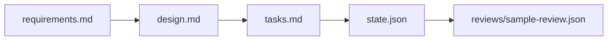

# REQ-1 Sample Feature Design

## Overview

The sample feature demonstrates the spec layout itself. There is no runtime
artifact; the design is a layout exercise.

## Architecture

## Components

- **`requirements.md`** — User Story + 3 ACs covering layout completeness, EARS preservation, and the "small example" assumption.
- **`design.md`** (this file) — Architecture diagram + Wave plan.
- **`tasks.md`** — single Wave with two tasks.
- **`state.json`** — `phase: "done"` snapshot for browse-only viewing.
- **`reviews/sample-review.json`** — minimal review record reflecting verdict `PASS`.

## Trade-offs / Alternatives

- **Adopted: single-Wave example.** Smaller surface = lower cognitive load for
  first-time readers. Multi-Wave examples can be added later if requested.
- **Rejected: a fully-built sample app with code under `src/`.** The point of
  the example is to illustrate spec artifacts, not a working app.

## Risks

- Risk: example drifts from the real `/mumei:proceed` template as the orchestrator
  evolves.
  - Mitigation: the example is regenerated whenever the plan SKILL.md template
    changes; CI does not auto-verify drift, so this is a manual maintainer
    responsibility.

## Wave Plan

- Wave 1: Sample artifact set — produce all spec / state / review files.

## Related

- requirements: requirements.md
